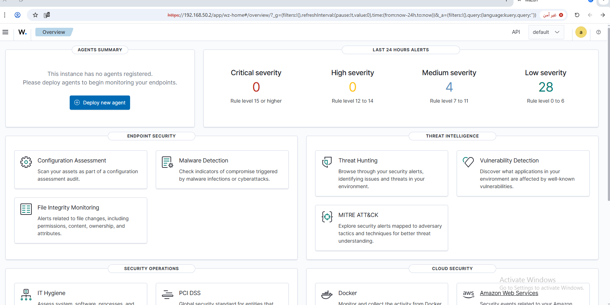
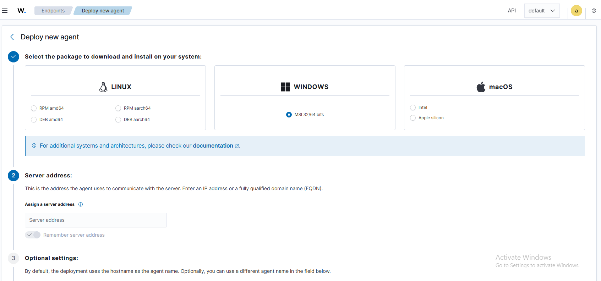
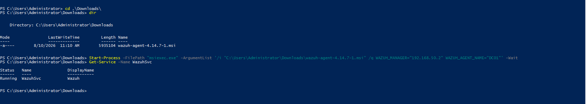

# 02 - Domain Controller Setup

## Goal

Set up a Windows Server Domain Controller to serve as the authentication and DNS backbone of the lab, and register it as a Wazuh agent for centralized monitoring.

## What I did

**1. Dashboard before registering any agents - clicked "Deploy new agent":**



**2. Deploy new agent page - chose Windows and wrote the agent name:**



**3. Downloaded the tool directly on DC01:**


```
https://packages.wazuh.com/4.x/windows/wazuh-agent-4.14.7-1.msi
```

**4. Installed via PowerShell, pointing it at the Wazuh manager and naming the agent:**



```powershell
Start-Process -FilePath "msiexec.exe" -ArgumentList '/i "C:\Users\Administrator\Downloads\wazuh-agent-4.14.7-1.msi" /q WAZUH_MANAGER="192.168.50.132" WAZUH_AGENT_NAME="DC01"' -Wait
Get-Service -Name WazuhSvc
```

Result: `Running`. Confirmed **Active** on the Wazuh Dashboard.

## Issues Faced & How I Solved Them

No issues on DC01 - the direct download from `packages.wazuh.com` worked and the install completed cleanly on the first attempt.

## Lesson Learned

Not every machine on the isolated network behaves the same way - DC01 resolved and reached `packages.wazuh.com` without a problem, while WIN-CLIENT later failed on the exact same domain (see `04-windows-client-setup.md`). Worth checking DNS/connectivity per machine rather than assuming a network-wide issue.

## Result

DC01 registered and reporting to the Wazuh Dashboard as **Active**.
