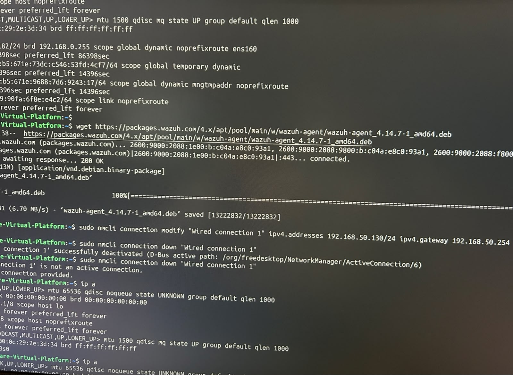
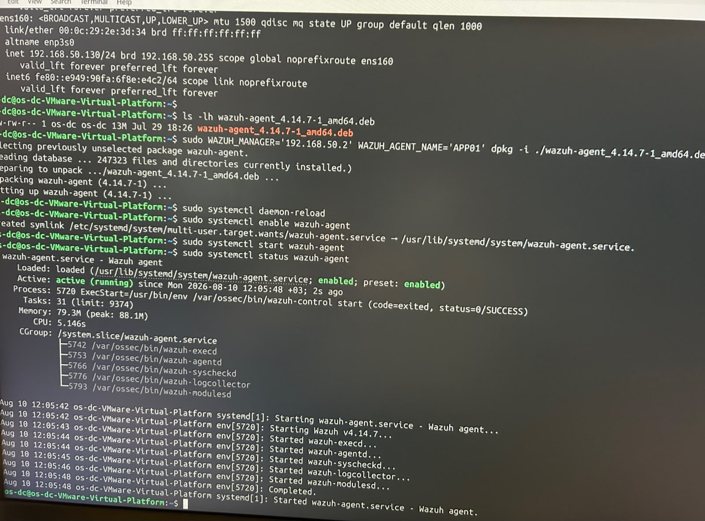

# 03 - App Server Setup

## Goal

Stand up APP01 (Ubuntu) as a general-purpose Linux app server on the lab network, and register it as a Wazuh agent.

## What I did

**1. Downloaded the agent package while still on internet, then switched to the isolated static IP:**



```bash
wget https://packages.wazuh.com/4.x/apt/pool/main/w/wazuh-agent/wazuh-agent_4.14.7-1_amd64.deb

sudo nmcli connection modify "Wired connection 1" ipv4.addresses 192.168.50.130/24 ipv4.gateway 192.168.50.254
sudo nmcli connection down "Wired connection 1"
sudo nmcli connection up "Wired connection 1"
```

Confirmed the new address with `ip a` → `192.168.50.130/24` on `ens160`.

**2. Installed the agent and started the service:**



```bash
sudo WAZUH_MANAGER='192.168.50.132' WAZUH_AGENT_NAME='APP01' dpkg -i ./wazuh-agent_4.14.7-1_amd64.deb

sudo systemctl daemon-reload
sudo systemctl enable wazuh-agent
sudo systemctl start wazuh-agent
sudo systemctl status wazuh-agent
```

Result: `active (running)`, all sub-processes (`wazuh-execd`, `wazuh-agentd`, `wazuh-syscheckd`, `wazuh-logcollector`, `wazuh-modulesd`) started successfully. Confirmed **Active** on the Wazuh Dashboard.

## Issues Faced & How I Solved Them

No issues - the package was downloaded before disconnecting the VM from the internet, so the install and network switch to the isolated segment went through cleanly.

## Lesson Learned

Downloading the agent package *before* moving a machine onto the isolated network avoids the DNS/connectivity problem entirely - worth doing this for any future machine added to the lab instead of troubleshooting it after the fact.

## Result

APP01 registered and reporting to the Wazuh Dashboard as **Active**, with a fixed static IP on the isolated lab segment.
