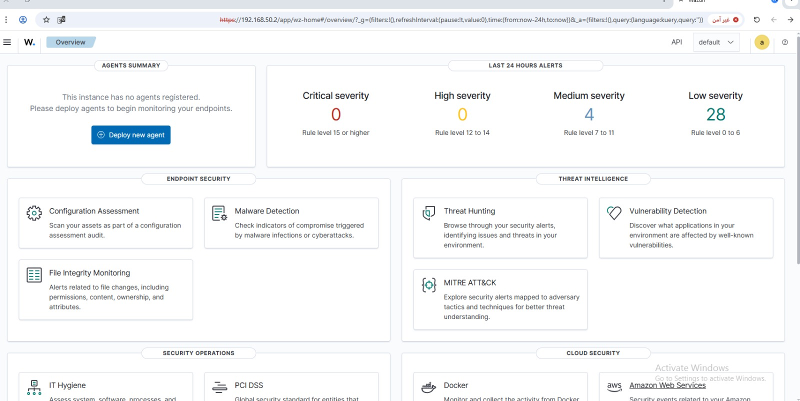
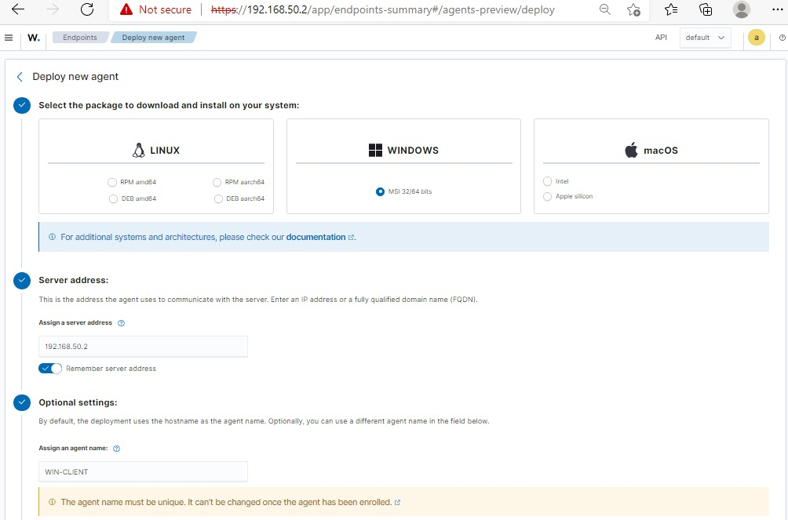
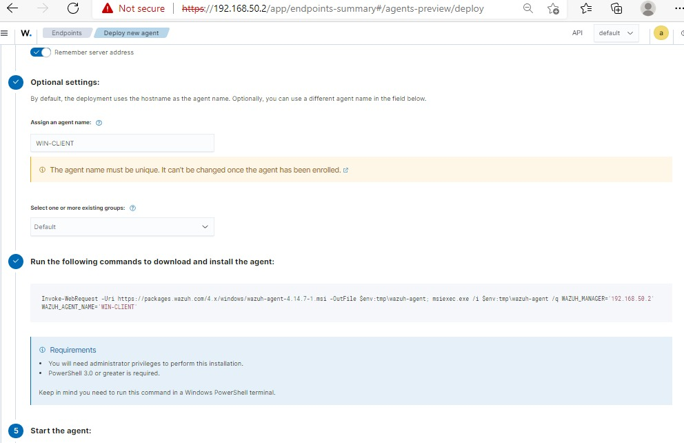
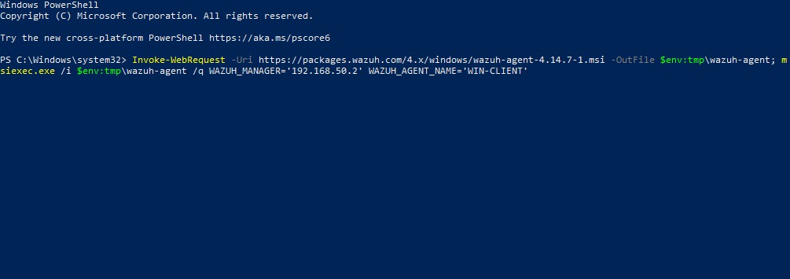
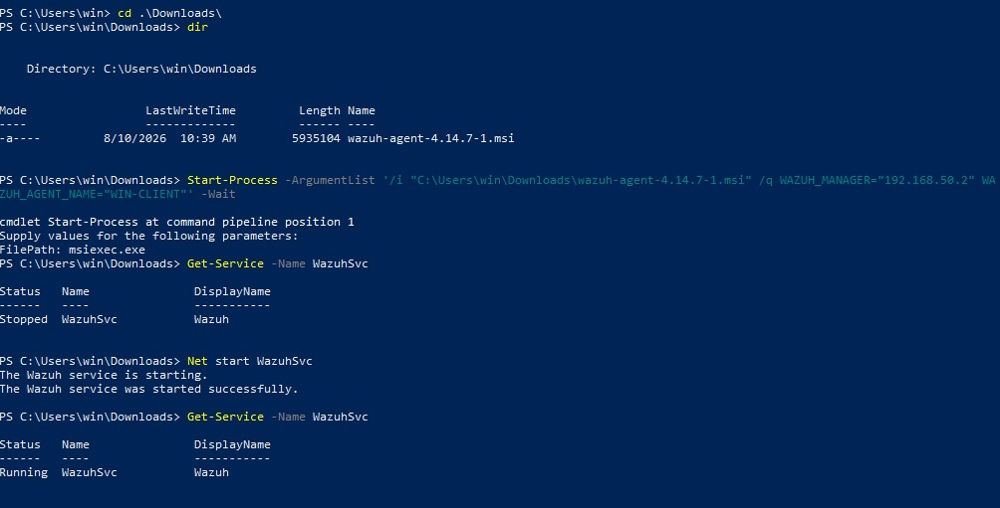
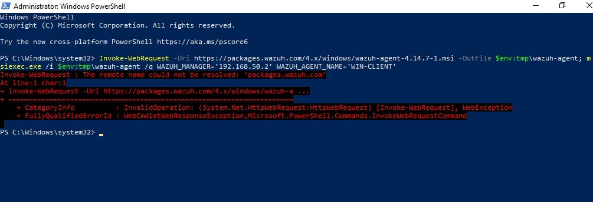
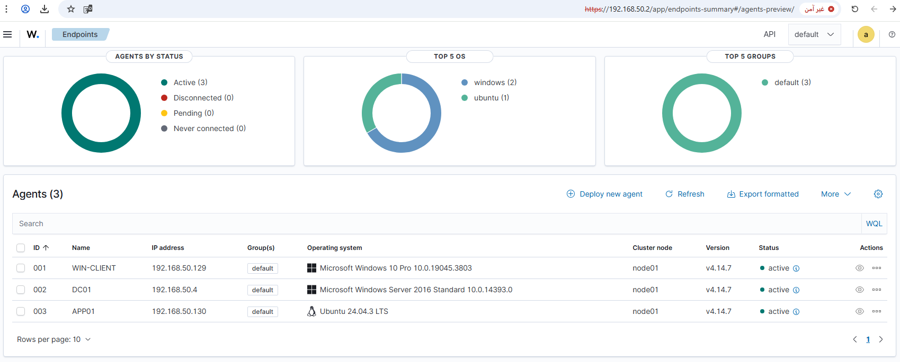

# 04 - Windows Client Setup

## Goal

Join a Windows 10 machine to the domain as a regular workstation, and register it as a Wazuh agent.

## What I did

**1. Dashboard before registering any agents:**



**2. Deploy new agent - selected Windows, set server address and agent name:**



Server address: `192.168.50.132` - Agent name: `WIN-CLIENT`

**3. Dashboard generated the install command:**



```powershell
Invoke-WebRequest -Uri https://packages.wazuh.com/4.x/windows/wazuh-agent-4.14.7-1.msi -OutFile $env:tmp\wazuh-agent; msiexec.exe /i $env:tmp\wazuh-agent /q WAZUH_MANAGER='192.168.50.132' WAZUH_AGENT_NAME='WIN-CLIENT'
```

**4. Ran the command on WIN-CLIENT:**



**5. It failed - see Issues below. Fixed by transferring the MSI manually and installing locally:**



```powershell
Start-Process -ArgumentList '/i "C:\Users\win\Downloads\wazuh-agent-4.14.7-1.msi" /q WAZUH_MANAGER="192.168.50.132" WAZUH_AGENT_NAME="WIN-CLIENT"' -Wait
Net start WazuhSvc
Get-Service -Name WazuhSvc
```

Result: `Running`. Confirmed **Active** on the Wazuh Dashboard.

## Issues Faced & How I Solved Them

### Issue - `Invoke-WebRequest` failed to resolve `packages.wazuh.com`



```
Invoke-WebRequest : The remote name could not be resolved: 'packages.wazuh.com'
```

**Why it happened:** WIN-CLIENT sits fully inside the air-gapped lab network with no path to the internet, so it can't resolve or reach any external domain - including `packages.wazuh.com`. This is expected behavior for an isolated network, not a misconfiguration.

**Fix:** Downloaded the MSI on a separate machine that has internet access, transferred the file into the isolated network, and ran the install locally instead of relying on the machine to fetch it itself.

## Lesson Learned

Any workflow that assumes live internet access (like the dashboard's auto-generated one-liner) breaks by design in an air-gapped environment. The reliable pattern here is: download the package externally → transfer it in → install locally with the same `WAZUH_MANAGER` / `WAZUH_AGENT_NAME` parameters.

## Result

WIN-CLIENT registered and reporting to the Wazuh Dashboard as **Active**.

Final check on the **Endpoints** page confirmed all three agents Active:



| ID | Name | IP | OS | Status |
|---|---|---|---|---|
| 001 | WIN-CLIENT | 192.168.50.129 | Windows 10 Pro | active |
| 002 | DC01 | 192.168.50.131 | Windows Server 2016 Standard | active |
| 003 | APP01 | 192.168.50.130 | Ubuntu 24.04.3 LTS | active |
