# 06 - Sysmon Setup

## Goal

Install Sysmon on DC01 and WIN-CLIENT for deeper Windows visibility (process creation, DNS queries, registry changes, network connections) beyond the default Windows Event Log, and feed it into Wazuh.

## What I did

Downloaded Sysmon from Microsoft Sysinternals, and a known-good config from SwiftOnSecurity:
```
https://learn.microsoft.com/en-us/sysinternals/downloads/sysmon
https://github.com/SwiftOnSecurity/sysmon-config
```
Transferred both zip files to DC01 and WIN-CLIENT manually (no internet on the isolated network), then repeated the same steps on each machine.

### DC01

**1. Installed Sysmon with the config:**
```powershell
.\Sysmon64.exe -accepteula -i sysmonconfig-export.xml
```
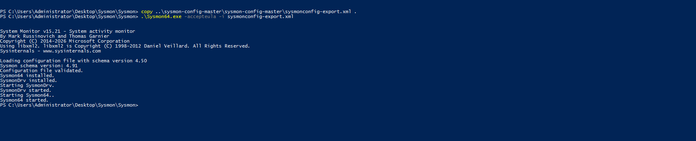

**2. Confirmed events were logging:**
```powershell
Get-WinEvent -LogName 'Microsoft-Windows-Sysmon/Operational' -MaxEvents 5
```
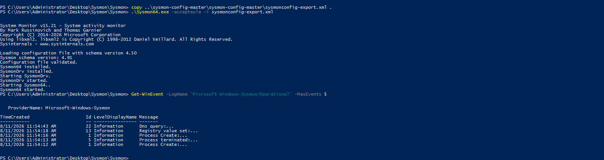

**3. Located the agent's config folder:**
```
C:\Program Files (x86)\ossec-agent
```
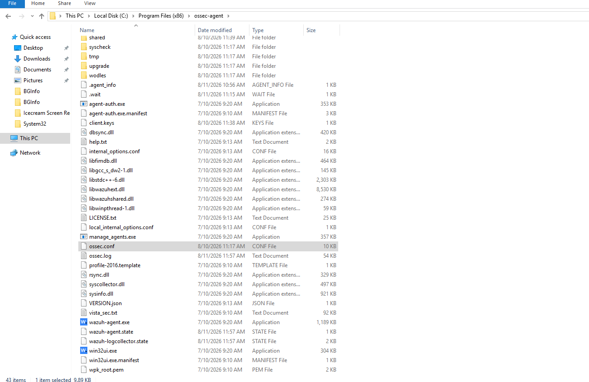

**4. Added Sysmon as a log source in `ossec.conf`:**
```xml
<localfile>
  <location>Microsoft-Windows-Sysmon/Operational</location>
  <log_format>eventchannel</log_format>
</localfile>
```
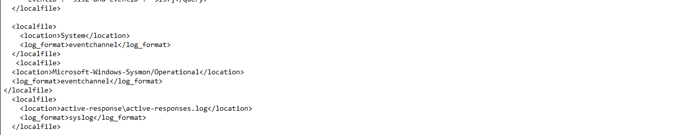

**5. Restarted the agent:**
```powershell
Restart-Service WazuhSvc
```


### WIN-CLIENT

**1. Installed Sysmon with the config:**
```powershell
.\Sysmon64.exe -accepteula -i sysmonconfig-export.xml
```
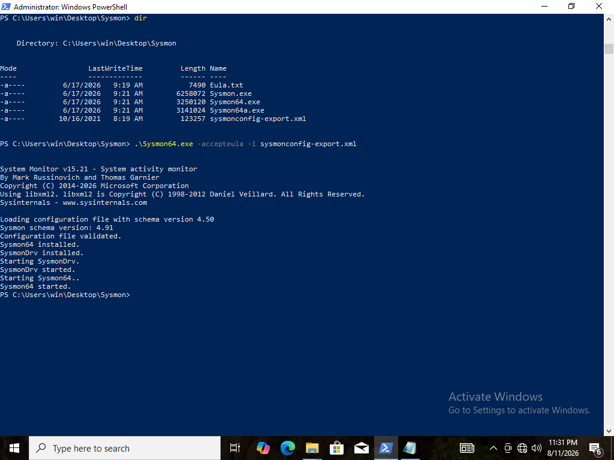

**2. Confirmed events were logging:**
```powershell
Get-WinEvent -LogName 'Microsoft-Windows-Sysmon/Operational' -MaxEvents 5
```
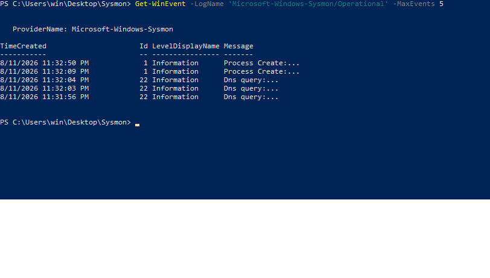

**3. Added Sysmon as a log source in `ossec.conf`:**
```xml
<localfile>
  <location>Microsoft-Windows-Sysmon/Operational</location>
  <log_format>eventchannel</log_format>
</localfile>
```
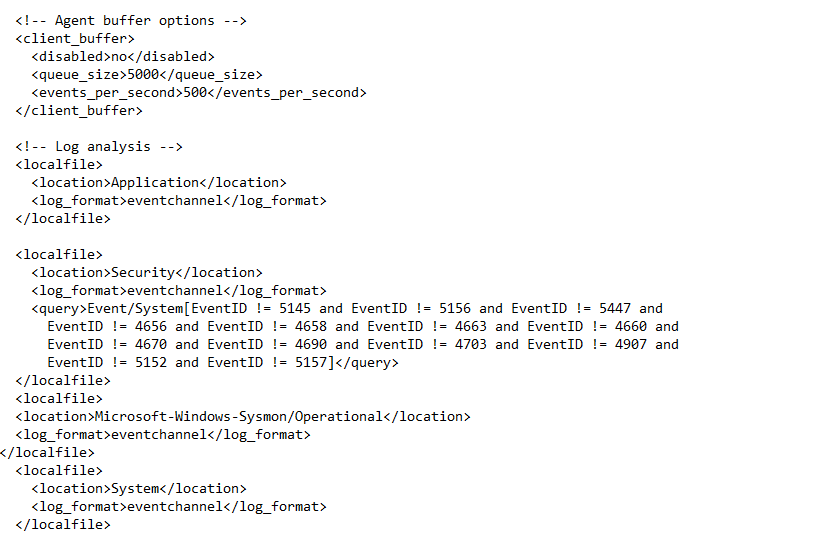

**4. Restarted the agent:**
```powershell
Restart-Service WazuhSvc
```
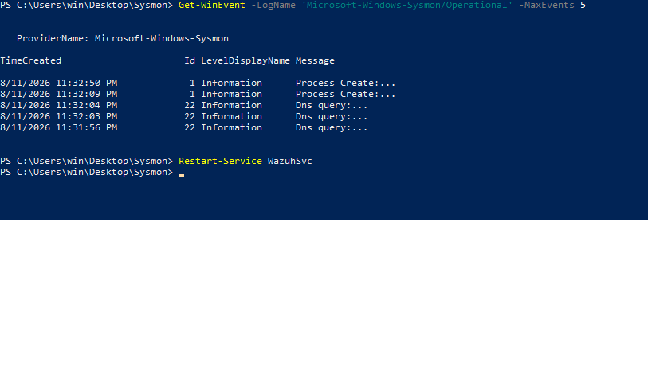

Confirmed on the dashboard with `data.win.system.providerName: "Microsoft-Windows-Sysmon"` - 38 hits.

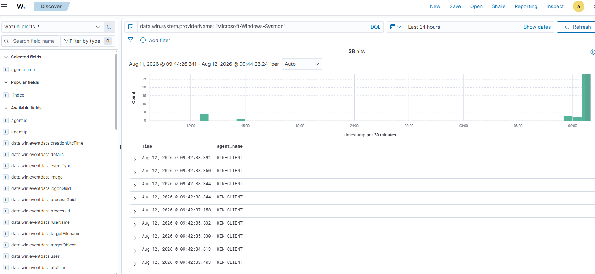

## Issues Faced & How I Solved Them

### Issue - `Sysmon64.exe` not recognized

```
Sysmon64.exe : The term 'Sysmon64.exe' is not recognized as the name of a cmdlet, function, script file, or operable program.
```
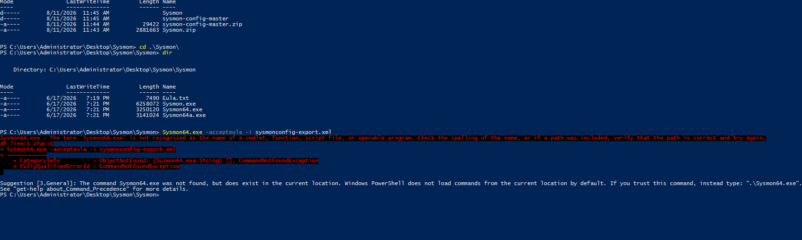

**Why:** PowerShell doesn't run executables from the current folder unless told to explicitly.

**Fix:** ran it with `.\` in front - `.\Sysmon64.exe ...`

### Issue - config file not found

```
Error: Failed to open xml configuration: sysmonconfig-export.xml
```
(the process also crashed outright once - "System activity monitor has stopped working")

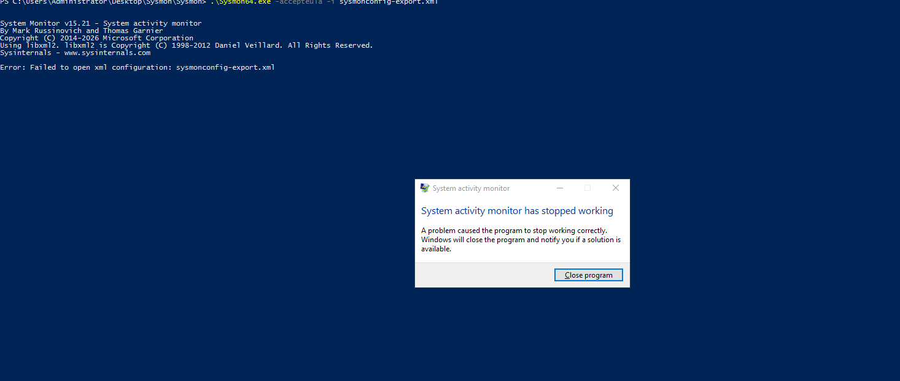

**Why:** the zip extracted into a nested folder (`sysmon-config-master\sysmon-config-master\`), so `sysmonconfig-export.xml` wasn't in the same folder as `Sysmon64.exe`.

**Fix:** copied the config into the same folder as the executable, then re-ran the install:
```powershell
copy ..\sysmon-config-master\sysmon-config-master\sysmonconfig-export.xml .
.\Sysmon64.exe -accepteula -i sysmonconfig-export.xml
```

## Result

Sysmon running on both DC01 and WIN-CLIENT, logging process creation, DNS queries, registry changes, and more - all feeding into Wazuh as an additional log source alongside the default Windows Security log.
