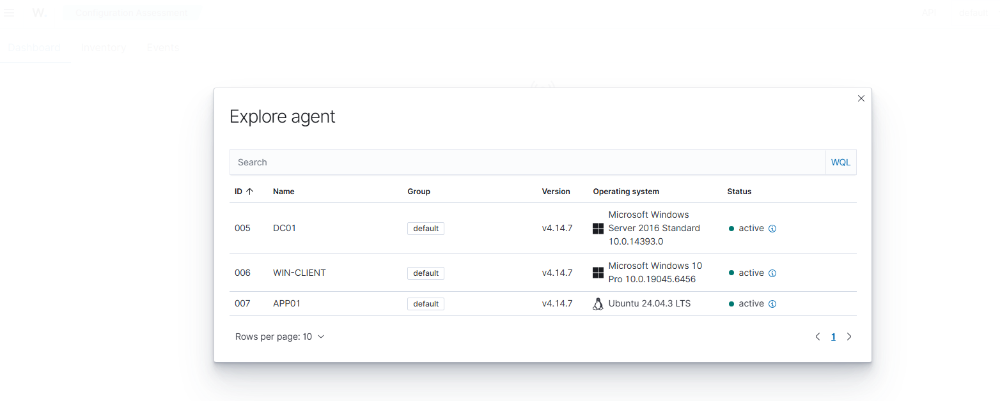
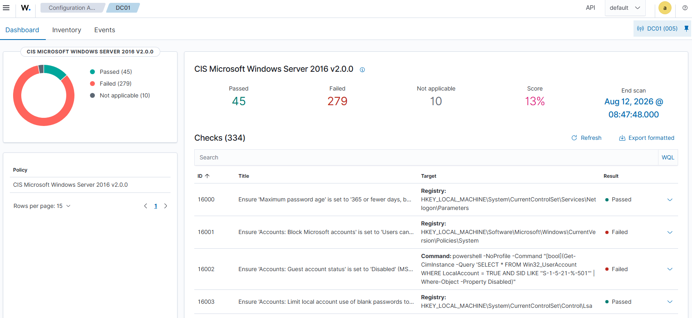
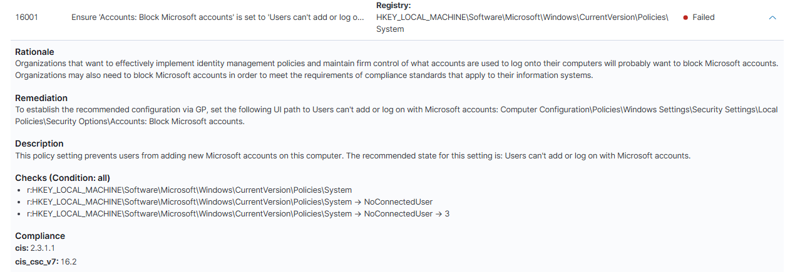
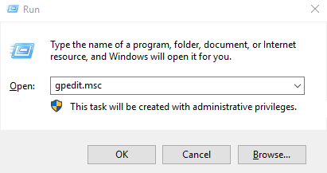
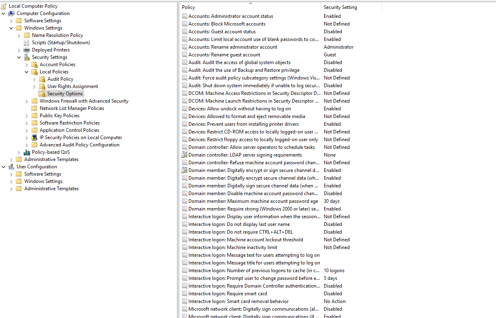
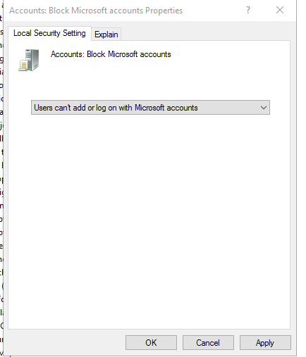
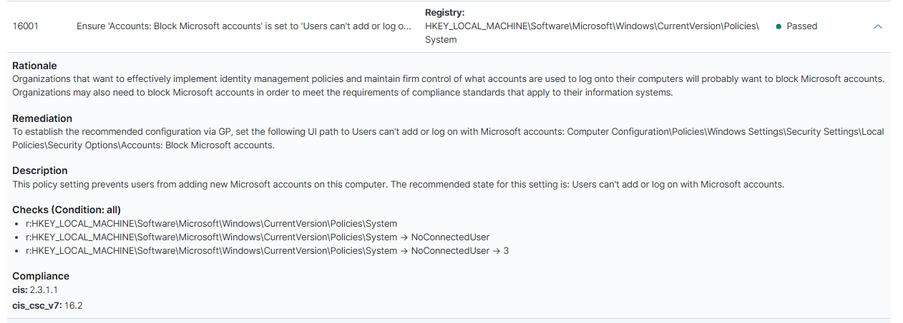
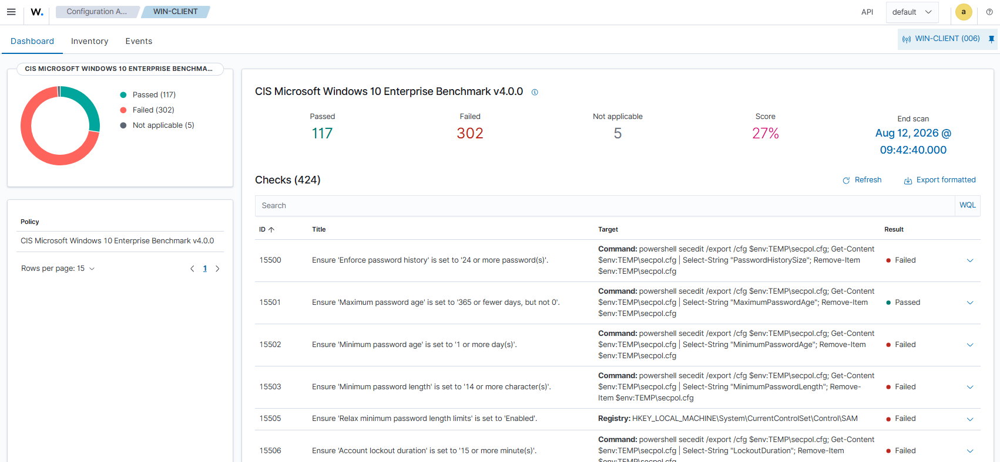
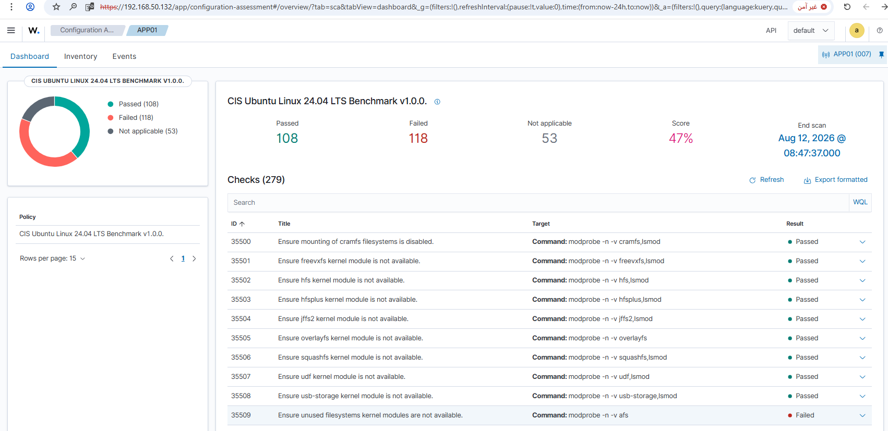

# 07 - Wazuh SCA (Security Configuration Assessment)

## Goal

Check DC01, WIN-CLIENT, and APP01's actual configuration against CIS Benchmarks, fix one real finding on DC01 end-to-end, and confirm the fix reflects in Wazuh.

## What I did

SCA runs entirely offline - the CIS policy files ship with the Wazuh agent itself, and every check runs locally (registry read, local PowerShell command, or config file read). No internet needed.

**1. Opened Configuration Assessment on the dashboard and picked an agent:**



**2. DC01 results - CIS Microsoft Windows Server 2016 v2.0.0, 334 checks:**



Passed: 45 - Failed: 279 - Not applicable: 10 - Score: 13%

## Fixing a Real Finding on DC01

Picked check **16001 - Accounts: Block Microsoft accounts** (CIS 2.3.1.1) to fix end-to-end.

**Before - Failed:**



**Fix - via Local Group Policy:**

1. Opened Local Group Policy Editor:
```
gpedit.msc
```


2. Navigated to `Computer Configuration > Windows Settings > Security Settings > Local Policies > Security Options`, found **Accounts: Block Microsoft accounts** set to **Not Defined**:



3. Changed it to **Users can't add or log on with Microsoft accounts** and applied:



4. Forced the policy to apply immediately instead of waiting for the next refresh cycle:
```powershell
gpupdate /force
```


**After - Passed:**



Confirmed the fix reflects correctly in Wazuh's next SCA scan - same check (16001), same registry path, now reporting **Passed**.

## Other Agents - Summary Results

**WIN-CLIENT** - CIS Microsoft Windows 10 Enterprise Benchmark v4.0.0, 424 checks. Passed: 117 - Failed: 302 - Not applicable: 5 - Score: 27%



**APP01** - CIS Ubuntu Linux 24.04 LTS Benchmark v1.0.0, 279 checks. Passed: 108 - Failed: 118 - Not applicable: 53 - Score: 47%



## Result

SCA confirmed running automatically on all three agents against their respective CIS benchmarks, entirely offline. One real finding (16001 on DC01) fixed end-to-end and confirmed via a before/after scan comparison. The other two agents' failed checks remain as a backlog for future hardening passes - not attempted to fix all of them in this session, since the goal here was proving the SCA → fix → re-scan workflow works, not a full hardening sweep.
