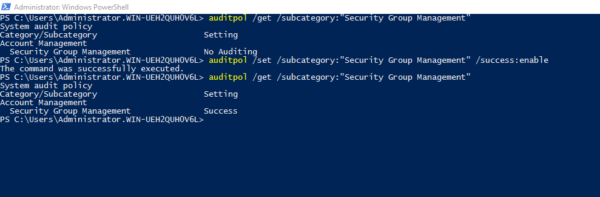
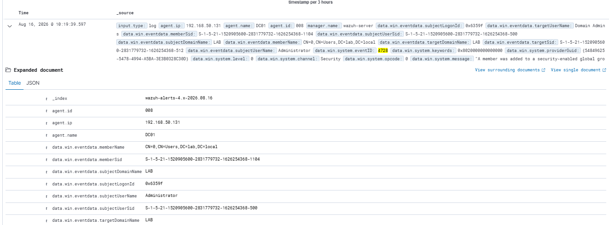
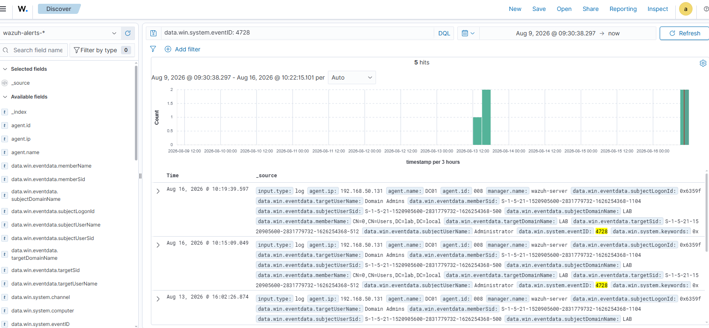
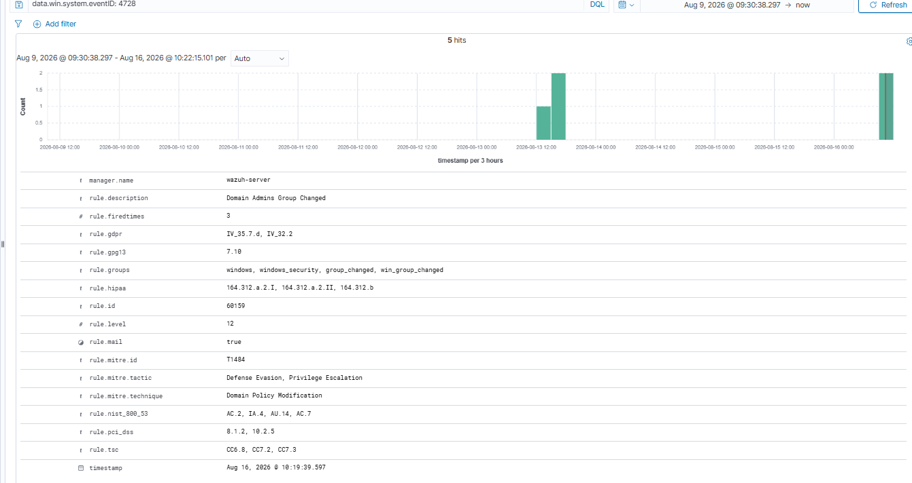

# Rule 01 - User Added to Domain Admins Group

**Status:** ✅ Built and tested

## Overview

Detects when any user account is added to the `Domain Admins` security group on the domain controller - one of the highest-privilege actions possible in an Active Directory environment.

| Field | Value |
|---|---|
| Log Source | Windows Security Event Log (DC01) |
| Event ID | 4728 |
| Wazuh Rule ID | 60159 (built-in) |
| Rule Description | Domain Admins Group Changed |
| Rule Level | 12 |
| MITRE ATT&CK | T1484 - Domain Policy Modification |
| MITRE Tactics | Defense Evasion, Privilege Escalation |
| ECC Control | 2-2-3-3, 2-2-3-4, 2-12-3-2 |

## Simulation Steps

1. Confirmed the `"Security Group Management"` audit subcategory was enabled on DC01 - a hard prerequisite for Event 4728 to be logged at all (this subcategory can silently reset on its own; see Lessons Learned):
   ```powershell
   auditpol /get /subcategory:"Security Group Management"
   ```
   If it comes back `No Auditing`, enable it first:
   ```powershell
   auditpol /set /subcategory:"Security Group Management" /success:enable
   ```
2. Created a standard domain user `user1` on DC01.
3. Ran `Add-ADGroupMember -Identity "Domain Admins" -Members user1` from an elevated PowerShell session on DC01.
4. Confirmed the change with `Get-ADGroupMember -Identity "Domain Admins"`.
5. Verified Windows generated Event ID 4728 in the Security log.
6. Searched Wazuh Dashboard → Discover for `data.win.system.eventID: 4728` and confirmed the alert appeared.

## Evidence

1. Confirm the `"Security Group Management"` audit subcategory is enabled on DC01 before testing.

```powershell
auditpol /get /subcategory:"Security Group Management"
```



2. `Add-ADGroupMember` command run on DC01.

```
Add-ADGroupMember -Identity "Domain Admins" -Members user1
```


3. Discover search results for the event, showing multiple matches across test runs.

```
data.win.system.eventID: 4728
```



4. Full expanded alert with all fields (`subjectUserName: Administrator`, `targetUserName: Domain Admins`, `memberName: user1`, `eventID: 4728`).

```
data.win.system.eventID: 4728
```



5. Full rule metadata (rule.id 60159, MITRE/NIST/PCI-DSS/GDPR/HIPAA mappings, 5 total hits across test runs).

```
data.win.system.eventID: 4728
```



## False Positive Testing

Repeated the add/remove cycle three times across two days (Aug 13 and Aug 16) to confirm the rule fires consistently, not just once. All 5 test events were captured correctly with matching timestamps in the alert data.
