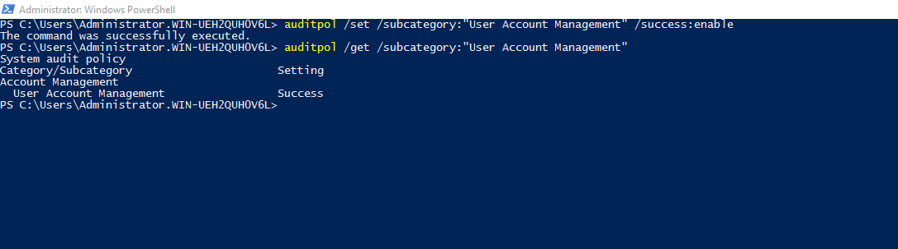
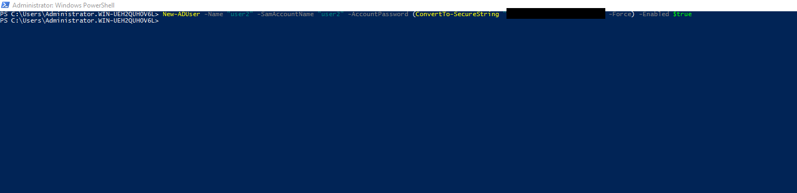
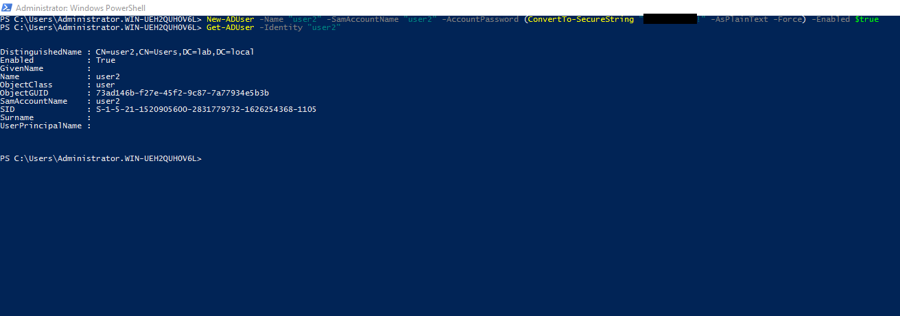
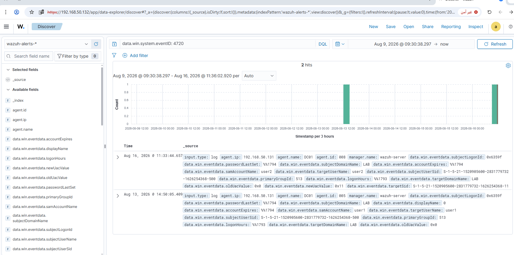
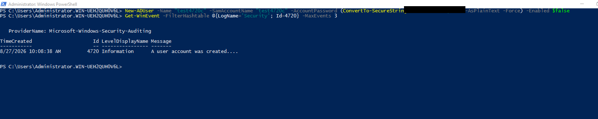

# Rule 02 - New Domain User Account Created

**Status:** ✅ Built and tested

## Overview

Detects when a new user account shows up on the domain controller. In a lot of insider-threat scenarios this is step one - someone creates a "spare" account to use later (tied to Rule 01, which watches what happens after).

| Field | Value |
|---|---|
| Log Source | Windows Security Event Log (DC01) |
| Event ID | 4720 |
| Wazuh Rule ID | 60109 (built-in) |
| Rule Description | User account enabled or created |
| Rule Level | 8 |
| MITRE ATT&CK | T1098 - Account Manipulation (future improvement: T1136.002 - Domain Account - would be more precise, but the shared base rule with Rule #05 makes it not worth a dedicated override; see Lessons Learned) |
| MITRE Tactics | Persistence |
| ECC Control | 2-2-3-1, 2-12-3-1 |

## Simulation Steps

1. Confirmed the `"User Account Management"` audit subcategory was enabled on DC01 - a hard prerequisite for Event 4720 to be logged at all (this subcategory can silently reset on its own; see Lessons Learned):
   ```powershell
   auditpol /get /subcategory:"User Account Management"
   ```
   If it comes back `No Auditing`, enable it first:
   ```powershell
   auditpol /set /subcategory:"User Account Management" /success:enable
   ```
2. Created a new domain user on DC01 via PowerShell:
   ```
   New-ADUser -Name "user2" -SamAccountName "user2" -AccountPassword (ConvertTo-SecureString "<REDACTED>" -AsPlainText -Force) -Enabled $true
   ```
3. Confirmed creation with `Get-ADUser -Identity "user2"`.
4. Verified Windows generated Event ID 4720 in the Security log.
5. Searched Wazuh Dashboard → Discover for `data.win.system.eventID: 4720` - alert appeared immediately (no time-sync issue this time, unlike Rule 01).

## Evidence

1. Confirm the `"User Account Management"` audit subcategory is enabled on DC01 before testing.

```powershell
auditpol /get /subcategory:"User Account Management"
```



2. `New-ADUser` command run on DC01, creating the account that triggers the alert.

```
New-ADUser -Name "user2" -SamAccountName "user2" -AccountPassword (ConvertTo-SecureString "<REDACTED>" -AsPlainText -Force) -Enabled $true
```



3. `Get-ADUser` output confirming the new account's details (SID, distinguished name, enabled status).

```
Get-ADUser -Identity "user2"
```



4. Wazuh Dashboard search confirming the alert reached the indexer for `data.win.system.eventID: 4720`.

```
data.win.system.eventID: 4720
```



5. A second, independent confirmation run (`test4720c`) after re-enabling the audit subcategory in a later session - `Get-WinEvent` locally on DC01 confirming Event 4720 was logged.

```powershell
New-ADUser -Name "test4720c" -SamAccountName "test4720c" -AccountPassword (ConvertTo-SecureString "<REDACTED>" -AsPlainText -Force) -Enabled $false
Get-WinEvent -FilterHashtable @{LogName='Security'; Id=4720} -MaxEvents 3
```



Screenshots stored in `screenshots/rules/rule-02-new-user-account/`.

## Lessons Learned

- Built-in rule 60109 already covers Event 4720 - no custom rule to write here.
- The audit subcategory it depends on (`"User Account Management"`, shared with Rules #03-#05) can silently reset on its own - check `auditpol /get /subcategory:"User Account Management"` first if a rule in that range stops firing.

## False Positive Testing

Not yet repeated across multiple sessions - noted for future testing once more accounts are created as part of later scenarios (e.g. Rule 01/02 combined story).
