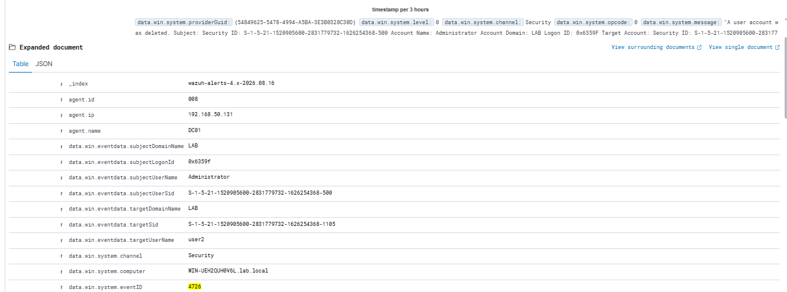
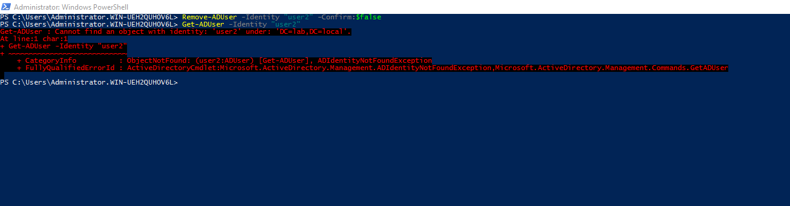
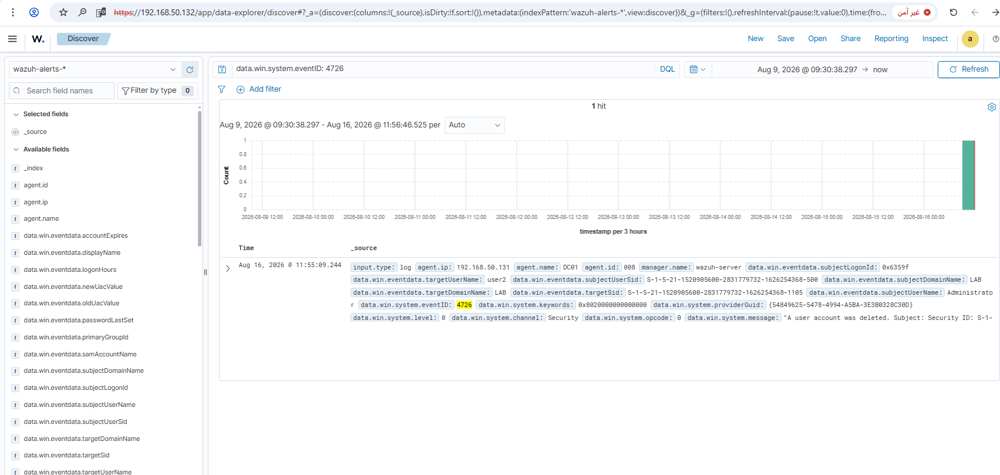

# Rule 03 - User Account Deleted

**Status:** ✅ Built and tested

## Overview

Detects a user account getting deleted on the domain controller. Pairs with Rule 02 - together they cover the "create, then delete" pattern someone might use to cover their tracks after using a throwaway account.

| Field | Value |
|---|---|
| Log Source | Windows Security Event Log (DC01) |
| Event ID | 4726 |
| Wazuh Rule ID | 60111 (built-in) |
| Rule Description | User account disabled or deleted |
| Rule Level | 8 |
| MITRE ATT&CK | Not mapped by this built-in rule |
| ECC Control | 2-2-3-5, 2-12-3-1 |

## Simulation Steps

1. Deleted the `user2` account created in Rule 02, on DC01 via PowerShell:
   ```
   Remove-ADUser -Identity "user2" -Confirm:$false
   ```
2. Confirmed deletion with `Get-ADUser -Identity "user2"` - correctly returned `ADIdentityNotFoundException`, proving the account no longer exists.
3. Verified Windows generated Event ID 4726 in the Security log (`"A user account was deleted"`).
4. Searched Wazuh Dashboard → Discover for `data.win.system.eventID: 4726` - alert appeared immediately.

## Evidence

1. `Remove-ADUser` command run on DC01, followed by `Get-ADUser` confirming the account no longer exists (error is the expected, correct result).

```
Remove-ADUser -Identity "user2" -Confirm:$false
Get-ADUser -Identity "user2"
```



2. Full expanded alert with all fields (`targetUserName: user2`, `subjectUserName: Administrator`, `eventID: 4726`, message: "A user account was deleted").

```
data.win.system.eventID: 4726
```



3. Discover search results confirming the single matching event.

```
data.win.system.eventID: 4726
```



Screenshots stored in `screenshots/rules/rule-03-user-deleted/`.

## Lessons Learned

Rule 60111 already handles Event 4726 out of the box - another easy one.

## False Positive Testing

Not yet repeated across multiple sessions - noted for future testing.
