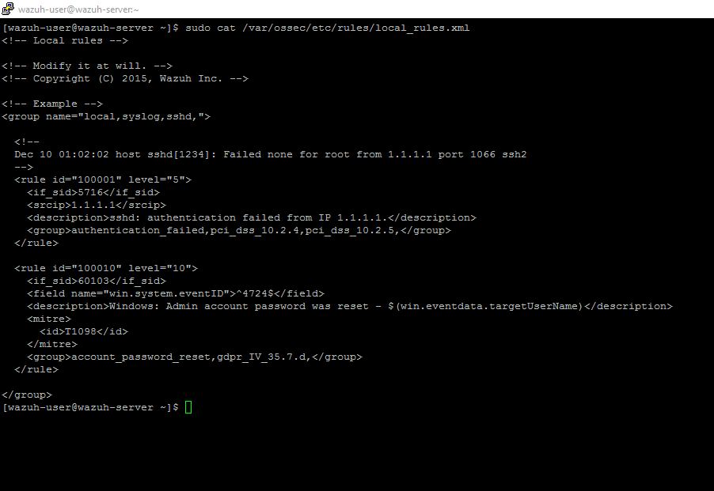
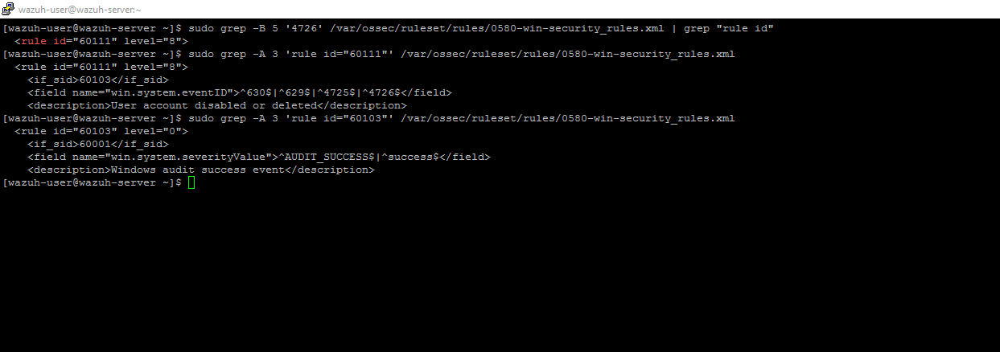
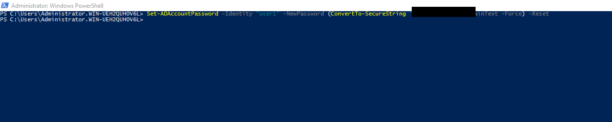
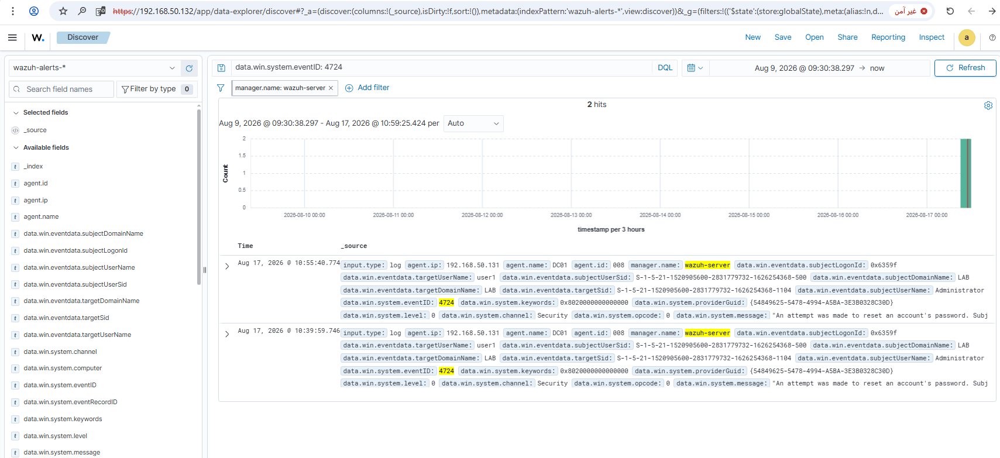
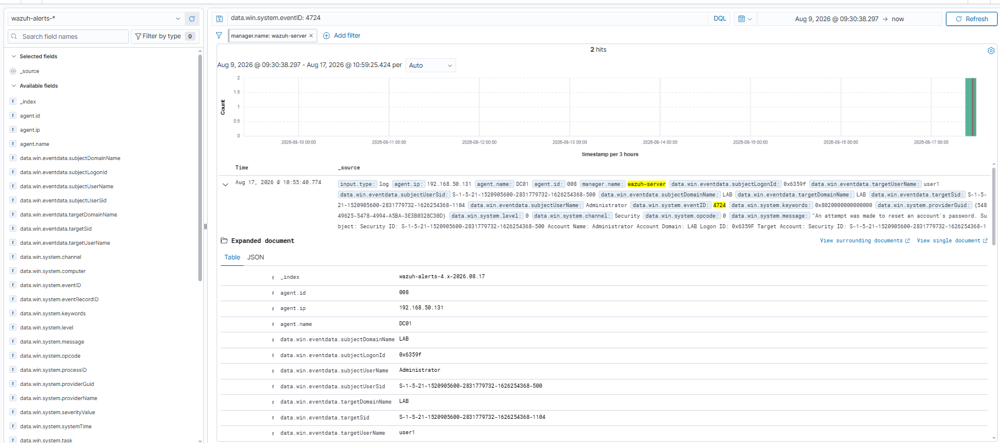

# Rule 04 - Admin Account Password Changed

**Status:** ✅ Built and tested

## Overview

Detects when an admin resets someone's password on the domain controller. Rules 01-03 all had a ready-made Wazuh rule to hook into, but this event doesn't. Had to write a custom rule from scratch, and it took some trial and error to get the parent rule right.

| Field | Value |
|---|---|
| Log Source | Windows Security Event Log (DC01) |
| Event ID | 4724 |
| Wazuh Rule ID | 100010 (custom, in `local_rules.xml`) |
| Rule Description | Windows: Admin account password was reset |
| Rule Level | 10 |
| MITRE ATT&CK | T1098 - Account Manipulation |
| ECC Control | 2-2-3-2, 2-12-3-2 |

## The Custom Rule

```xml
<rule id="100010" level="10">
  <if_sid>60103</if_sid>
  <field name="win.system.eventID">^4724$</field>
  <description>Windows: Admin account password was reset - $(win.eventdata.targetUserName)</description>
  <mitre>
    <id>T1098</id>
  </mitre>
  <group>account_password_reset,gdpr_IV_35.7.d,</group>
</rule>
```

To add this rule directly to `local_rules.xml`:

```bash
sudo sed -i '$i\
<rule id="100010" level="10">\
  <if_sid>60103</if_sid>\
  <field name="win.system.eventID">^4724$</field>\
  <description>Windows: Admin account password was reset - $(win.eventdata.targetUserName)</description>\
  <mitre>\
    <id>T1098</id>\
  </mitre>\
  <group>account_password_reset,gdpr_IV_35.7.d,</group>\
</rule>' /var/ossec/etc/rules/local_rules.xml
sudo grep -A 8 'id="100010"' /var/ossec/etc/rules/local_rules.xml
```

## Why `if_sid: 60103` - How I Got There

My first two tries at this failed quietly. The event was reaching `archives.log` fine, but no alert ever came out:

1. **First try - `if_sid: 60106`.** Just a guess, and I hadn't checked it against the actual ruleset first. Wrong guess.
2. **Second try - `if_sid: 60100`.** This one exists for real, but when I looked at its definition it needs `win.system.severityValue = INFORMATION`. My event's actual severity is `AUDIT_SUCCESS`, so the parent never matched in the first place - meaning my rule never even got a chance to run.
3. **What actually worked:** instead of guessing a third time, I went and looked at Rule 60111, which already fires correctly on Event 4726 (confirmed in Rule 03). Traced its parent chain up:
   - `60111` needs `if_sid: 60103`
   - `60103` needs `win.system.severityValue = ^AUDIT_SUCCESS$|^success$`

   That matched my event exactly. Updated `local_rules.xml` to use `if_sid: 60103`, restarted `wazuh-manager`, and it fired right away on the next test.

## Lessons Learned

Don't guess a parent `if_sid`. Trace a working rule's parent chain (`grep -A 3 'rule id="X"' <ruleset file>`) instead of guessing blind.

## Simulation Steps

1. Reset `user1`'s password on DC01 via PowerShell:
   ```
   Set-ADAccountPassword -Identity "user1" -NewPassword (ConvertTo-SecureString "<REDACTED>" -AsPlainText -Force) -Reset
   ```
2. Verified Windows generated Event ID 4724 in the Security log (confirmed via `archives.log` on SIEM-SRV before the rule fix).
3. After correcting `if_sid` to 60103 and restarting `wazuh-manager`, repeated the command and confirmed the alert appeared both directly (`grep '"id":"100010"' alerts.log`) and in Wazuh Dashboard.

## Evidence

1. Custom rule added to `local_rules.xml` (full file content, alongside the default `sshd` example rule).

```
sudo cat /var/ossec/etc/rules/local_rules.xml
```



2. Parent rule chain verification - tracing Rule 60111 (known-working, fires on Event 4726) up to Rule 60103, confirming its `severityValue` condition matches our event.

```
sudo grep -B 5 '4726' /var/ossec/ruleset/rules/0580-win-security_rules.xml | grep "rule id"
sudo grep -A 3 'rule id="60111"' /var/ossec/ruleset/rules/0580-win-security_rules.xml
sudo grep -A 3 'rule id="60103"' /var/ossec/ruleset/rules/0580-win-security_rules.xml
```



3. `Set-ADAccountPassword` command run on DC01.

```
Set-ADAccountPassword -Identity "user1" -NewPassword (ConvertTo-SecureString "<REDACTED>" -AsPlainText -Force) -Reset
```



4. Discover search results showing both test runs (before and after the `if_sid` fix - only the second one, after the fix, actually generated an alert).

```
data.win.system.eventID: 4724
```



5. Full expanded alert confirming the fix worked (`targetUserName: user1`, `eventID: 4724`).

```
data.win.system.eventID: 4724
```



Screenshots stored in `screenshots/rules/rule-04-admin-password-reset/`.

## False Positive Testing

Not yet repeated across multiple sessions - noted for future testing.
