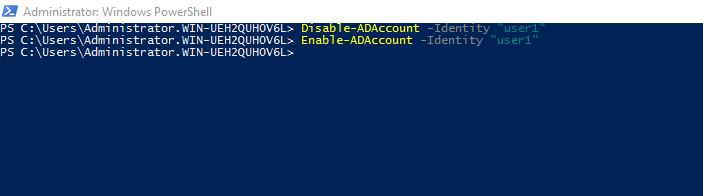
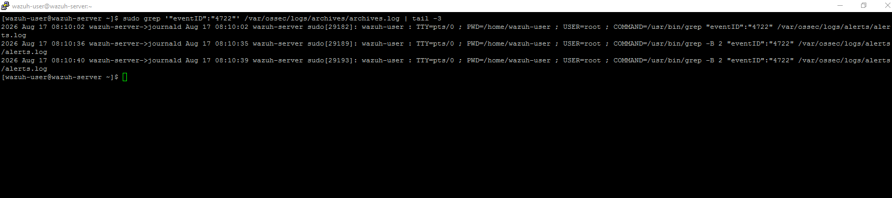
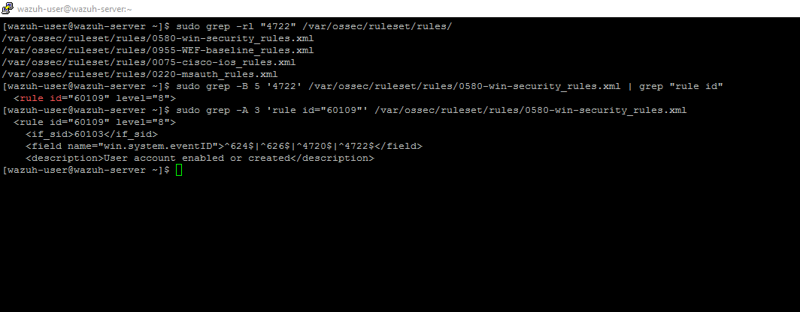
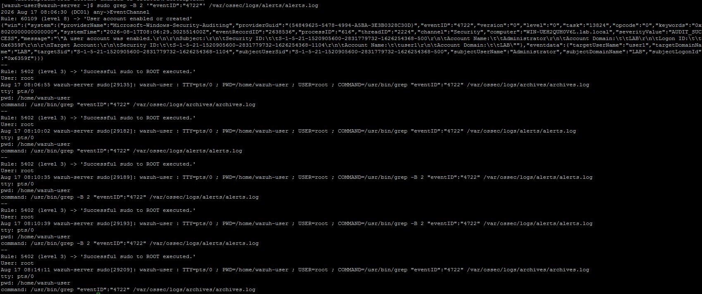
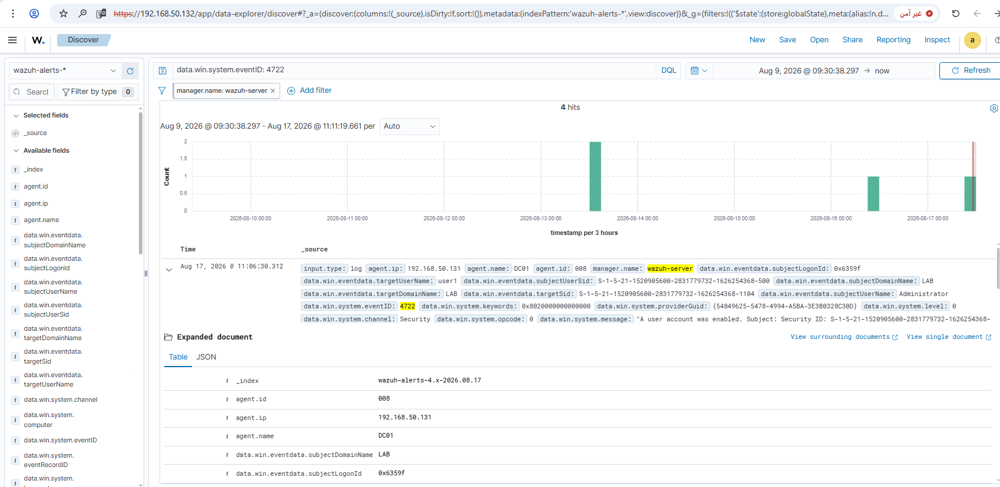

# Rule 05 - Disabled Account Re-Enabled

**Status:** ✅ Built and tested

## Overview

Detects when a disabled account gets turned back on. This time I didn't need a custom rule like Rule 04 - a built-in one already covers it.

| Field | Value |
|---|---|
| Log Source | Windows Security Event Log (DC01) |
| Event ID | 4722 |
| Wazuh Rule ID | 60109 (built-in) |
| Rule Description | User account enabled or created |
| Rule Level | 8 |
| MITRE ATT&CK | Not mapped by this built-in rule |
| ECC Control | 2-2-3-5, 2-12-3-2 |

## Simulation Steps

1. Disabled `user1` on DC01, then immediately re-enabled it (the re-enable is what generates Event 4722):
   ```
   Disable-ADAccount -Identity "user1"
   Enable-ADAccount -Identity "user1"
   ```
2. Confirmed the event reached `archives.log` on SIEM-SRV.
3. Verified whether a built-in rule already covered Event 4722, following the same verification method established in Rule 04:
   - Searched all rule files for any mention of `4722`: found a match in `0580-win-security_rules.xml`.
   - Found the specific rule matching the event: **Rule 60109**, condition `^624$|^626$|^4720$|^4722$`, parent `if_sid: 60103` - the same parent rule confirmed correct in Rule 04.
   - Since 60109 already covers 4722 directly and its parent chain was already proven to work, no custom rule was needed this time.
4. Confirmed the alert fired with `Rule: 60109 (level 8) -> 'User account enabled or created'` in `alerts.log`.
5. Confirmed the alert appeared in Wazuh Dashboard → Discover for `data.win.system.eventID: 4722`.

## Evidence

1. `Disable-ADAccount` then `Enable-ADAccount` run on DC01.

```
Disable-ADAccount -Identity "user1"
Enable-ADAccount -Identity "user1"
```



2. Event confirmed reaching `archives.log` on SIEM-SRV.

```
sudo grep '"eventID":"4722"' /var/ossec/logs/archives/archives.log | tail -3
```



3. Rule verification sequence - searching all rule files for `4722`, locating Rule 60109 in the Windows Security ruleset, and confirming its condition covers 4722 with parent `60103`.

```
sudo grep -rl "4722" /var/ossec/ruleset/rules/
sudo grep -B 5 '4722' /var/ossec/ruleset/rules/0580-win-security_rules.xml | grep "rule id"
sudo grep -A 3 'rule id="60109"' /var/ossec/ruleset/rules/0580-win-security_rules.xml
```



4. Alert confirmed in `alerts.log`, showing `Rule: 60109 (level 8) -> 'User account enabled or created'` matched against the real event.

```
sudo grep -B 2 '"eventID":"4722"' /var/ossec/logs/alerts/alerts.log
```



5. Dashboard search confirming the alert is visible in Discover.

```
data.win.system.eventID: 4722
```



Screenshots stored in `screenshots/rules/rule-05-account-reenabled/`.

## Lessons Learned

Rule 60103 (the same parent used in Rule #04) handled this one without any changes.

## False Positive Testing

Not yet repeated across multiple sessions - noted for future testing.
