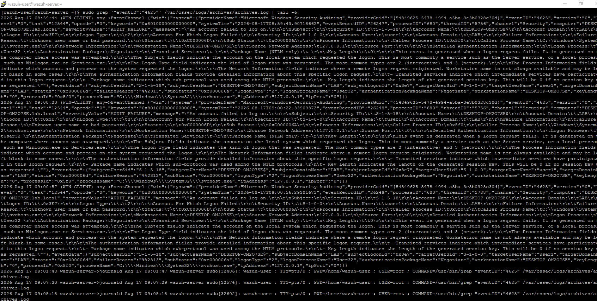
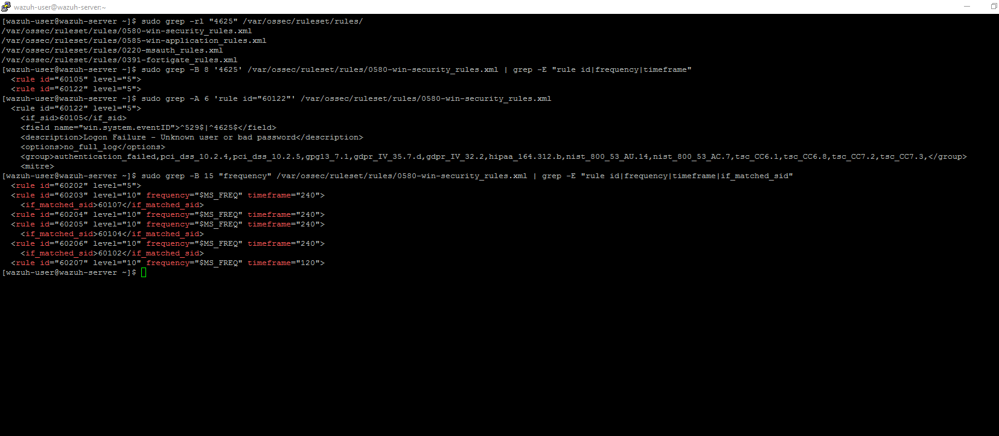
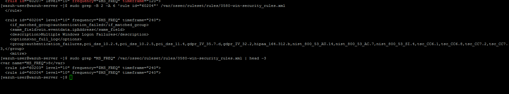
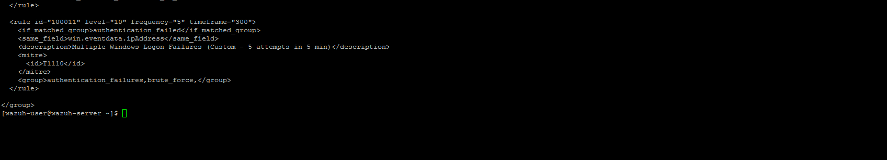
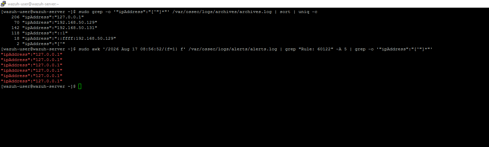
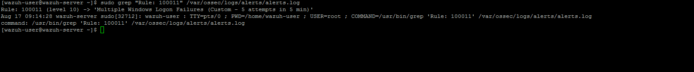
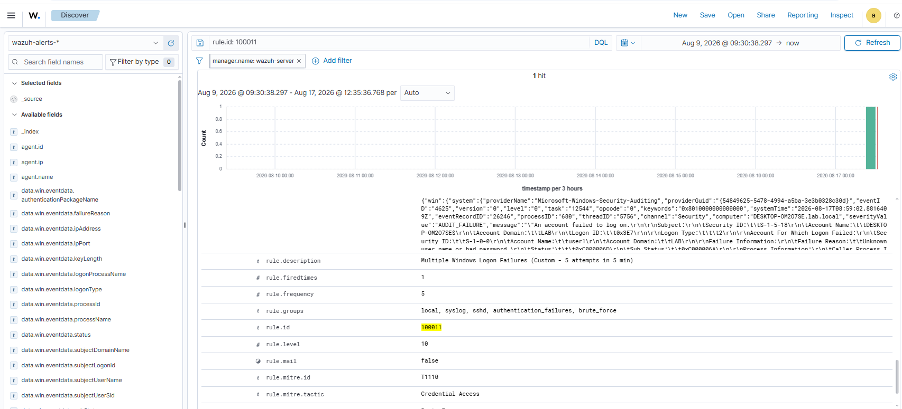

# Rule 06 - Repeated Failed Logon Attempts (Brute Force)

**Status:** ✅ Built and tested

## Overview

Detects a bunch of failed logins from the same source in a short window - classic brute-force behavior. This one's different from Rules 01-05 because it needs correlation logic (frequency + timeframe), not just a single event matching. That made both building it and debugging it a bit more involved.

| Field | Value |
|---|---|
| Log Source | Windows Security Event Log (DC01) |
| Event ID | 4625 (5+ within 5 min) |
| Wazuh Rule ID | 100011 (custom) |
| Rule Description | Multiple Windows Logon Failures (Custom - 5 attempts in 5 min) |
| Rule Level | 10 |
| MITRE ATT&CK | T1110 - Brute Force (tactic: Credential Access) |
| ECC Control | 2-2-3-2, 2-12-3-4 |

## The Custom Rule

```xml
<rule id="100011" level="10" frequency="5" timeframe="300">
  <if_matched_group>authentication_failed</if_matched_group>
  <same_field>win.eventdata.ipAddress</same_field>
  <description>Multiple Windows Logon Failures (Custom - 5 attempts in 5 min)</description>
  <mitre>
    <id>T1110</id>
  </mitre>
  <group>authentication_failures,brute_force,</group>
</rule>
```

To add this rule directly to `local_rules.xml`:

```bash
sudo sed -i '$i\
<rule id="100011" level="10" frequency="5" timeframe="300">\
  <if_matched_group>authentication_failed</if_matched_group>\
  <same_field>win.eventdata.ipAddress</same_field>\
  <description>Multiple Windows Logon Failures (Custom - 5 attempts in 5 min)</description>\
  <mitre>\
    <id>T1110</id>\
  </mitre>\
  <group>authentication_failures,brute_force,</group>\
</rule>' /var/ossec/etc/rules/local_rules.xml
sudo grep -A 8 'id="100011"' /var/ossec/etc/rules/local_rules.xml
```

## Why a Custom Rule Was Needed

There's already a default Wazuh rule for this (**Rule 60204**, same `if_matched_group: authentication_failed` + `same_field: ipAddress` setup), but its threshold sits behind a shared variable `$MS_FREQ = 8` (8 attempts / 240 seconds) that other correlation rules also depend on. Didn't want to touch that global value and risk breaking something else, so I wrote a separate rule (100011) instead, with a threshold that made more sense for lab testing: 5 attempts in 300 seconds.

## Troubleshooting Trail

First test - 6 failed logins - and no alert from Rule 100011. Went through it step by step:

1. **Checked the underlying single-event rule (60122) fired correctly.** `grep "Rule: 60122" alerts.log` showed 20+ matches, way above the threshold. So it wasn't an ingestion problem.
2. **Wondered if the manager restart reset the correlation window.** Checked how many 60122 matches happened after the restart specifically: 8, still above the threshold of 5. Not that either.
3. **Wondered if `same_field: ipAddress` was breaking the grouping.** The archives showed a mix of IPs in general (127.0.0.1, real LAN IPs, IPv6 loopback), and `same_field` needs an exact match across the whole sequence. Checked the actual IPs on the post-restart matches though, and all 6 were `127.0.0.1` - consistent. Not this either.
4. **Turned out I was searching `alerts.log` wrong.** I kept searching for `"id":"100011"` (JSON-style), but that's not how correlation rule matches get logged. Switched to `Rule: 100011` (plain-text, same fix that solved a similar issue in Rule 05) and there it was: `Rule: 100011 (level 10) -> 'Multiple Windows Logon Failures (Custom - 5 attempts in 5 min)'`.

## Lessons Learned

- A shared default rule's threshold (`$MS_FREQ`) affects other rules too - wrote a separate custom rule instead of editing it.
- `alerts.log` needs `Rule: X`, not `"id":"X"`, to find correlation rule matches.

## Simulation Steps

1. Generated 5-6 failed logon attempts against `user1` from WIN-CLIENT using wrong passwords in quick succession (`runas /user:LAB\user1 cmd`, entering an incorrect password each time).
2. Confirmed the events reached `archives.log` on SIEM-SRV.
3. Verified the default single-event rule (60122) and searched for an existing frequency-based rule (60204) as a reference - found its default threshold too high for lab testing (8/240s), so wrote a custom rule with a lower threshold (5/300s) instead of altering the shared variable.
4. Diagnosed a false "not working" result caused by searching `alerts.log` with the wrong text pattern (see Troubleshooting Trail above).
5. Confirmed the alert `Rule: 100011` fired in `alerts.log`.
6. Confirmed in Wazuh Dashboard using `rule.id: 100011` - returned exactly 1 hit, correctly grouping all 5 failed attempts into a single alert.

## Evidence

1. Failed logon events (4625) confirmed reaching `archives.log`.

```
sudo grep '"eventID":"4625"' /var/ossec/logs/archives/archives.log | tail -6
```



2. Rule verification sequence - searching ruleset files for 4625, locating the base rule (60122) and its condition.

```
sudo grep -rl "4625" /var/ossec/ruleset/rules/
sudo grep -B 8 '4625' /var/ossec/ruleset/rules/0580-win-security_rules.xml | grep -E "rule id|frequency|timeframe"
sudo grep -A 6 'rule id="60122"' /var/ossec/ruleset/rules/0580-win-security_rules.xml
```



3. Existing frequency-based rule (60204) and its default `$MS_FREQ` threshold (8 attempts / 240s) - the reason a custom rule was written instead of reusing it directly.

```
sudo grep -B 2 -A 6 'rule id="60204"' /var/ossec/ruleset/rules/0580-win-security_rules.xml
sudo grep "MS_FREQ" /var/ossec/ruleset/rules/0580-win-security_rules.xml | head -3
```



4. Custom rule (100011) added to `local_rules.xml`.

```
sudo cat /var/ossec/etc/rules/local_rules.xml
```



5. `same_field` diagnosis - confirming all relevant events shared the exact same `ipAddress` value, ruling out a grouping mismatch.

```
sudo grep -o '"ipAddress":"[^"]*"' /var/ossec/logs/archives/archives.log | sort | uniq -c
sudo awk '/2026 Aug 17 08:56:52/{f=1} f' /var/ossec/logs/alerts/alerts.log | grep "Rule: 60122" -A 5 | grep -o '"ipAddress":"[^"]*"'
```



6. Alert confirmed in `alerts.log` using the correct search pattern (`Rule: 100011`).

```
sudo grep "Rule: 100011" /var/ossec/logs/alerts/alerts.log
```



7. Dashboard search (`rule.id: 100011`) - 1 hit, correctly correlating 5 failed attempts.

```
rule.id: 100011
```



Screenshots stored in `screenshots/rules/rule-06-brute-force/`.

## False Positive Testing

Not yet repeated across multiple sessions - noted for future testing. Worth testing what happens with attempts spread across *different* source IPs, since `same_field` would correctly NOT group those (a real attacker distributing attempts across multiple hosts would need a different correlation rule, e.g. grouped by target account instead of source IP).
