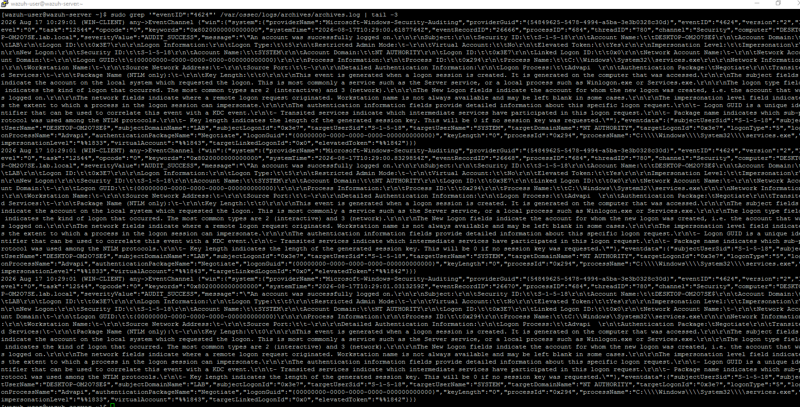
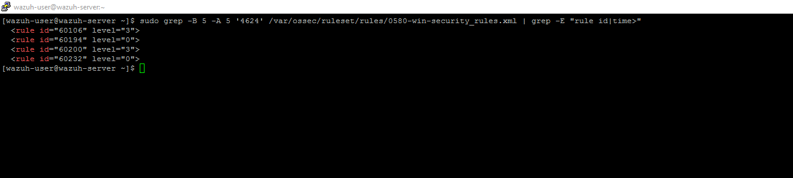
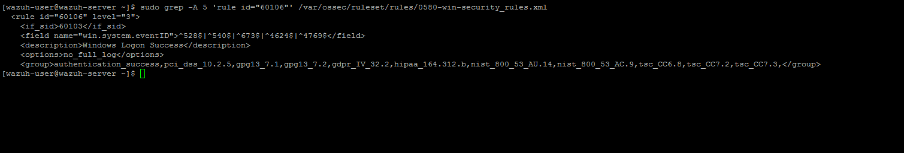
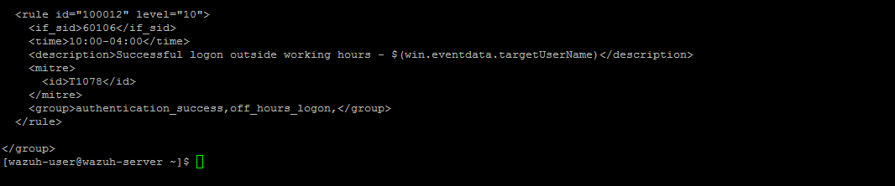
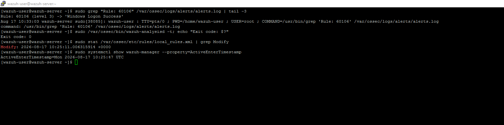
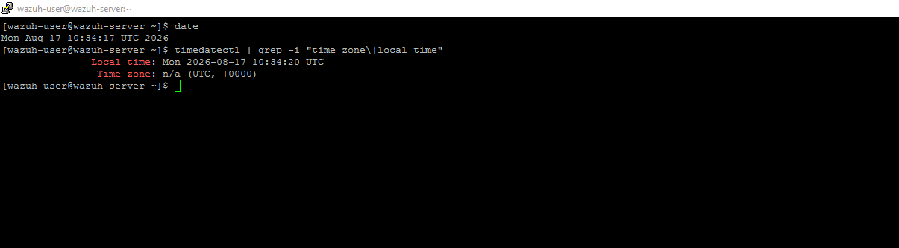
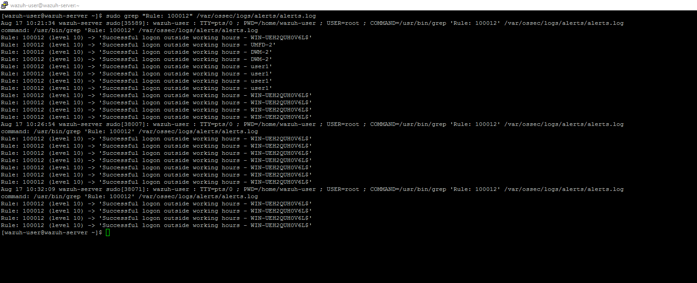
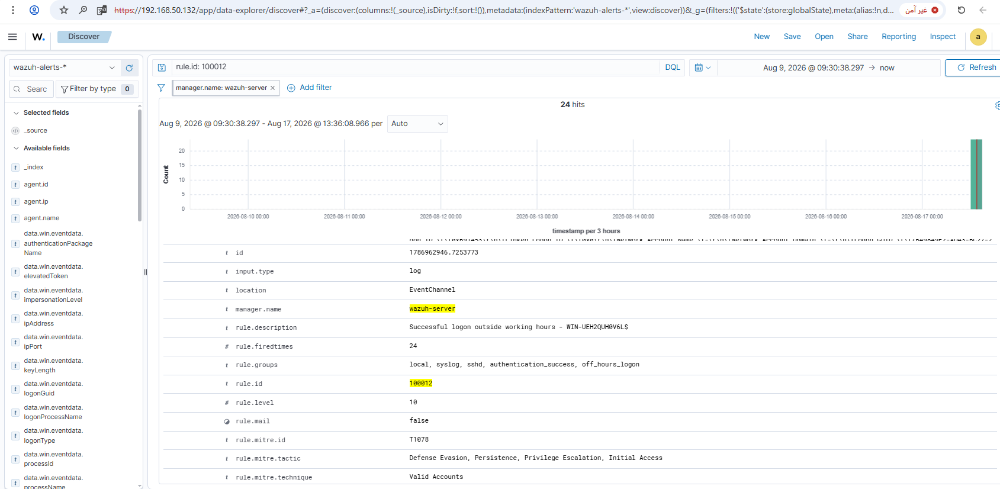

# Rule 07 - Successful Logon Outside Working Hours

**Status:** ✅ Built and tested

## Overview

Detects a successful logon (Event 4624) that happens outside working hours. The event itself is totally normal, thousands happen every day. What matters is the timing, not the fact that it happened. Needed a custom rule with Wazuh's `<time>` filter, and this one taught me something about timezones the hard way.

| Field | Value |
|---|---|
| Log Source | Windows Security Event Log (DC01) |
| Event ID | 4624 (time-filtered) |
| Wazuh Rule ID | 100012 (custom) |
| Rule Description | Successful logon outside working hours - $(win.eventdata.targetUserName) |
| Rule Level | 10 |
| MITRE ATT&CK | T1078 - Valid Accounts (tactics: Defense Evasion, Persistence, Privilege Escalation, Initial Access) |
| ECC Control | 2-12-3-4 |

## The Custom Rule

```xml
<rule id="100012" level="10">
  <if_sid>60106</if_sid>
  <time>10:00-04:00</time>
  <description>Successful logon outside working hours - $(win.eventdata.targetUserName)</description>
  <mitre>
    <id>T1078</id>
  </mitre>
  <group>authentication_success,off_hours_logon,</group>
</rule>
```

To add this rule directly to `local_rules.xml`:

```bash
sudo sed -i '$i\
<rule id="100012" level="10">\
  <if_sid>60106</if_sid>\
  <time>10:00-04:00</time>\
  <description>Successful logon outside working hours - $(win.eventdata.targetUserName)</description>\
  <mitre>\
    <id>T1078</id>\
  </mitre>\
  <group>authentication_success,off_hours_logon,</group>\
</rule>' /var/ossec/etc/rules/local_rules.xml
sudo grep -A 8 'id="100012"' /var/ossec/etc/rules/local_rules.xml
```

The `<time>` value is written in **UTC**, not local time - see the root cause below for why.

## Root Cause - Timezone Mismatch (Troubleshooting)

First wrote it as `<time>13:00-07:00</time>`, meaning "after 1 PM Riyadh, before 7 AM Riyadh." Logged in at 1:16 PM Riyadh time, which should've been outside working hours, but the rule didn't fire.

Turned out Wazuh's `<time>` filter checks the manager's own clock, not Riyadh time. SIEM-SRV runs on UTC, and Riyadh is UTC+3, so 1:16 PM Riyadh was really only 10:16 AM on the manager, still inside the working-hours window I'd set. Rewrote the range in UTC and it worked right away.

## Lessons Learned

Wazuh's `<time>` filter uses the manager's own clock (UTC here), not local time - convert ranges to UTC first.

## Simulation Steps

1. Confirmed Event 4624 (successful logon) reaches SIEM-SRV normally.
2. Searched for an existing Wazuh rule using `<time>` for this event - none found, so a custom rule was needed.
3. Found the general "logon success" rule (60106) to build on top of.
4. Wrote the custom rule with a Riyadh-time range, tested it, and it did not fire.
5. Diagnosed the manager's actual clock and found it runs on UTC, not Riyadh time.
6. Rewrote the `<time>` range in UTC and restarted the manager.
7. Logged in again and confirmed the alert fired.
8. Confirmed in Wazuh Dashboard.

## Evidence

1. Confirming Event 4624 reaches the server normally - this is just to make sure the raw event exists before building a rule around it.

```
sudo grep '"eventID":"4624"' /var/ossec/logs/archives/archives.log | tail -3
```



2. Checking if any ready-made rule already filters this event by time - none did, so a custom rule was the only option.

```
sudo grep -B 5 -A 5 '4624' /var/ossec/ruleset/rules/0580-win-security_rules.xml | grep -E "rule id|time>"
```



3. Checking the general logon-success rule (60106) to use as the parent for our custom rule.

```
sudo grep -A 5 'rule id="60106"' /var/ossec/ruleset/rules/0580-win-security_rules.xml
```



4. Adding the custom rule (100012) to `local_rules.xml`.

```
sudo cat /var/ossec/etc/rules/local_rules.xml
```



5. First test didn't fire - checking the underlying rule (60106) still works, the rule syntax is valid, and the restart actually happened after the edit. All came back fine, so the problem had to be somewhere else.

```
sudo grep "Rule: 60106" /var/ossec/logs/alerts/alerts.log | tail -3
sudo /var/ossec/bin/wazuh-analysisd -t; echo "Exit code: $?"
sudo stat /var/ossec/etc/rules/local_rules.xml | grep Modify
sudo systemctl show wazuh-manager --property=ActiveEnterTimestamp
```



6. Checking the server's actual clock - found it runs on UTC, not Riyadh time. This was the real problem.

```
date
timedatectl | grep -i "time zone\|local time"
```



7. After rewriting the time range in UTC and logging in again, the alert fired correctly for real user and system accounts.

```
sudo grep "Rule: 100012" /var/ossec/logs/alerts/alerts.log
```



8. Confirmed in Wazuh Dashboard - 24 hits total, correctly tagged with MITRE T1078.

```
rule.id: 100012
```



Screenshots stored in `screenshots/rules/rule-07-off-hours-logon/`.

## False Positive Testing

Not yet repeated across multiple sessions. Worth revisiting once real working-hours are finalized - this lab used 07:00-13:00 as a placeholder schedule, narrower than a typical real workday, purely to make same-day testing possible.
