# Rule 08 - GPO Changed Outside Normal Maintenance Window

**Status:** ✅ Built and tested

## Overview

Detects when a Group Policy Object (GPO) gets changed on the domain controller (say, a password policy setting), but specifically when it happens outside a set maintenance window. GPO changes hit every computer and user the policy applies to, so an unauthorized or off-schedule change here is a big deal. This one needed two parts: first just getting the raw event to reach the SIEM at all (more work than usual), then a time-filtered rule on top of that.

| Field | Value |
|---|---|
| Log Source | Windows Security Event Log (DC01) |
| Event ID | 5136 |
| Base Wazuh Rule | 60229 (built-in - `A directory service object was modified`, level 4) |
| Custom Wazuh Rule ID | 100013 (custom, in `local_rules.xml`) |
| Rule Description | GPO modified outside maintenance window |
| Rule Level | 10 |
| Maintenance Window (lab definition) | 17:00-24:00 Riyadh time = safe, no alert. Everything else (00:00-17:00 Riyadh) = alert. |
| MITRE ATT&CK | T1484 - Domain Policy Modification (future improvement: the sub-technique T1484.001 - Group Policy Modification - would be more precise for this specific scenario) |
| ECC Control | 2-12-3-1 |

## The Custom Rule

```xml
<rule id="100013" level="10">
  <if_sid>60229</if_sid>
  <time>21:00-14:00</time>
  <description>GPO modified outside maintenance window</description>
  <mitre>
    <id>T1484</id>
  </mitre>
  <group>gpo_change,off_hours_change,</group>
</rule>
```

To add this rule directly to `local_rules.xml`:

```bash
sudo sed -i '$i\
<rule id="100013" level="10">\
  <if_sid>60229</if_sid>\
  <time>21:00-14:00</time>\
  <description>GPO modified outside maintenance window</description>\
  <mitre>\
    <id>T1484</id>\
  </mitre>\
  <group>gpo_change,off_hours_change,</group>\
</rule>' /var/ossec/etc/rules/local_rules.xml
sudo grep -A 8 'id="100013"' /var/ossec/etc/rules/local_rules.xml
```

The `<time>` value is written in **UTC**, not Riyadh local time - same lesson as Rule 07. Maintenance window (safe) = 17:00-midnight Riyadh = 14:00-21:00 UTC. Everything else is the alert window, which converts to the wraparound range `21:00-14:00` used in the rule.

## Part 1 - Getting the Raw Event to Reach the SIEM

Unlike every other rule in this project, Event 5136 doesn't fire just because the general Security audit policy is on. It needs two separate things enabled:

1. **The "Directory Service Changes" audit subcategory must be enabled** (a different category than "Account Management" used by Rules 01-05):
   ```
   auditpol /get /subcategory:"Directory Service Changes"
   ```
   Came back `No Auditing` by default - fixed with:
   ```
   auditpol /set /subcategory:"Directory Service Changes" /success:enable
   ```

2. **The GPO object itself needs a SACL** (System Access Control List) - an explicit audit entry saying "log Success attempts by Everyone". The GUI method (Group Policy Management → GPO Properties → Security → Advanced → Auditing) didn't match the expected menu layout on this Windows Server build. Used PowerShell instead:
   ```powershell
   Import-Module ActiveDirectory
   $gpo = Get-GPO -Name "Default Domain Policy"
   $gpoPath = "AD:\" + $gpo.Path
   $acl = Get-Acl $gpoPath
   $identity = New-Object System.Security.Principal.NTAccount("Everyone")
   $adRights = [System.DirectoryServices.ActiveDirectoryRights]::GenericAll
   $auditFlags = [System.Security.AccessControl.AuditFlags]::Success
   $inheritanceType = [System.DirectoryServices.ActiveDirectorySecurityInheritance]::None
   $rule = New-Object System.DirectoryServices.ActiveDirectoryAuditRule($identity, $adRights, $auditFlags, $inheritanceType)
   $acl.AddAuditRule($rule)
   Set-Acl -Path $gpoPath -AclObject $acl
   ```
   First attempt failed with `Cannot find drive. A drive with the name 'AD' does not exist` - the Active Directory PowerShell module wasn't loaded in that session. Fixed by running `Import-Module ActiveDirectory` first, then re-running the full script - it succeeded with no errors.

## Part 2 - Finding the Base Rule and Building the Time Filter

Once the raw event reached the SIEM and started generating alerts against a built-in rule (visible in the dashboard as `rule.id: 60229`, level 4), the base rule ID was confirmed directly on the server:

```
sudo grep -B2 -A5 'rule id="60229"' /var/ossec/ruleset/rules/0580-win-security_rules.xml
```

```xml
<rule id="60229" level="4">
  <if_sid>60103</if_sid>
  <field name="win.system.eventID">^5136$</field>
  <description>A directory service object was modified</description>
  <options>no_full_log</options>
  <mitre>
    ...
```

With the base rule confirmed, rule 100013 was written as a child of 60229 with the `<time>` filter added, following the same pattern as Rule 07.

## Troubleshooting - The Rule Wasn't Actually Saved

First test on rule 100013: nothing happened. No alert, no error either. Spent a good while checking things - base rule 60229 was still firing fine, `wazuh-analysisd -t` said the syntax was valid, checked the manager's restart time, checked for UTC drift, even tried `wazuh-logtest` (which failed at the decoder stage because of a bad paste of the JSON event, unrelated red herring).

The real answer only showed up once I asked to see the full contents of `local_rules.xml` again: rule 100013 was never actually in there. An earlier edit through `nano` looked like it worked, but never actually got saved - the file only had rules 100001 and 100010-100012 the whole time. Every check I'd been doing was chasing a rule that didn't exist.

Added it again with a direct `sed` command, checked with `grep -A6 '100013' local_rules.xml` right away to be sure it actually stuck, and it fired correctly on the next test.

## Simulation Steps

1. Confirmed `Directory Service Changes` audit subcategory was disabled by default (`No Auditing`).
2. Enabled it via `auditpol /set /subcategory:"Directory Service Changes" /success:enable`.
3. Added a Success SACL for Everyone on the `Default Domain Policy` GPO object via PowerShell (after fixing the missing `ActiveDirectory` module).
4. Edited the GPO (changed `Minimum password length` multiple times across the session) to trigger modifications.
5. Confirmed Event 5136 reached `archives.log`, then confirmed the built-in rule 60229 was generating alerts (visible in dashboard, `rule.id: 60229`).
6. Identified 60229 as the correct parent rule via `grep` on the ruleset file.
7. Added custom rule 100013 (`if_sid: 60229`, `<time>21:00-14:00</time>`) to `local_rules.xml`.
8. First test showed no alert - extensive diagnosis (base rule, syntax check, restart timing, manager clock, `wazuh-logtest`) before discovering the rule was never actually saved to the file.
9. Re-added the rule directly via `sed`, verified with `grep` that it was present in the file, validated syntax (`wazuh-analysisd -t` → exit 0), and restarted the manager.
10. Triggered a new GPO change and confirmed the alert fired immediately.
11. Confirmed in Wazuh Dashboard - 4 hits for `rule.id: 100013`, correctly tagged with MITRE T1484 (Domain Policy Modification).

## Evidence

Full walkthrough, in the exact order it happened - Part 1 (getting the raw event to reach the SIEM) followed by Part 2 (building and testing the time-filtered custom rule).

### Part 1 - Getting the Raw Event to Reach the SIEM

**Step 1 - Open Group Policy Management and locate the Default Domain Policy.**

*(GUI action - no command; navigated via Group Policy Management console.)*

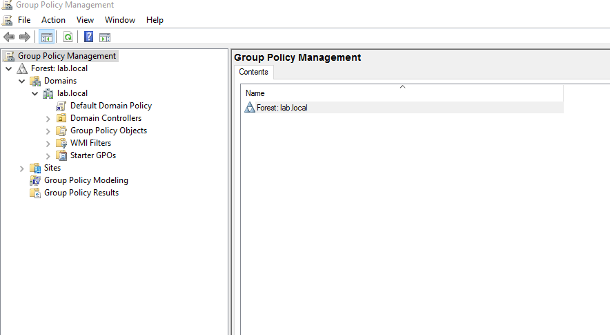

**Step 2 - Check the Password Policy before any change.** Baseline: `Minimum password length: 7 characters`.

*(GUI action - no command; Group Policy Management Editor → Password Policy.)*

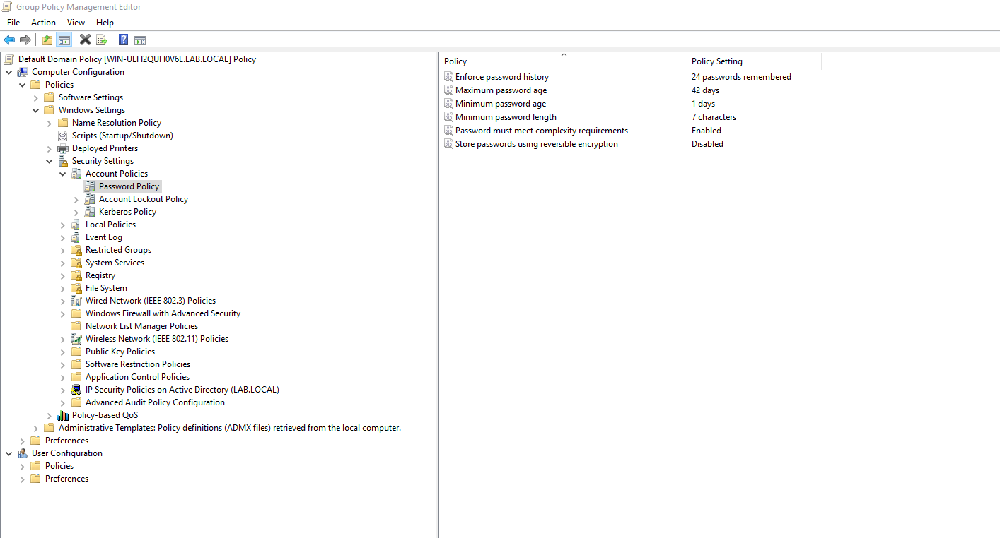

**Step 3 - First trigger change.** Set `Minimum password length` to 5 characters to generate a GPO modification.

*(GUI action - no command; edited the value directly in the Password Policy screen.)*

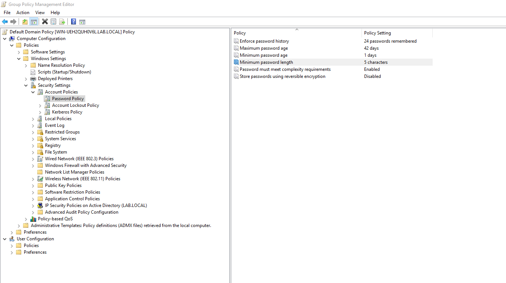

**Step 4 - Check `archives.log` right after the first change.** No results yet, as expected - the `Directory Service Changes` audit subcategory was still disabled at this point.

```
sudo grep '"eventID":"5136"' /var/ossec/logs/archives/archives.log | tail -3
```

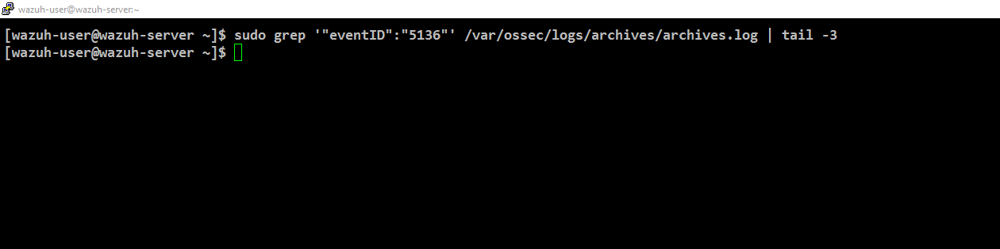

**Step 5 - Confirm the audit subcategory status.**

```
auditpol /get /subcategory:"Directory Service Changes"
```

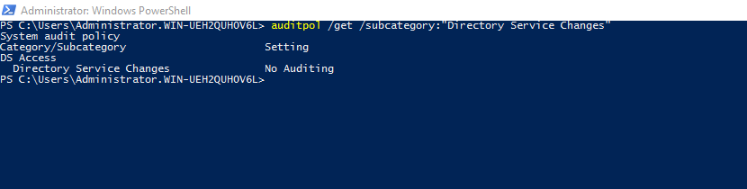

**Step 6 - Enable the subcategory.**

```
auditpol /set /subcategory:"Directory Service Changes" /success:enable
```

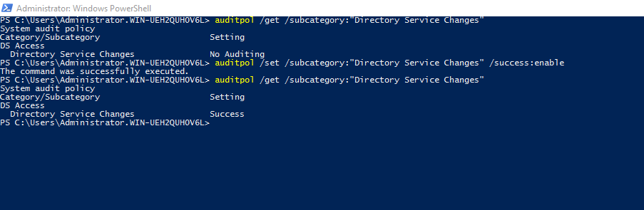

**Step 7 - First attempt at adding a SACL to the GPO object via PowerShell.** Failed - the Active Directory module wasn't loaded yet.

```powershell
Import-Module ActiveDirectory
$gpo = Get-GPO -Name "Default Domain Policy"
$gpoPath = "AD:\" + $gpo.Path
$acl = Get-Acl $gpoPath
$identity = New-Object System.Security.Principal.NTAccount("Everyone")
$adRights = [System.DirectoryServices.ActiveDirectoryRights]::GenericAll
$auditFlags = [System.Security.AccessControl.AuditFlags]::Success
$inheritanceType = [System.DirectoryServices.ActiveDirectorySecurityInheritance]::None
$rule = New-Object System.DirectoryServices.ActiveDirectoryAuditRule($identity, $adRights, $auditFlags, $inheritanceType)
$acl.AddAuditRule($rule)
Set-Acl -Path $gpoPath -AclObject $acl
```

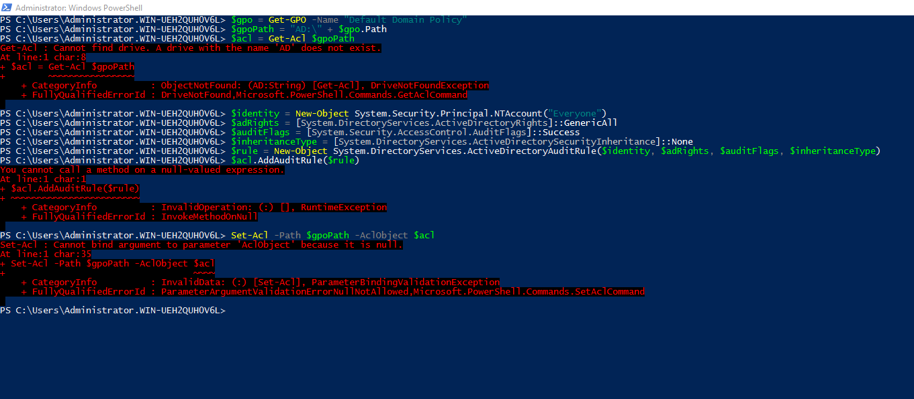

**Step 8 - Load the missing module.**

```powershell
Import-Module ActiveDirectory
```

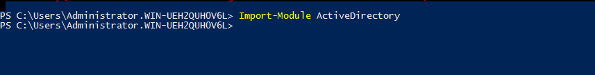

**Step 9 - Re-run the full SACL script.** Succeeded with no errors this time.

```powershell
$gpo = Get-GPO -Name "Default Domain Policy"
$gpoPath = "AD:\" + $gpo.Path
$acl = Get-Acl $gpoPath
$identity = New-Object System.Security.Principal.NTAccount("Everyone")
$adRights = [System.DirectoryServices.ActiveDirectoryRights]::GenericAll
$auditFlags = [System.Security.AccessControl.AuditFlags]::Success
$inheritanceType = [System.DirectoryServices.ActiveDirectorySecurityInheritance]::None
$rule = New-Object System.DirectoryServices.ActiveDirectoryAuditRule($identity, $adRights, $auditFlags, $inheritanceType)
$acl.AddAuditRule($rule)
Set-Acl -Path $gpoPath -AclObject $acl
```

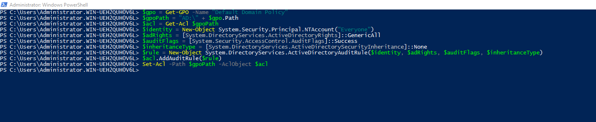

**Step 10 - Re-check the Password Policy screen** (still at 5 characters) before triggering a fresh change.

*(GUI action - no command; Group Policy Management Editor → Password Policy.)*


**Step 11 - Second trigger change.** Set `Minimum password length` to 3 characters, now that auditing and the SACL are both in place.

*(GUI action - no command; edited the value directly in the Password Policy screen.)*

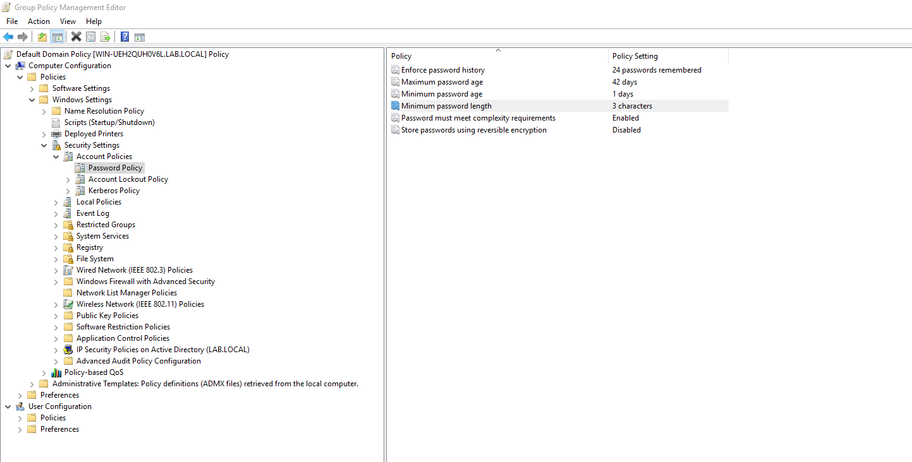

**Step 12 - Confirm `archives.log` now shows real Event 5136 entries** - `Added`/`Deleted` operations with `versionNumber` incrementing (6 → 7).

```
sudo grep '"eventID":"5136"' /var/ossec/logs/archives/archives.log | tail -3
```

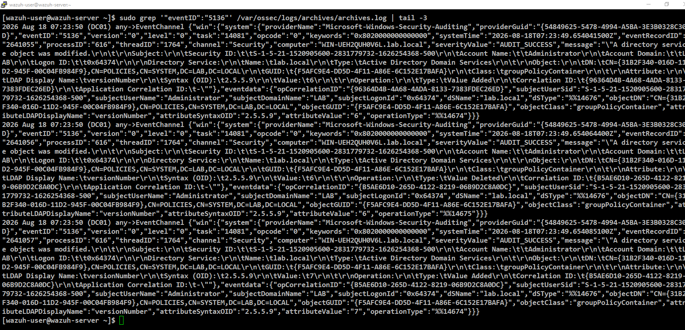

**Step 13 - Confirm in Wazuh Dashboard.** Filter `data.win.system.eventID: 5136` on the `wazuh-alerts-*` index - returns 4 hits, confirming an alert (not just a raw log entry) is being generated.

```
data.win.system.eventID: 5136
```

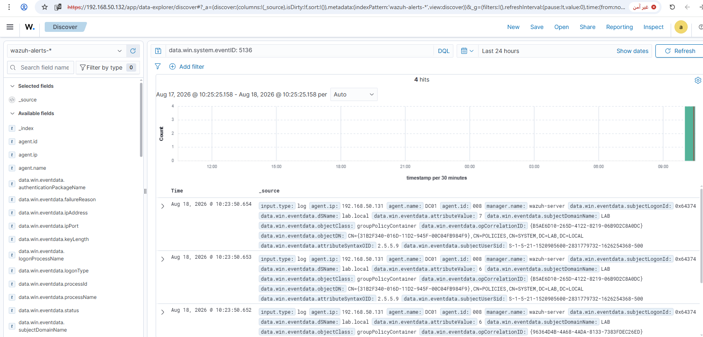

**Step 14 - Expand the alert** to confirm the full event detail (`eventID: 5136`, subject, object, computer).

*(GUI action - no command; expanded the row in Discover.)*

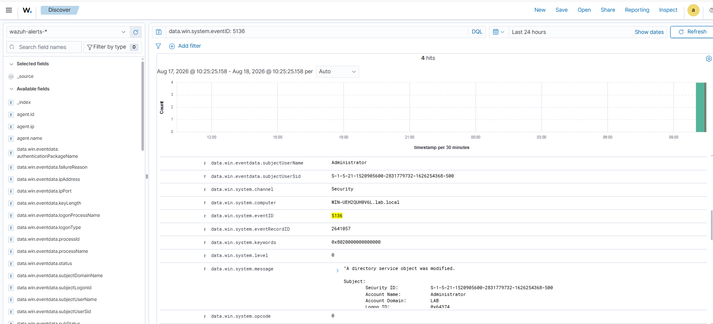

### Part 2 - Building and Testing the Time-Filtered Custom Rule

**Step 15 - Confirm the built-in rule (60229) was already generating alerts** for Event 5136, before the custom rule existed.

```
rule.id: 60229
```

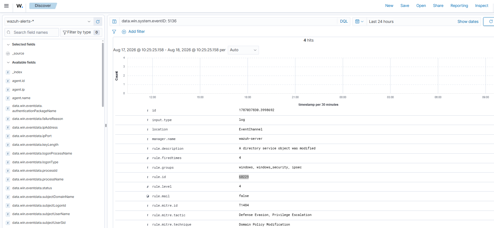

**Step 16 - Look up the base rule's definition** directly in the ruleset to confirm the correct `if_sid` to build on.

```
sudo grep -B2 -A5 'rule id="60229"' /var/ossec/ruleset/rules/0580-win-security_rules.xml
```

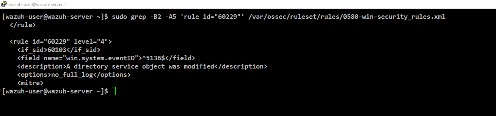

**Step 17 - Add custom rule 100013 to `local_rules.xml`.**

```xml
<rule id="100013" level="10">
  <if_sid>60229</if_sid>
  <time>21:00-14:00</time>
  <description>GPO modified outside maintenance window</description>
  <mitre>
    <id>T1484</id>
  </mitre>
  <group>gpo_change,off_hours_change,</group>
</rule>
```

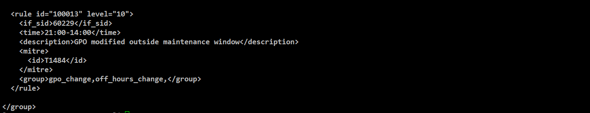

**Step 18 - Confirm the rule is present in the file and the ruleset syntax is valid.**

```
sudo grep -A6 '100013' /var/ossec/etc/rules/local_rules.xml
sudo /var/ossec/bin/wazuh-analysisd -t; echo "Exit code: $?"
```

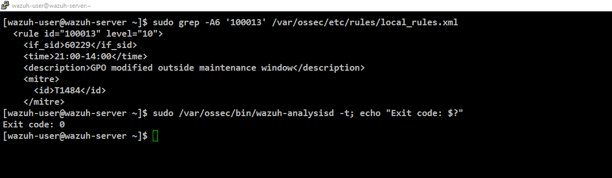

**Step 19 - Early troubleshooting attempts** before discovering the rule had never actually been saved - repeated `grep` checks for `Rule: 100013` in `alerts.log` came back empty.

```
sudo grep "Rule: 100013" /var/ossec/logs/alerts/alerts.log | tail -3
```

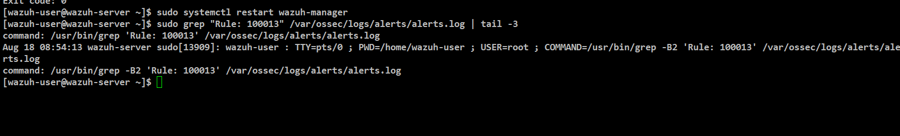

**Step 20 - Root cause found.** Confirmed the rule was genuinely present in the file, restarted the manager, and the first real alert fired correctly.

```
sudo systemctl restart wazuh-manager
sudo systemctl status wazuh-manager | grep -i active
sudo grep -B2 "Rule: 100013" /var/ossec/logs/alerts/alerts.log | grep "^20"
```

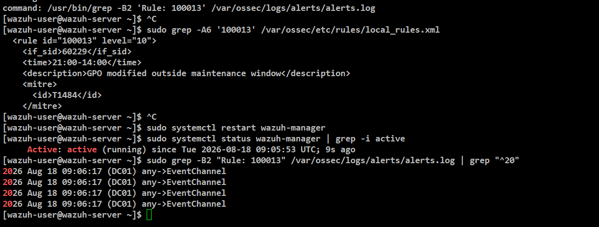

**Step 21 - Confirm in Wazuh Dashboard.** 4 hits for `rule.id: 100013`.

```
rule.id: 100013
```

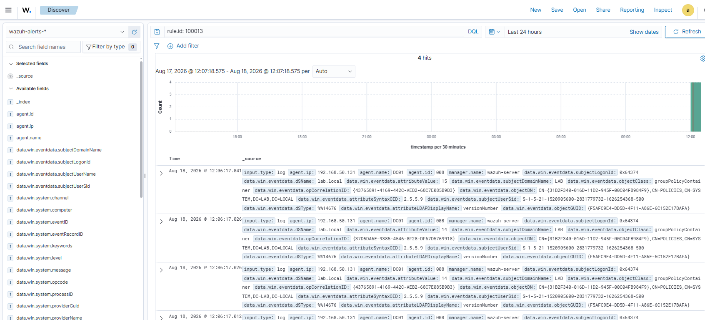

**Step 22 - Expand the alert.** Confirms `rule.description`, `rule.level: 10`, and `rule.mitre.id: T1484`.

*(GUI action - no command; expanded the row in Discover.)*

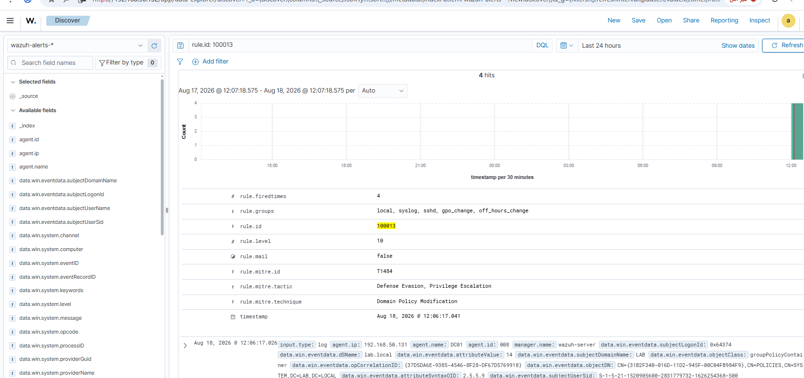

Screenshots stored in `screenshots/rules/rule-08-gpo-modified/part1-detection/` (Steps 1-14) and `screenshots/rules/rule-08-gpo-modified/` (Steps 15-22).

## Lessons Learned

- Some events (like DS Access) need their own audit subcategory + an explicit SACL, not just general auditing.
- Check the rule file directly before chasing timezone/syntax theories - an edit can silently fail to save.

## False Positive Testing

Not yet performed - noted for future testing. Worth testing a GPO change made *after* 17:00 Riyadh time to confirm the rule correctly stays silent inside the maintenance window.
