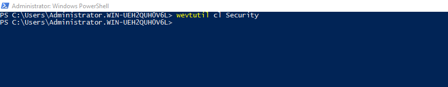
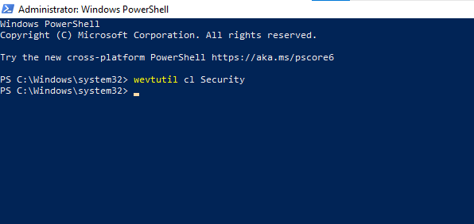
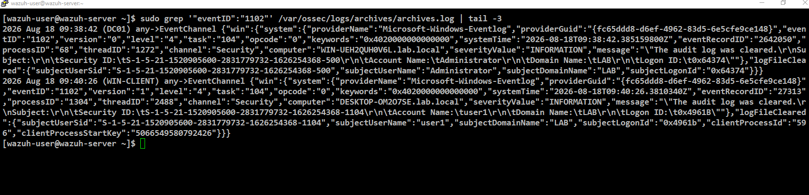
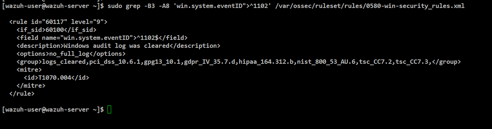
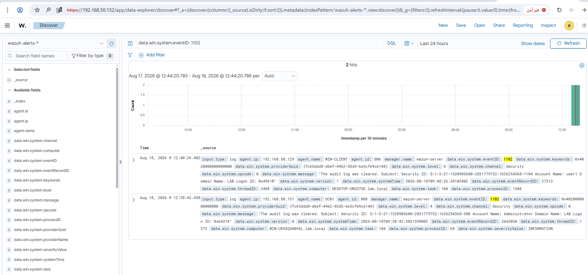
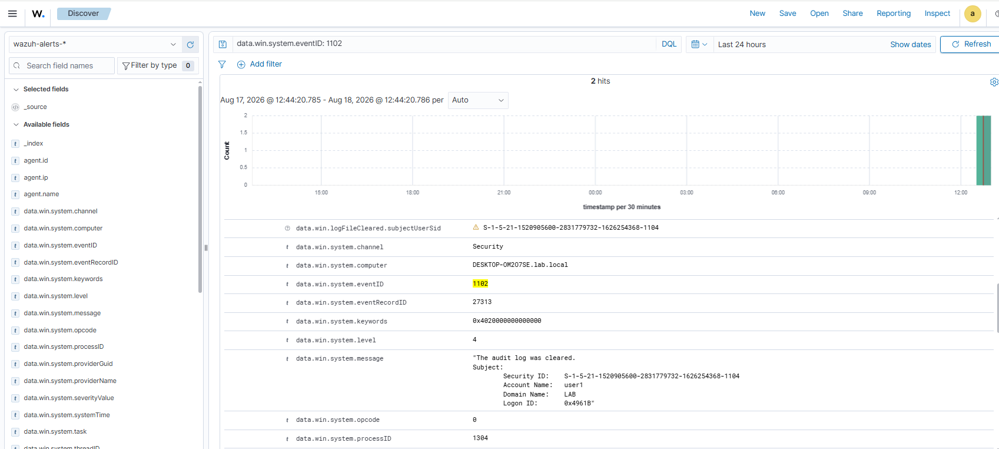
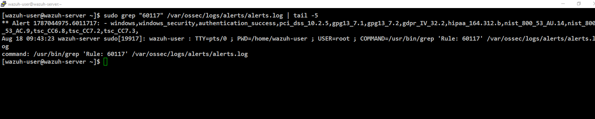
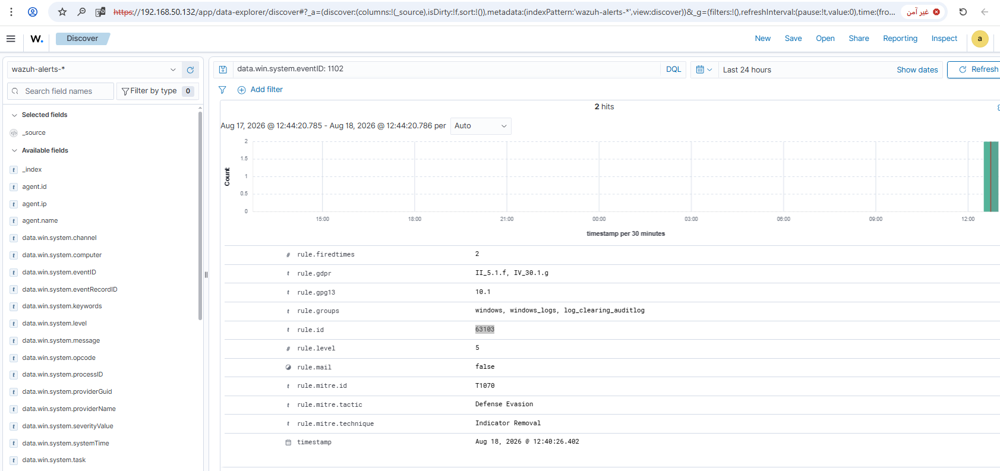
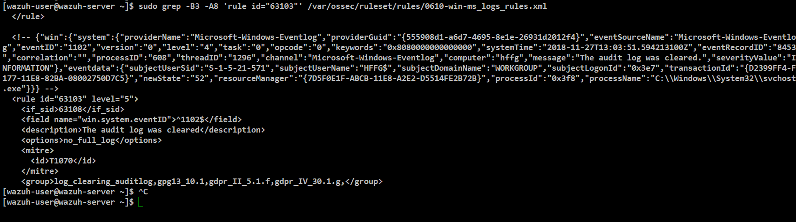

# Rule 09 - Event Log Cleared (Covering Tracks)

**Status:** ✅ Built and tested

## Overview

Detects the Windows Security Event Log itself getting wiped (Event 1102) - a classic move to cover tracks after doing something malicious. Unlike most rules here, this event is rare enough on its own in normal use that it's treated as suspicious just by happening, no threshold or time filter needed. Tested it on both DC01 and WIN-CLIENT to make sure the built-in rule covers the whole domain, not just one box.

| Field | Value |
|---|---|
| Log Source | Windows Security Event Log (DC01 + WIN-CLIENT) |
| Event ID | 1102 |
| Wazuh Rule ID | 63103 (built-in - `The audit log was cleared`, level 5) |
| Rule Description | The audit log was cleared |
| Rule Level | 5 |
| MITRE ATT&CK | T1070 - Indicator Removal |
| ECC Control | 2-12-3-1, 2-12-3-4 |

No custom rule was needed - Wazuh already ships a built-in rule that matches this event exactly, similar to Rule 05.

## Lessons Learned

Don't trust a ruleset text search alone - confirm the actual firing `rule.id` directly on a real alert (a similar-looking rule can be a false lead).

## Simulation Steps

1. Ran `wevtutil cl Security` on DC01 to clear its Security log.
2. Ran `wevtutil cl Security` on WIN-CLIENT to clear its Security log.
3. Confirmed both Event 1102 entries reached `archives.log` (one per host).
4. Searched the ruleset for a matching rule by event ID - found rule 60117 as an apparent candidate.
5. Confirmed in Wazuh Dashboard - 2 hits for `data.win.system.eventID: 1102`, one from each host.
6. Expanded the WIN-CLIENT event to inspect full detail.
7. Checked `alerts.log` for rule 60117 - the match returned was an unrelated alert, meaning 60117 never actually fired for this event.
8. Went back to the dashboard, expanded the real alert, and read `rule.id` directly - confirmed the actual firing rule was 63103.
9. Looked up rule 63103's definition in the ruleset to confirm the match (event ID, description, MITRE mapping all align).

## Evidence

**Step 1 - Clear the Security log on DC01.**

```powershell
wevtutil cl Security
```



**Step 2 - Clear the Security log on WIN-CLIENT.**

```powershell
wevtutil cl Security
```



**Step 3 - Confirm both events reached `archives.log`.**

```
sudo grep '"eventID":"1102"' /var/ossec/logs/archives/archives.log | tail -3
```



**Step 4 - Search the ruleset for a candidate matching rule.** This first turned up rule 60117 - later found to *not* be the rule that actually fires (see Lesson above).

```
sudo grep -B3 -A8 'win.system.eventID">^1102' /var/ossec/ruleset/rules/0580-win-security_rules.xml
```



**Step 5 - Confirm in Wazuh Dashboard.** 2 hits for `data.win.system.eventID: 1102`, one from each host.

```
data.win.system.eventID: 1102
```



**Step 6 - Expand the WIN-CLIENT event to inspect full detail.**

*(GUI action - no command; expanded the row in Discover.)*



**Step 7 - Check `alerts.log` for rule 60117.** The result matched an unrelated authentication alert - not the log-clearing event - confirming 60117 was the wrong rule.

```
sudo grep "60117" /var/ossec/logs/alerts/alerts.log | tail -5
```



**Step 8 - Expand the real alert in the dashboard and read `rule.id` directly.** Confirmed the actual firing rule: `rule.id: 63103`, `rule.level: 5`, `rule.mitre.id: T1070`, `rule.description: The audit log was cleared`.

*(GUI action - no command; expanded the row in Discover and read the field list.)*



**Step 9 - Look up rule 63103's definition in the ruleset to confirm the match.**

```
sudo grep -B3 -A8 'rule id="63103"' /var/ossec/ruleset/rules/0610-win-ms_logs_rules.xml
```



Screenshots stored in `screenshots/rules/rule-09-log-cleared/`.

## False Positive Testing

Not yet performed - noted for future testing. Since 1102 is rare in this lab's normal operation, false positives should be minimal, but worth checking against legitimate maintenance activity (e.g. scheduled log rotation, if any is ever configured) later on.
