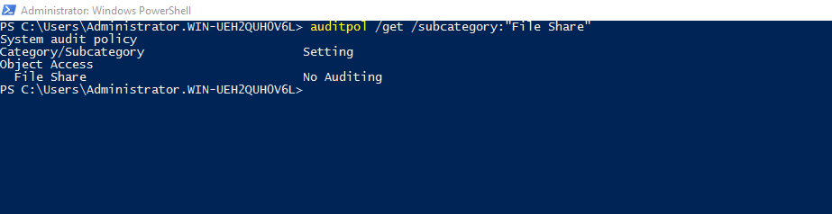
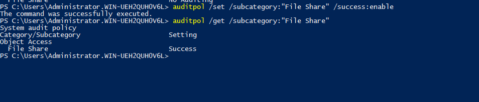
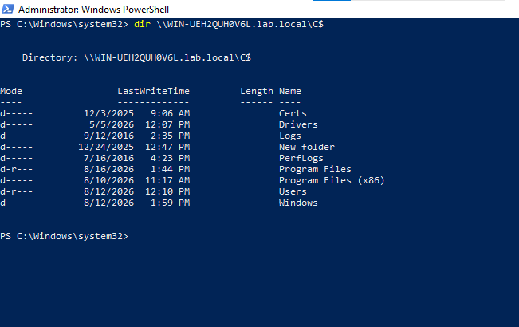
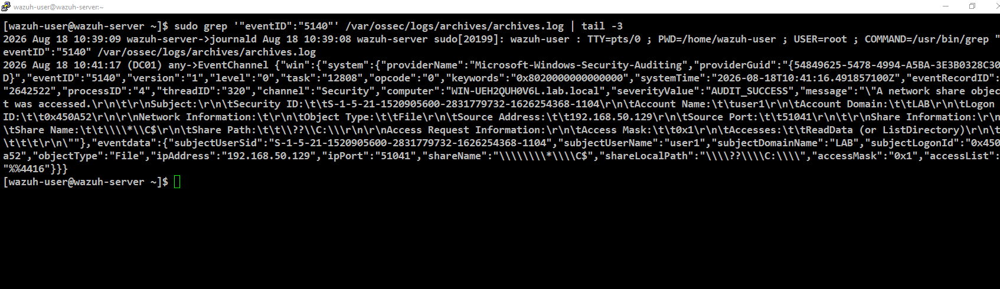
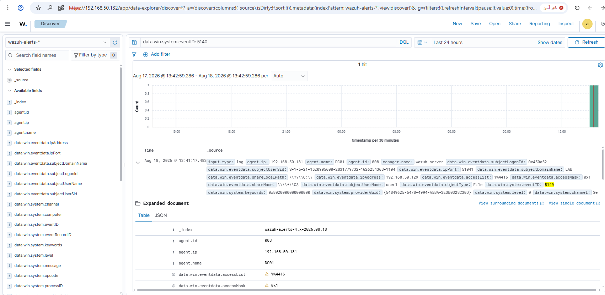

# Rule 10 - Access to Admin Share (ADMIN$ / C$)

**Status:** ✅ Built and tested

## Overview

Detects remote access to a hidden admin share (like `\\DC01\C$` or `\\DC01\ADMIN$`) - a common lateral movement move, used to drop tools on a remote machine or reach system files without logging in interactively. Tested by hitting DC01's `C$` share remotely from WIN-CLIENT.

| Field | Value |
|---|---|
| Log Source | Windows Security Event Log (DC01) |
| Event ID | 5140 |
| Wazuh Rule ID | 67017 (built-in - `A network share was accessed`, level 3) |
| Rule Description | A network share was accessed. |
| Rule Level | 3 |
| MITRE ATT&CK | T1021.002 - Remote Services: SMB/Windows Admin Shares |
| ECC Control | 2-2-3-3 |

No custom rule was needed - Wazuh already ships a built-in rule that matches this event.

## Lessons Learned

Same as Rule #08: Event 5140 needs its own audit subcategory ("File Share") enabled - general auditing isn't enough.

## Simulation Steps

1. On DC01, checked the `File Share` audit subcategory - found disabled (`No Auditing`) by default.
2. Enabled it via `auditpol /set /subcategory:"File Share" /success:enable`.
3. From WIN-CLIENT, accessed DC01's `C$` share remotely: `dir \\WIN-UEH2QUH0V6L.lab.local\C$`.
4. Confirmed Event 5140 reached `archives.log`, with `Source Address: 192.168.50.129` (WIN-CLIENT) confirming the access was genuinely remote.
5. Confirmed in Wazuh Dashboard - 1 hit for `data.win.system.eventID: 5140`, and read the fired rule's fields directly rather than guessing from a ruleset search (lesson from Rule 09): `rule.id: 67017`, `rule.description: A network share was accessed.`, `rule.level: 3`, `rule.mitre.id: T1021.002`.

## Evidence

**Step 1 - Check the `File Share` audit subcategory on DC01.**

```powershell
auditpol /get /subcategory:"File Share"
```



**Step 2 - Enable the subcategory.**

```powershell
auditpol /set /subcategory:"File Share" /success:enable
```



**Step 3 - From WIN-CLIENT, access DC01's `C$` share remotely.**

```powershell
dir \\WIN-UEH2QUH0V6L.lab.local\C$
```



**Step 4 - Confirm Event 5140 reached `archives.log`.** `Source Address: 192.168.50.129` confirms the access came from WIN-CLIENT, not locally.

```
sudo grep '"eventID":"5140"' /var/ossec/logs/archives/archives.log | tail -3
```



**Step 5 - Confirm in Wazuh Dashboard.** 1 hit for `data.win.system.eventID: 5140`.

```
data.win.system.eventID: 5140
```



**Step 6 - Read the fired rule's fields directly.** Expanding the alert's `rule.*` fields (not shown in a separate screenshot, read directly from the same expanded row above) confirmed:

| Field | Value |
|---|---|
| `rule.id` | 67017 |
| `rule.description` | A network share was accessed. |
| `rule.level` | 3 |
| `rule.mitre.id` | T1021.002 |

Screenshots stored in `screenshots/rules/rule-10-admin-share-access/`.

## False Positive Testing

Not yet performed - noted for future testing. `C$`/`ADMIN$` access also happens legitimately (backup agents, remote admin tools, some monitoring software), so this rule will likely need allowlisting by source IP or account in a real environment. Worth revisiting once normal admin tooling in this lab is defined.
