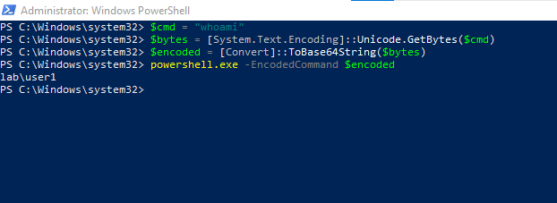
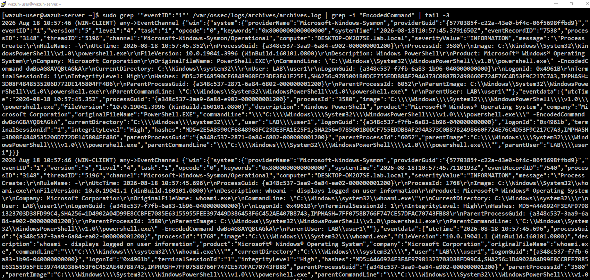
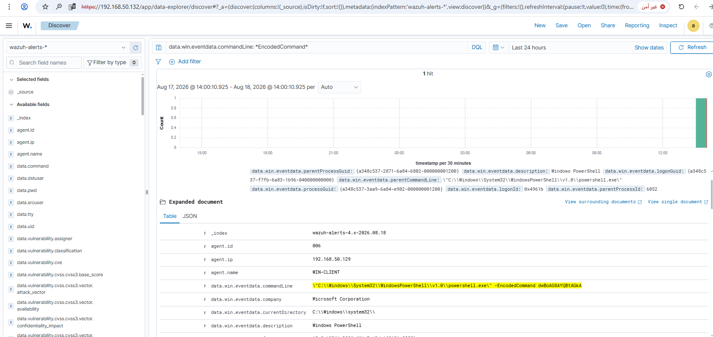

# Rule 11 - Encoded PowerShell Execution (`-EncodedCommand`)

**Status:** ✅ Built and tested

## Overview

Detects PowerShell launching with `-EncodedCommand`, a Base64-encoded string. It's a common trick to dodge plain-text command-line detection, since the real command isn't visible as-is. This is the first rule in the project that uses Sysmon instead of the plain Windows Security log - Sysmon Event ID 1 (Process Creation) captures the full command line, encoded payload and all, plus the parent-to-child process chain.

| Field | Value |
|---|---|
| Log Source | Sysmon (WIN-CLIENT) |
| Sysmon Event ID | 1 (Process Creation) |
| Wazuh Rule ID | 92057 (built-in - `Powershell.exe spawned a powershell process which executed a base64 encoded command`, level 12) |
| Rule Description | Powershell.exe spawned a powershell process which executed a base64 encoded command |
| Rule Level | 12 |
| MITRE ATT&CK | T1059.001 - Command and Scripting Interpreter: PowerShell (tactic: Execution) |
| ECC Control | 2-3-3-1, 2-12-3-1 |

No custom rule was needed - Wazuh already ships a built-in rule that matches this pattern directly, and at a notably higher level (12) than most rules built so far, reflecting how strong a signal `-EncodedCommand` is.

## Simulation Steps

1. From WIN-CLIENT, ran PowerShell with a Base64-encoded `whoami` command via `-EncodedCommand`.
2. Confirmed Sysmon Event 1 reached `archives.log`, showing the full process chain: `powershell.exe -EncodedCommand ...` as parent, spawning `whoami.exe` as child.
3. Confirmed in Wazuh Dashboard - filtering on the command line returned 1 hit, and reading the fired rule's fields directly (not guessing from a ruleset search) confirmed: `rule.id: 92057`, `rule.level: 12`, `rule.mitre.id: T1059.001`.

## Evidence

**Step 1 - Run PowerShell with a Base64-encoded command on WIN-CLIENT.**

```powershell
$cmd = "whoami"
$bytes = [System.Text.Encoding]::Unicode.GetBytes($cmd)
$encoded = [Convert]::ToBase64String($bytes)
powershell.exe -EncodedCommand $encoded
```



**Step 2 - Confirm the event reached `archives.log`.** Shows the full process chain - `powershell.exe -EncodedCommand dwBoAG8AYQBtAGkA` as parent, spawning `whoami.exe` as child.

```
sudo grep '"eventID":"1"' /var/ossec/logs/archives/archives.log | grep -i "EncodedCommand" | tail -3
```



**Step 3 - Confirm in Wazuh Dashboard.** Filtering on the command line returns 1 hit; expanding the alert confirms `rule.id: 92057`, `rule.level: 12`, `rule.mitre.id: T1059.001`, `rule.mitre.tactic: Execution`, `rule.mitre.technique: PowerShell`.

```
data.win.eventdata.commandLine: *EncodedCommand*
```



Screenshots stored in `screenshots/rules/rule-11-encoded-powershell/`.

## False Positive Testing

Not yet performed - noted for future testing. Some legitimate admin tooling and deployment scripts do use `-EncodedCommand` (e.g. to safely pass multi-line scripts through remote execution), so this will likely need allowlisting by known script hash or source in a real environment.
