# Rule 12 - Process Created From a Suspicious/Unusual Path

**Status:** ✅ Built and tested

## Overview

Detects any process launched from a path that's commonly used to stage or run malicious files - `C:\Windows\Temp\`, `C:\Users\Public\`, or `C:\Users\<user>\AppData\Local\Temp\`. Wazuh's built-in rules for similar paths (like 92003) only fire when the parent process is a scripting interpreter (`cscript.exe`/`wscript.exe`). This custom rule doesn't care about the parent at all - the point is to catch anything running from a suspicious spot, no matter what launched it.

| Field | Value |
|---|---|
| Log Source | Sysmon (WIN-CLIENT) |
| Sysmon Event ID | 1 (Process Creation) |
| Wazuh Rule ID | 100014 (custom - built on `if_group: sysmon_event1`, not on a specific parent rule) |
| Rule Description | Process created from a suspicious/unusual path |
| Rule Level | 6 |
| MITRE ATT&CK | T1036 - Masquerading (T1036.005 was considered but doesn't fit - it requires mimicking a trusted name/location, while this rule flags untrusted locations regardless of name) |
| ECC Control | 2-3-3-1 |

## Simulation Steps

1. Checked the built-in Sysmon ruleset for anything already covering "process from Temp/Public" - found rules 92003, 92005, 92029, 92065, 92066, but all of them require a specific parent (scripting interpreter or PowerShell), confirmed by tracing base rule 92000.
2. Built a custom rule (100014) on `if_group: sysmon_event1` directly - no `if_sid` dependency - so it isn't restricted to any particular parent process.
3. First attempt failed silently (no alert, but the event reached the manager fine). Root cause: `pcre2` fields in Wazuh XML rules go through two layers of backslash interpretation (the rule file parser, then the regex engine itself), so a literal single backslash in a Windows path needs **four** backslashes in the XML, not two.
4. Rebuilt the rule with the corrected escaping, restarted the manager, and re-ran the simulation - rule 100014 fired and confirmed in the dashboard.

## Evidence

**Step 1 - Search the built-in Sysmon ruleset for anything matching "temp" paths.**

```bash
sudo grep -i -B5 -A5 "temp" /var/ossec/ruleset/rules/0800-sysmon_id_1.xml
```

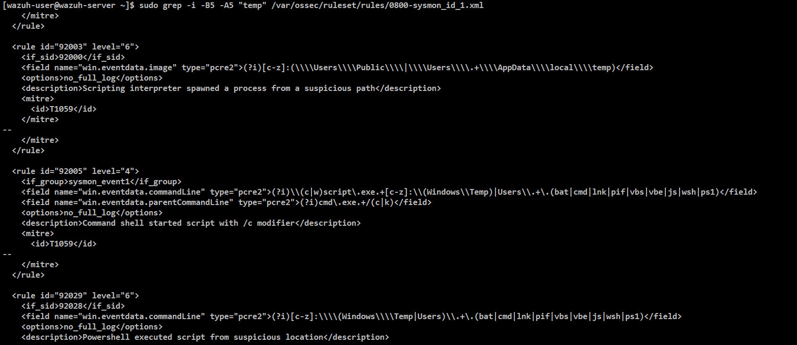

Continued output - more matches, all still tied to a scripting interpreter or PowerShell as the triggering condition.

```bash
sudo grep -i -B5 -A5 "temp" /var/ossec/ruleset/rules/0800-sysmon_id_1.xml
```

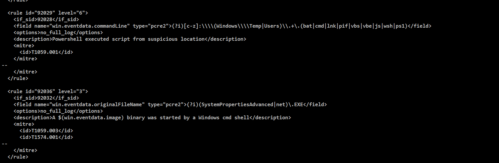

**Step 2 - Trace the base rule (92000) that 92003 depends on, to confirm the parent restriction.**

```bash
sudo grep -B3 -A15 'rule id="92000"' /var/ossec/ruleset/rules/0800-sysmon_id_1.xml
```

Confirms 92000 requires `win.eventdata.parentImage` to match `cscript.exe`/`wscript.exe` - too narrow for this rule's goal, so the custom rule was built on `if_group: sysmon_event1` instead (no parent restriction).

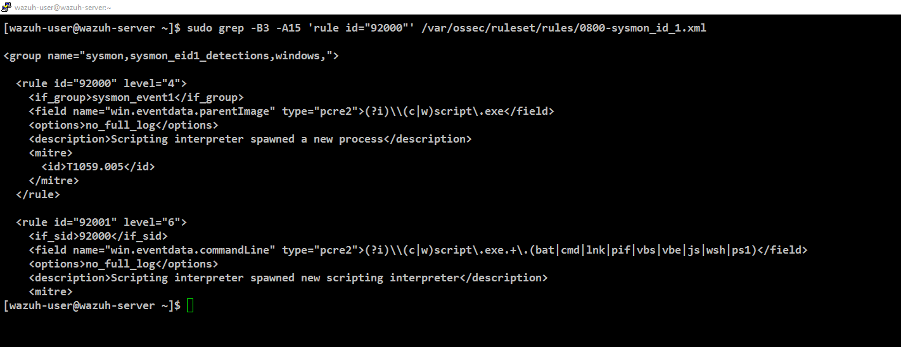

**Step 3 - Custom rule 100014, correct insertion command (4 backslashes per path separator, correctly escaped for both the XML parser and the PCRE2 engine).**

```bash
sudo sed -i '$i\
  <rule id="100014" level="6">\
    <if_group>sysmon_event1</if_group>\
    <field name="win.eventdata.image" type="pcre2">(?i)[c-z]:(\\\\\\\\Windows\\\\\\\\Temp\\\\\\\\|\\\\\\\\Users\\\\\\\\Public\\\\\\\\|\\\\\\\\Users\\\\\\\\.+\\\\\\\\AppData\\\\\\\\Local\\\\\\\\Temp\\\\\\\\)</field>\
    <description>Process created from a suspicious\/unusual path</description>\
    <mitre>\
      <id>T1036<\/id>\
    <\/mitre>\
  <\/rule>' /var/ossec/etc/rules/local_rules.xml
```

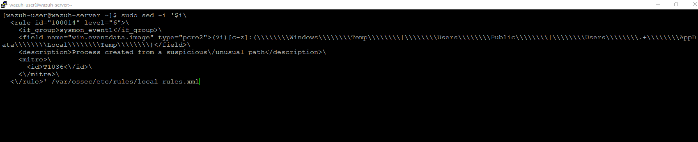

**Step 4 - Confirm the rule was added cleanly, once per file, at the end of `local_rules.xml`.**

```bash
sudo tail -12 /var/ossec/etc/rules/local_rules.xml
```

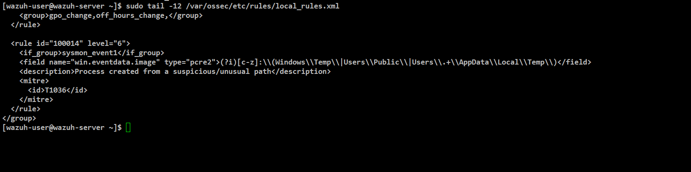

**Step 5 - Copy a test executable into `C:\Windows\Temp\` on WIN-CLIENT and run it.** *(GUI/PowerShell action on the client - no server-side command)*

```powershell
Copy-Item "C:\Windows\System32\cmd.exe" "C:\Windows\Temp\test-payload.exe"
Start-Process "C:\Windows\Temp\test-payload.exe"
```

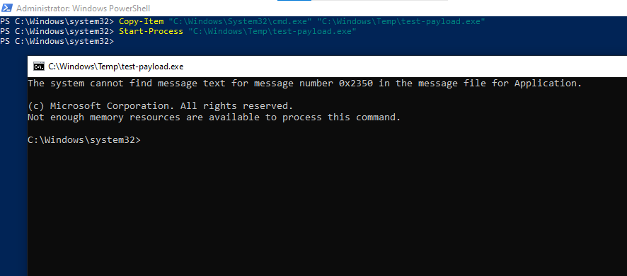

**Step 6 - First attempt: event reached the manager, but rule 100014 never fired.** Confirmed the `image` field decoded correctly to `C:\Windows\Temp\test-payload.exe` (Phase 2), yet only unrelated rules (92205, 92052) matched in `archives.json` - 100014 was silently skipped due to the escaping bug described above.

```bash
sudo /var/ossec/bin/wazuh-logtest
```
```bash
sudo tail -f /var/ossec/logs/archives/archives.json | grep -i "test-payload"
```

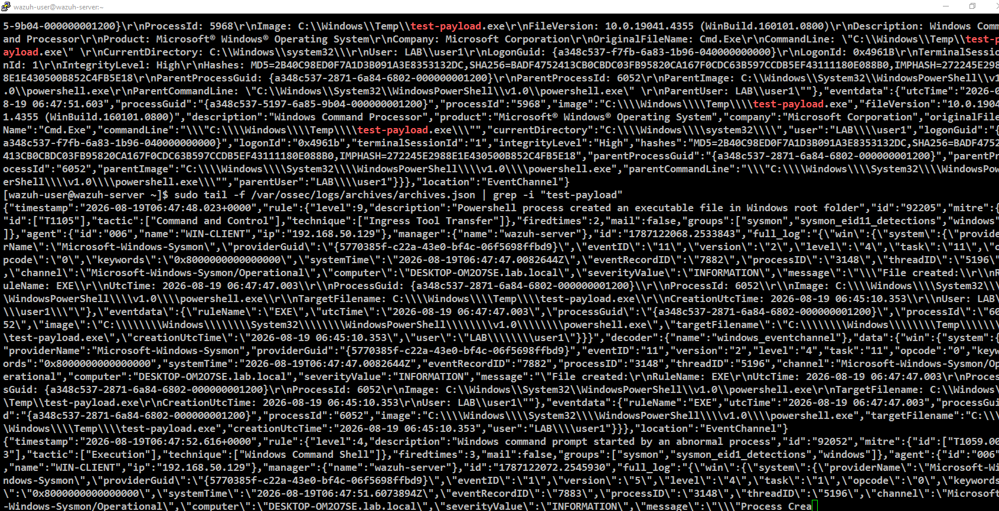

**Step 7 - After correcting the escaping (4 backslashes) and rewriting `local_rules.xml`, re-check the syntax before restarting the manager.**

```bash
sudo /var/ossec/bin/wazuh-logtest
```

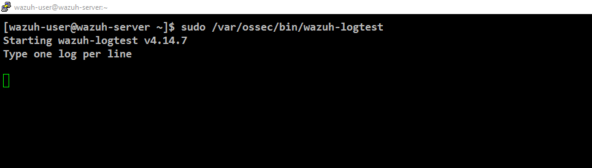

**Step 8 - Re-ran the simulation and confirmed rule 100014 fired this time, matching directly by rule ID in `archives.json`.**

```bash
sudo grep '"id":"100014"' /var/ossec/logs/archives/archives.json
```

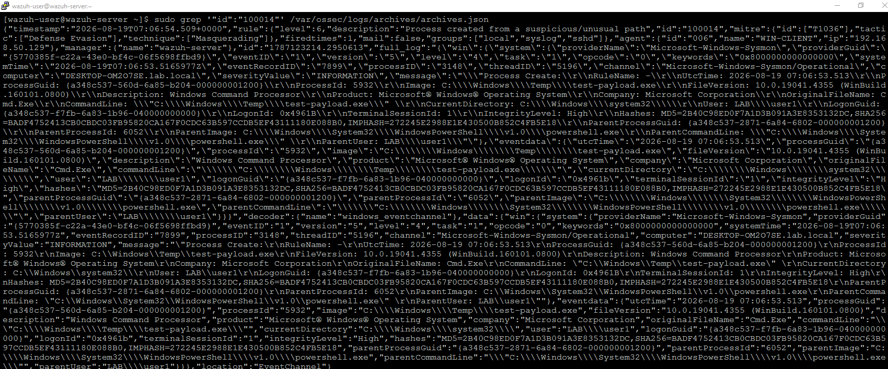

**Step 9 - Confirm in Wazuh Dashboard (Discover) - 1 hit.** *(GUI action - no command)*

```
rule.id:100014
```

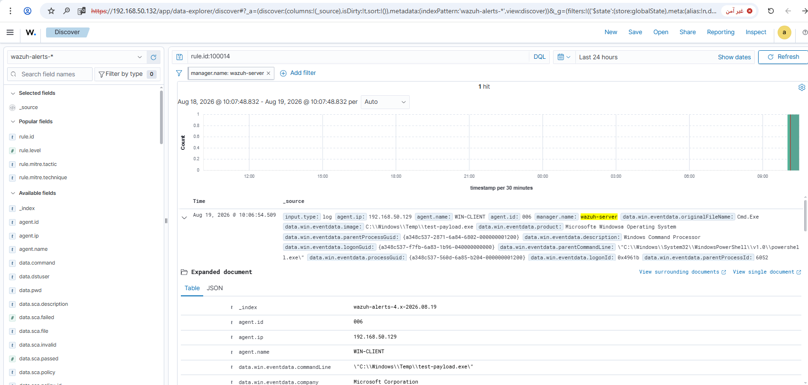

**Step 10 - Expand the alert and confirm the fired rule's fields directly.** `rule.id: 100014`, `rule.level: 6`, `rule.mitre.id: T1036`, `rule.mitre.tactic: Defense Evasion`, `rule.mitre.technique: Masquerading`. *(GUI action - no command)*

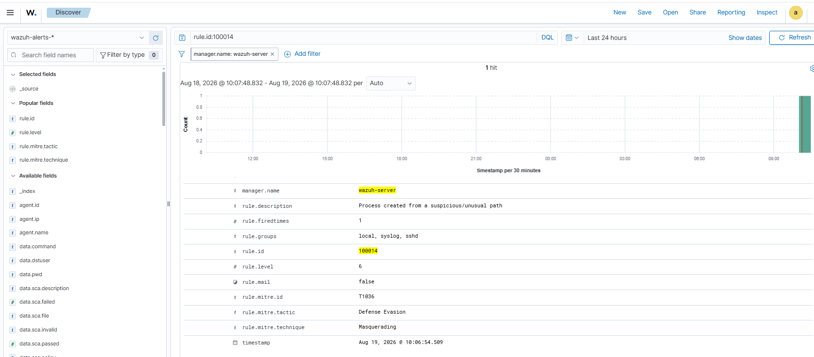

Screenshots stored in `screenshots/rules/rule-12-suspicious-path/`.

## Lessons Learned

PCRE2 fields in Wazuh get unescaped twice - a literal backslash in a Windows path needs four backslashes in the XML, not two.

## False Positive Testing

Not yet performed - noted for future testing. Legitimate software installers and Windows Update routinely stage executables in `Temp` before running them, so this rule will likely need allowlisting by known installer paths/hashes or a higher confidence threshold (e.g. combined with an unsigned-binary check) in a real environment.
