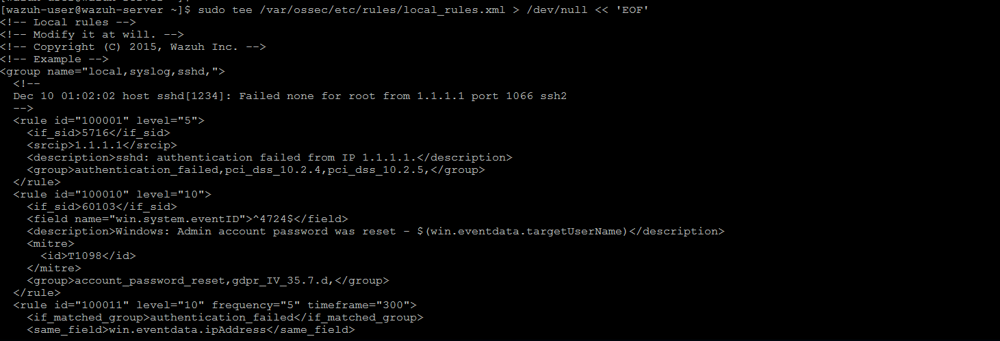
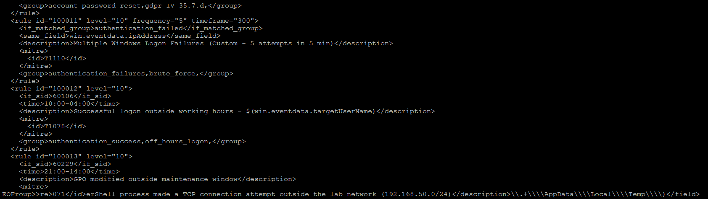
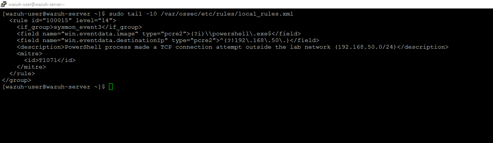
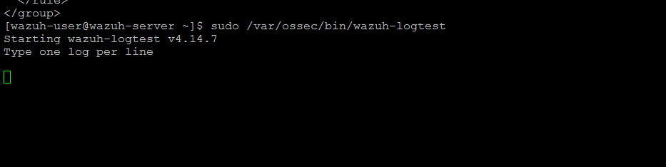
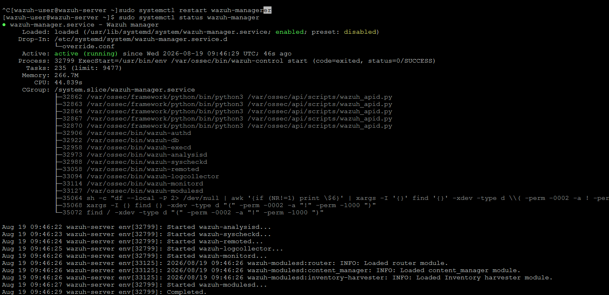
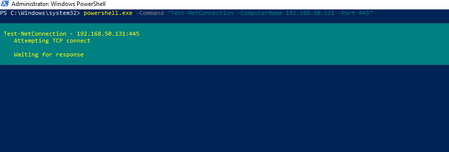
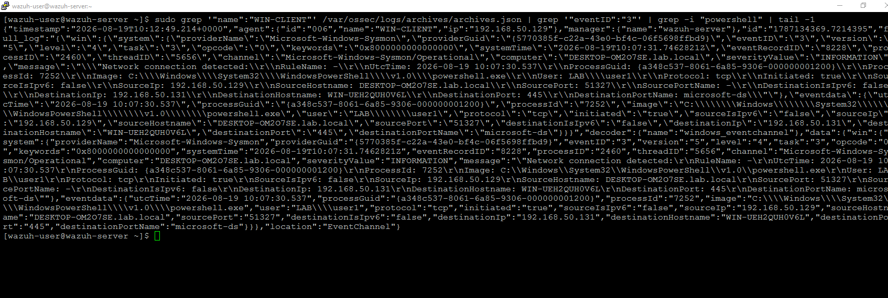
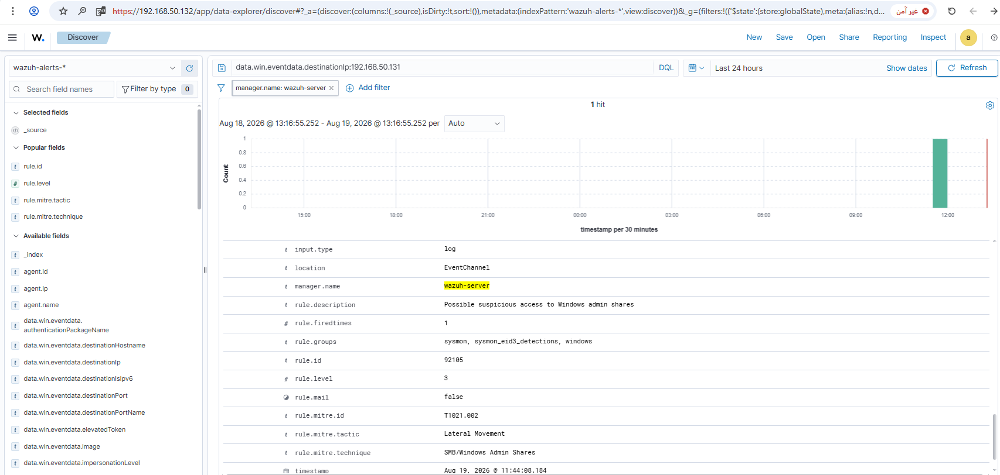

# Rule 13 - PowerShell TCP Connection Outside Lab Network

**Status:** 🟡 Built - logic verified, external-target simulation not possible (lab network fully isolated)

## Overview

Detects any TCP connection attempt made by `powershell.exe` heading outside the lab network (`192.168.50.0/24`). First rule in the project using Sysmon Event ID 3 (Network Connection) instead of Process Creation - a real outbound connection from a shell to somewhere outside a fully air-gapped lab is a strong red flag (C2, exfiltration, reverse shell).

| Field | Value |
|---|---|
| Log Source | Sysmon (WIN-CLIENT) |
| Sysmon Event ID | 3 (Network Connection) |
| Wazuh Rule ID | 100015 (custom) |
| Rule Description | PowerShell process made a TCP connection attempt outside the lab network (192.168.50.0/24) |
| Rule Level | 14 |
| MITRE ATT&CK | T1071 - Application Layer Protocol (loose fit - the protocol itself isn't confirmed, just the connection. T1059.001 was suggested but is the wrong tactic - it covers running PowerShell, not network activity, and is already covered by Rule #11) |
| ECC Control | 2-5-3-5 |

The rule is built directly on `if_group: sysmon_event3` (not on a narrower built-in rule) with two independent conditions: the process must be `powershell.exe`, and the destination IP must not start with `192.168.50.`

## What was verified vs. what wasn't

**Verified:** the rule loads with no syntax errors, and the first condition (`powershell.exe` making a real TCP connection) fires and reaches Wazuh correctly - tested with a real connection from WIN-CLIENT to DC01.

**Not verified end-to-end:** an actual connection to something genuinely outside `192.168.50.0/24`. The lab is fully air-gapped, so any attempt to reach an external address (like `8.8.8.8`) gets rejected at the network layer before Sysmon even sees it. That's a limitation of the isolated setup, not a problem with the rule logic itself.

## Steps

**Step 1 - Add the rule to `local_rules.xml` on SIEM-SRV.**

Rewrote the whole file with a heredoc at the time, keeping every existing rule (100001, 100010-100014) and adding the new one at the end. The screenshot below shows the full file content as it looked right after:

```xml
  <rule id="100015" level="14">
    <if_group>sysmon_event3</if_group>
    <field name="win.eventdata.image" type="pcre2">(?i)\\powershell\.exe$</field>
    <field name="win.eventdata.destinationIp" type="pcre2">^(?!192\.168\.50\.)</field>
    <description>PowerShell process made a TCP connection attempt outside the lab network (192.168.50.0/24)</description>
    <mitre>
      <id>T1071</id>
    </mitre>
  </rule>
```

To add just this rule directly (without rewriting the whole file):

```bash
sudo sed -i '$i\
<rule id="100015" level="14">\
  <if_group>sysmon_event3</if_group>\
  <field name="win.eventdata.image" type="pcre2">(?i)\\\\powershell\\.exe$</field>\
  <field name="win.eventdata.destinationIp" type="pcre2">^(?!192\\.168\\.50\\.)</field>\
  <description>PowerShell process made a TCP connection attempt outside the lab network (192.168.50.0/24)</description>\
  <mitre>\
    <id>T1071</id>\
  </mitre>\
</rule>' /var/ossec/etc/rules/local_rules.xml
sudo grep -A 8 'id="100015"' /var/ossec/etc/rules/local_rules.xml
```

The doubled backslashes in the `sed` command look excessive, but that's intentional: `sed` collapses `\\` down to `\` when it writes the line to the file, so each backslash needed in the final XML (as shown in the block above) has to be written twice here. Same lesson as Rule #12's pcre2 escaping issue - worth double-checking the `grep` output after running this to confirm the field values landed correctly.




**Step 2 - Confirm the rule was added cleanly.**

```bash
sudo tail -10 /var/ossec/etc/rules/local_rules.xml
```



**Step 3 - Syntax check.**

```bash
sudo /var/ossec/bin/wazuh-logtest
```



**Step 4 - Restart the manager and confirm it's running.**

```bash
sudo systemctl restart wazuh-manager
sudo systemctl status wazuh-manager
```



**Step 5 - Simulate a PowerShell TCP connection on WIN-CLIENT.** *(client-side step - not from Wazuh)*

```powershell
powershell.exe -Command "Test-NetConnection -ComputerName 192.168.50.131 -Port 445"
```



**Step 6 - Confirm the event reached the manager.** The `image` field correctly shows `powershell.exe` and the connection was captured.

```bash
sudo grep '"name":"WIN-CLIENT"' /var/ossec/logs/archives/archives.json | grep '"eventID":"3"' | grep -i "powershell" | tail -1
```



**Step 7 - Confirm in Wazuh Dashboard.** Since the destination (192.168.50.131) is inside the lab subnet, rule 100015 correctly does **not** fire - instead a different built-in rule (92105, "Possible suspicious access to Windows admin shares") matches, which is the expected and correct behavior. This confirms the pipeline works end-to-end and that rule 100015's network-scope condition is being evaluated correctly (it just wasn't the winning rule for an in-subnet destination, by design).

```
data.win.eventdata.destinationIp:192.168.50.131
```



Screenshots stored in `screenshots/rules/rule-13-external-connection/`.

## False Positive Testing

Not yet performed. Given the honest limitation above, this rule needs re-validation once tested against a genuine external-network target (e.g. after moving to the ESXi production environment with real internet access, or by adding a second isolated "external" subnet to the lab to simulate it safely).
