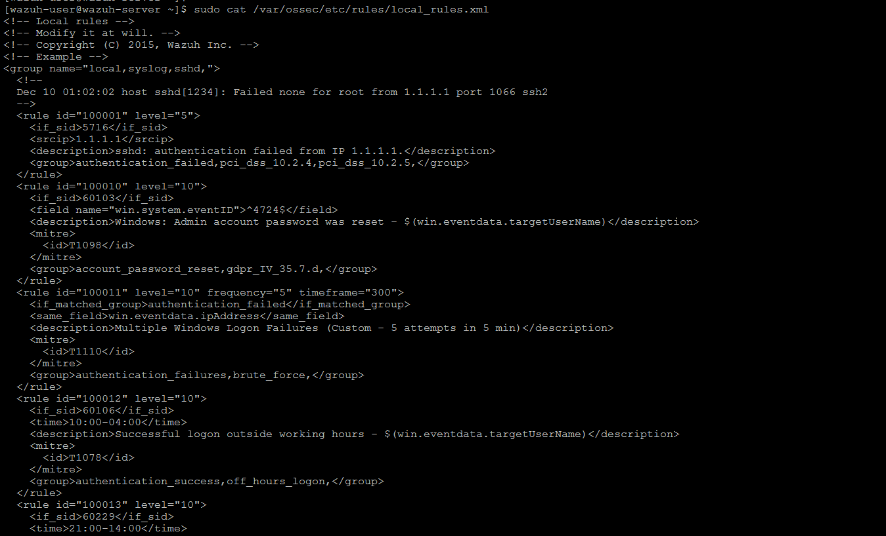
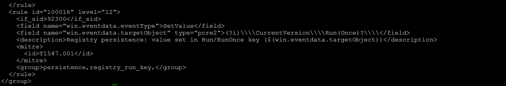
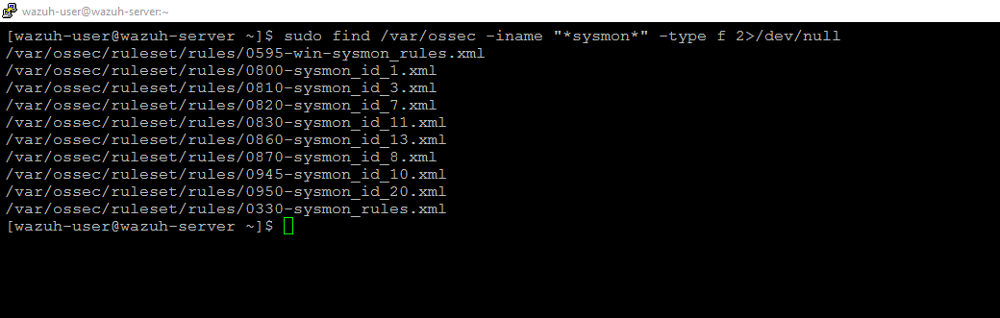
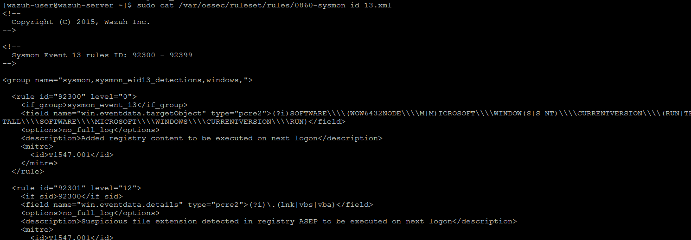
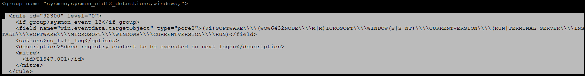
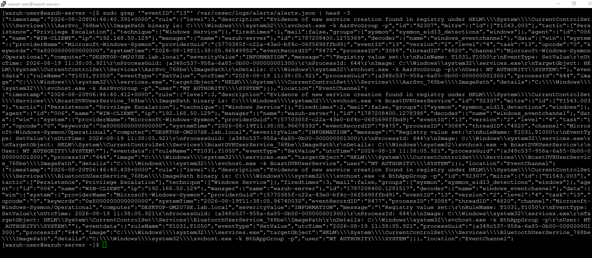
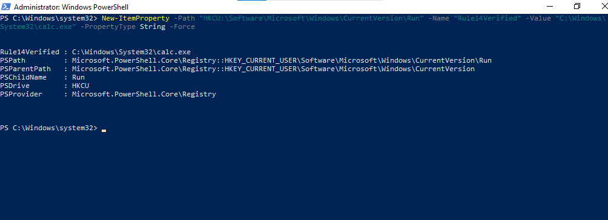
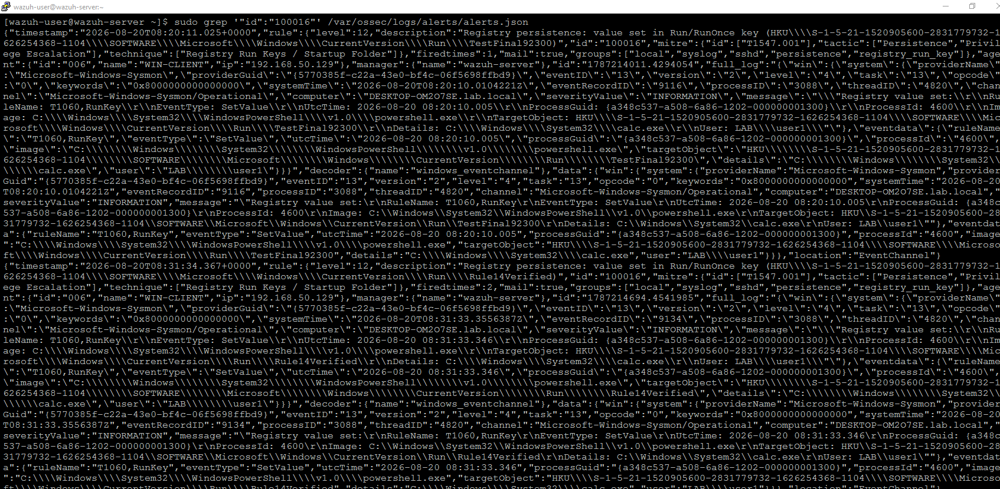
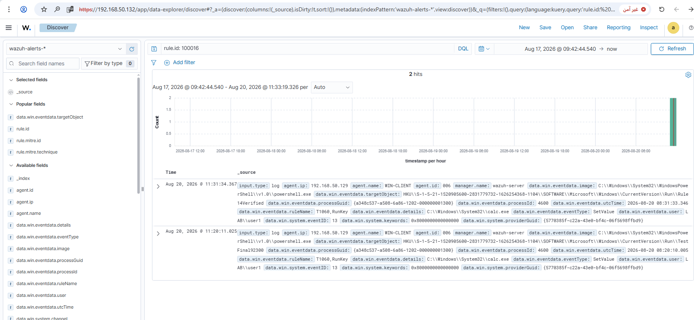
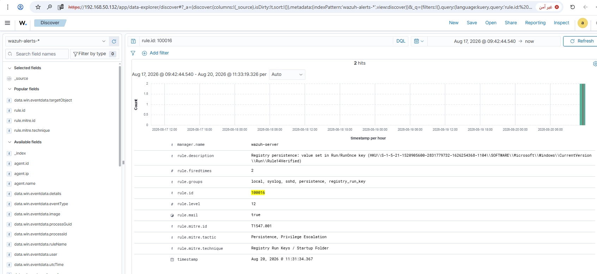

# Rule #14 - Registry Persistence via Run/RunOnce Keys

**Status:** ✅ Built and tested

## Overview

This rule watches for a value getting added or changed under the `Run` or
`RunOnce` registry keys - probably the most common way malware sets itself
up to auto-start on every reboot.

| Field | Value |
|---|---|
| Log Source | Sysmon (WIN-CLIENT) |
| Sysmon Event ID | 13 (RegistryEvent - Value Set) |
| Wazuh Rule ID | 100016 (custom - built on `if_sid: 92300`) |
| Rule Description | Registry persistence: value set in Run/RunOnce key ($(win.eventdata.targetObject)) |
| Rule Level | 12 |
| MITRE ATT&CK | T1547.001 - Registry Run Keys / Startup Folder (Persistence, Privilege Escalation) |
| ECC Control | 2-3-3-1 |

## Steps

**Step 1 - Review the existing local_rules.xml file.**

```bash
sudo cat /var/ossec/etc/rules/local_rules.xml
```



**Step 2 - Final rule content (rule ID 100016).**

```xml
<rule id="100016" level="12">
  <if_sid>92300</if_sid>
  <field name="win.eventdata.eventType">SetValue</field>
  <field name="win.eventdata.targetObject" type="pcre2">(?i)\\\\CurrentVersion\\\\Run(Once)?\\\\</field>
  <description>Registry persistence: value set in Run/RunOnce key ($(win.eventdata.targetObject))</description>
  <mitre>
    <id>T1547.001</id>
  </mitre>
  <group>persistence,registry_run_key,</group>
</rule>
```

To add this rule directly to `local_rules.xml`:

```bash
sudo sed -i '$i\
<rule id="100016" level="12">\
  <if_sid>92300</if_sid>\
  <field name="win.eventdata.eventType">SetValue</field>\
  <field name="win.eventdata.targetObject" type="pcre2">(?i)\\\\\\\\CurrentVersion\\\\\\\\Run(Once)?\\\\\\\\</field>\
  <description>Registry persistence: value set in Run/RunOnce key ($(win.eventdata.targetObject))</description>\
  <mitre>\
    <id>T1547.001</id>\
  </mitre>\
  <group>persistence,registry_run_key,</group>\
</rule>' /var/ossec/etc/rules/local_rules.xml
sudo grep -A 9 'id="100016"' /var/ossec/etc/rules/local_rules.xml
```

Same double-backslash-escaping note as Rule #12 and Rule #13 applies here - the `pcre2` field needs 4 literal backslashes per path separator in the file, so the `sed` command needs 8 (since `sed` collapses each `\\` to `\`). Worth confirming with the `grep` above that it landed correctly.



**Step 3 - Locate Sysmon Event ID 13 ruleset files.**

```bash
sudo find /var/ossec -iname "*sysmon*" -type f 2>/dev/null
```



**Step 4 - Inspect the dedicated Event ID 13 ruleset.**

```bash
sudo cat /var/ossec/ruleset/rules/0860-sysmon_id_13.xml
```



**Step 5 - Base rule 92300 (Run/RunOnce detection, level 0).**

Rule 92300 is a built-in Wazuh rule that silently classifies any
registry write under `CurrentVersion\Run` (including `WOW6432Node` and
`RunOnce` variants). Rule 100016 links to it directly via `if_sid`,
since it already matches the exact behavior we want to detect.



**Step 6 - Confirm Event ID 13 alerts already fire in this environment.**

```bash
sudo grep '"eventID":"13"' /var/ossec/logs/alerts/alerts.json | head -3
```

This confirms a sibling rule (92307) from the same ruleset file was
already firing successfully on real registry events in the lab,
validating that the base rule chain is active.



**Step 7 - Trigger a test event (GUI action / PowerShell - WIN-CLIENT).**

```powershell
New-ItemProperty -Path "HKCU:\Software\Microsoft\Windows\CurrentVersion\Run" -Name "Rule14Verified" -Value "C:\Windows\System32\calc.exe" -PropertyType String -Force
```



**Step 8 - Confirm the alert in alerts.json.**

```bash
sudo grep '"id":"100016"' /var/ossec/logs/alerts/alerts.json
```



**Step 9 - Confirm the alert in the Wazuh dashboard (Discover).**

Search: `rule.id: 100016`



**Step 10 - Expanded alert detail.**



Confirmed fields:
- `rule.id`: 100016
- `rule.level`: 12
- `rule.mitre.id`: T1547.001
- `rule.mitre.tactic`: Persistence, Privilege Escalation
- `rule.mitre.technique`: Registry Run Keys / Startup Folder
- `rule.description`: Registry persistence: value set in Run/RunOnce key (HKU\S-1-5-21-1520905600-2831779732-1626254368-1104\SOFTWARE\Microsoft\Windows\CurrentVersion\Run\Rule14Verified)

## Lessons Learned

When a "theoretically correct" parent rule doesn't fire, link directly to a known-working built-in rule instead (used `92300`, not `61615`).
