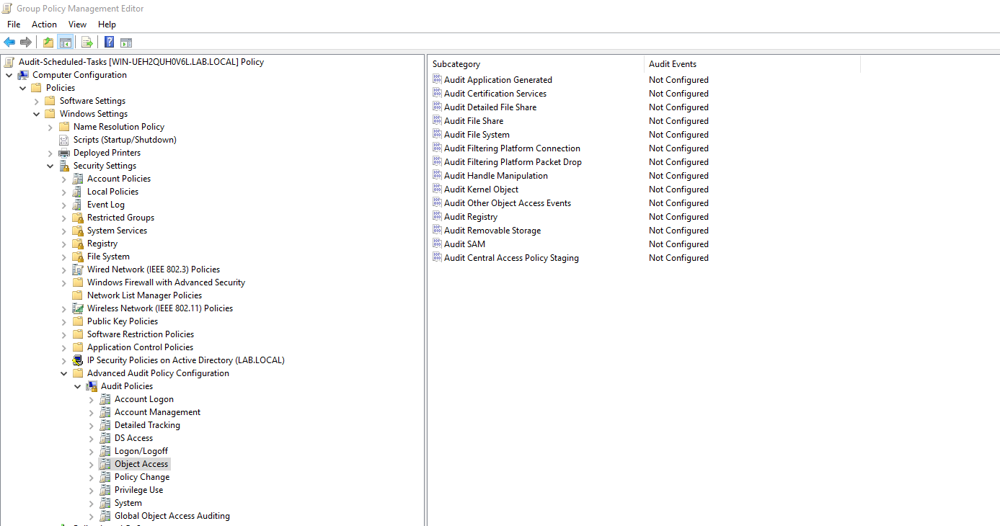
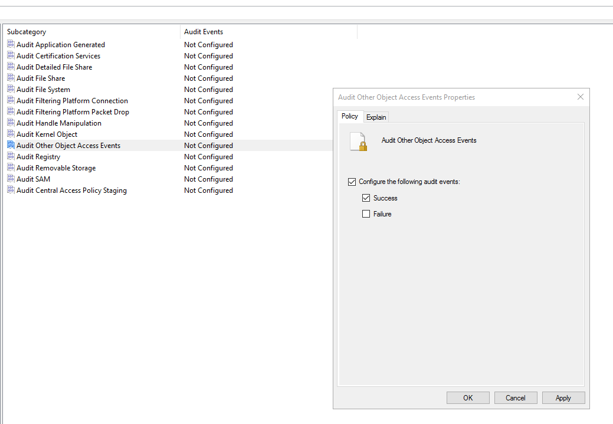
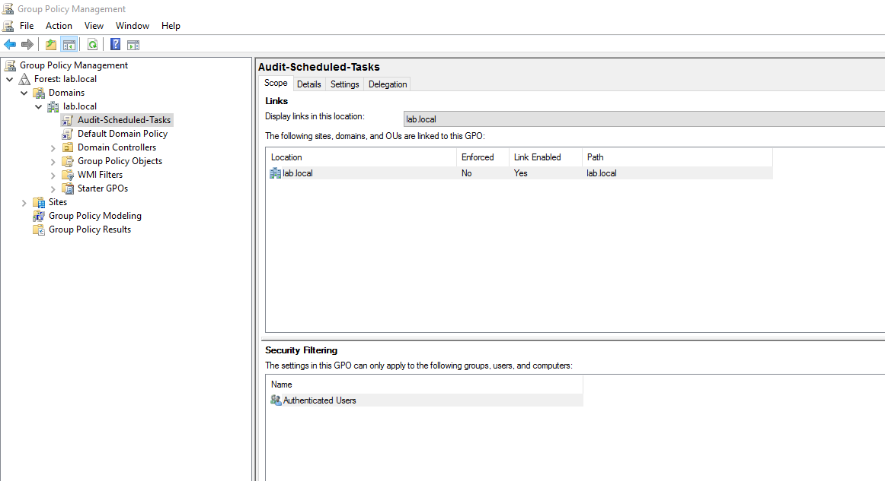
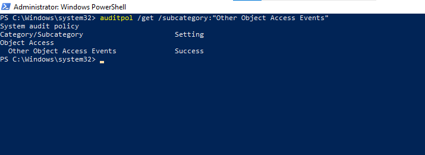
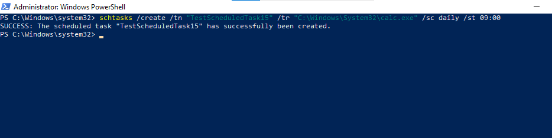
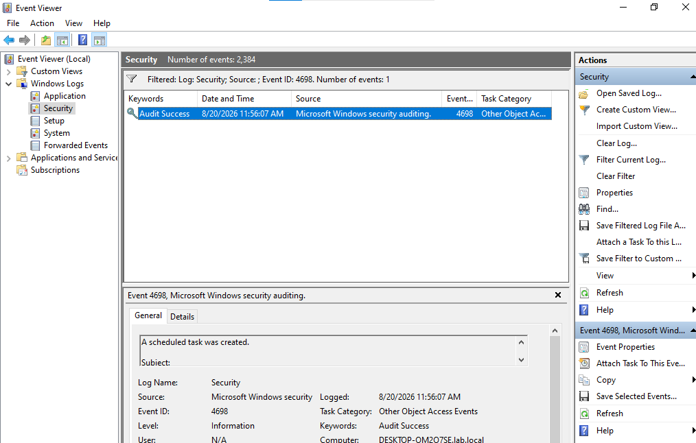
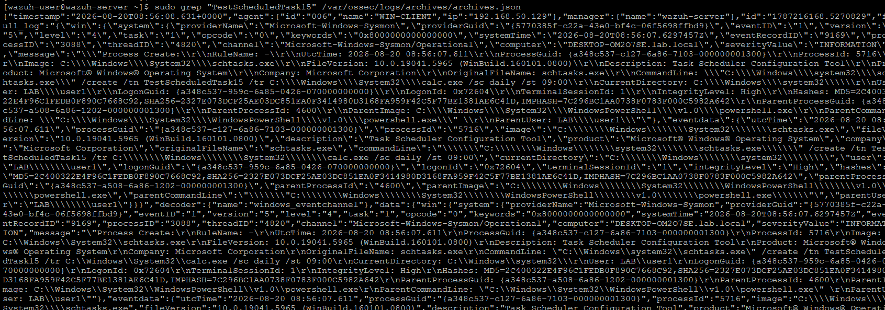
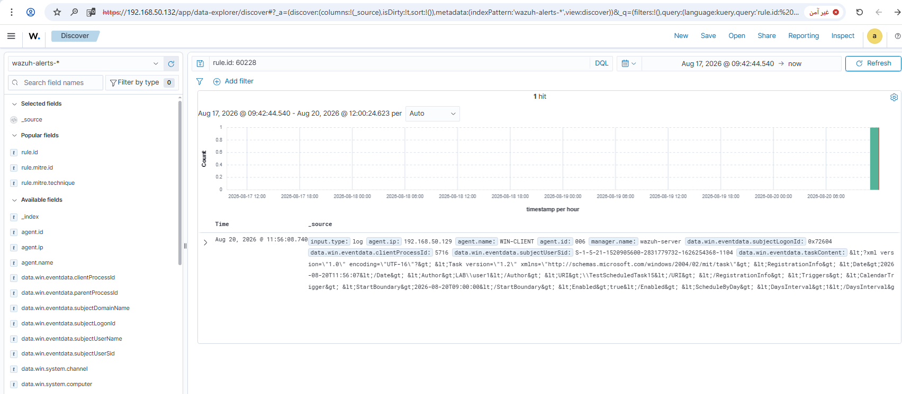
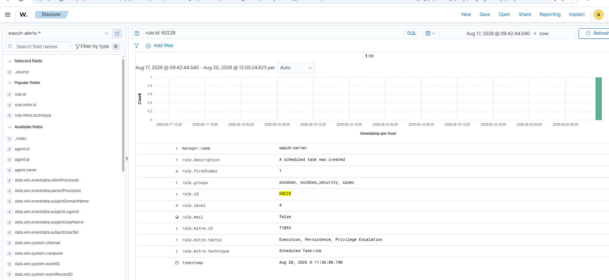

# Rule #15 - Scheduled Task Created or Modified

**Windows Security Event ID:** 4698 (A scheduled task was created)
**Rule ID:** 60228 (built-in Wazuh rule - no custom rule needed)
**Level:** 4
**MITRE ATT&CK:** T1053 - Scheduled Task/Job (future improvement: T1053.005 - Scheduled Task - would be more precise)

## Overview

This rule watches for a new scheduled task showing up on WIN-CLIENT.
Scheduled tasks are a common way to gain persistence - malware can
register a task to run on a schedule (boot, logon, interval), similar
in spirit to the Run/RunOnce trick from Rule #14, just through a
different part of Windows.

No custom rule needed this time - Wazuh's built-in rule 60228 already
covers Event ID 4698 out of the box.

| Field | Value |
|---|---|
| Log Source | Windows Security Event Log (WIN-CLIENT, via centralized GPO) |
| Event ID | 4698 (A scheduled task was created) |
| Wazuh Rule ID | 60228 (built-in) |
| Rule Description | A scheduled task was created |
| Rule Level | 4 |
| MITRE ATT&CK | T1053 - Scheduled Task/Job (Execution, Persistence, Privilege Escalation) (future improvement: T1053.005 - Scheduled Task - would be more precise) |
| ECC Control | 2-3-3-1 |

## Step 1 - Enable auditing centrally via GPO (DC01)

Since this environment now has more than one domain-joined client in
mind for future scale, auditing was enabled via Group Policy instead
of a local `auditpol` command, so it propagates to every domain-joined
computer automatically.

On **DC01**, open Group Policy Management Editor for the new GPO and
navigate to:

```
Computer Configuration → Policies → Windows Settings → Security Settings
  → Advanced Audit Policy Configuration → Audit Policies → Object Access
```



## Step 2 - Configure "Audit Other Object Access Events"

Double-click **Audit Other Object Access Events**, enable **Configure
the following audit events**, and check **Success**.



## Step 3 - Confirm the GPO link (Scope)

Confirm the new GPO (`Audit-Scheduled-Tasks`) is linked to `lab.local`,
so it applies to all domain-joined computers.



## Step 4 - Force policy update and verify on WIN-CLIENT

```powershell
gpupdate /force
auditpol /get /subcategory:"Other Object Access Events"
```



## Step 5 - Trigger a test scheduled task (WIN-CLIENT)

```powershell
schtasks /create /tn "TestScheduledTask15" /tr "C:\Windows\System32\calc.exe" /sc daily /st 09:00
```



## Step 6 - Confirm the event locally (Event Viewer - Security log)

Event ID 4698, Task Category: Other Object Access Events.



## Step 7 - Confirm the event reached the manager

```bash
sudo grep "TestScheduledTask15" /var/ossec/logs/archives/archives.json
```

The raw event arrived from WIN-CLIENT and was immediately matched by
the built-in rule 60228 (visible in the same archive entry), with no
custom rule needed.



## Step 8 - Confirm the alert in the Wazuh dashboard (Discover)

Search: `rule.id: 60228`



## Step 9 - Expanded alert detail



Confirmed fields:
- `rule.id`: 60228
- `rule.level`: 4
- `rule.description`: A scheduled task was created
- `rule.mitre.id`: T1053
- `rule.mitre.tactic`: Execution, Persistence, Privilege Escalation
- `rule.mitre.technique`: Scheduled Task/Job

## Notes

This was the first rule where auditing got rolled out through GPO
instead of a local `auditpol` command - closer to how a real
multi-client environment actually gets managed, and it confirmed GPO
propagation works end-to-end (DC01 to WIN-CLIENT) without touching
each machine by hand.

The built-in rule's level (4) is pretty low. If I need stronger
alerting later, I could layer a custom rule on top (same idea as Rule
#8) to bump up the severity for tasks created outside a maintenance
window or by an account that shouldn't be doing this.
