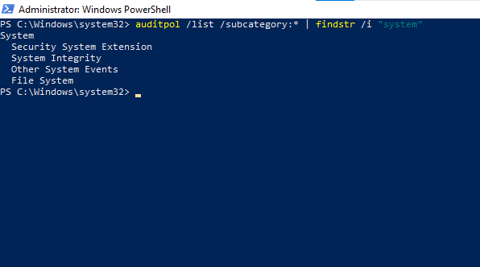
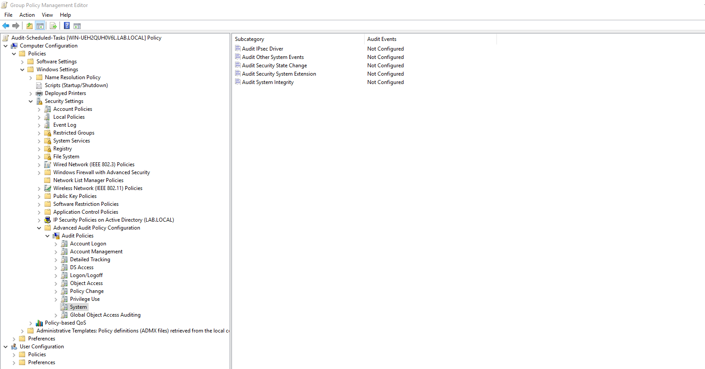
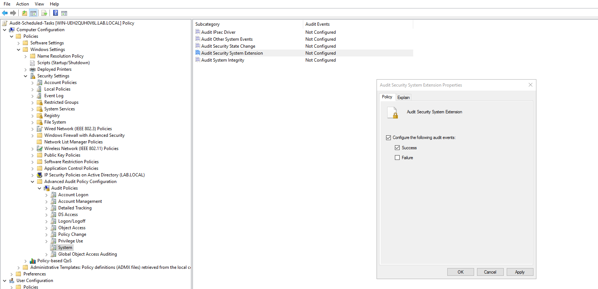
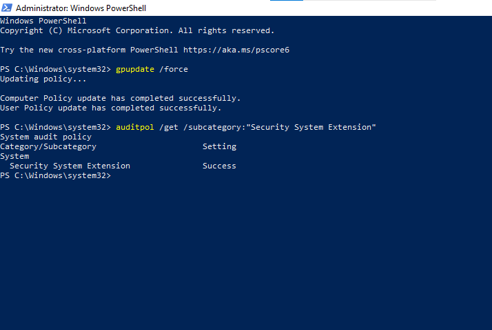
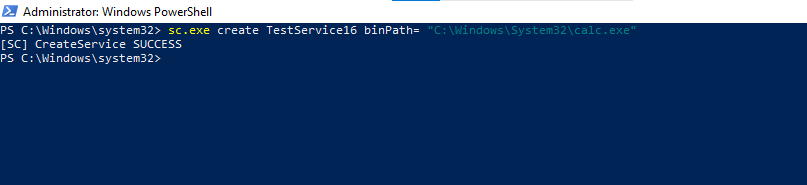
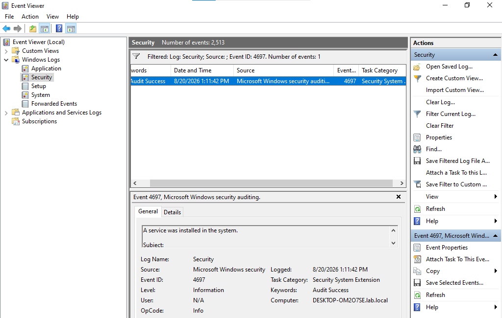
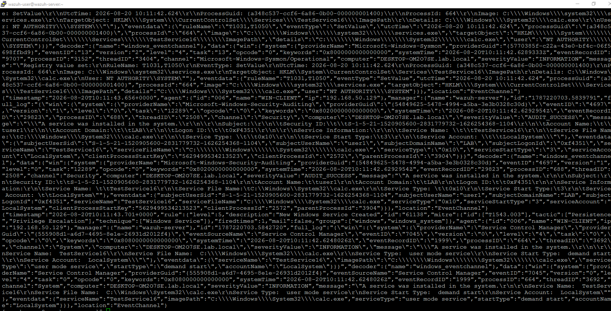
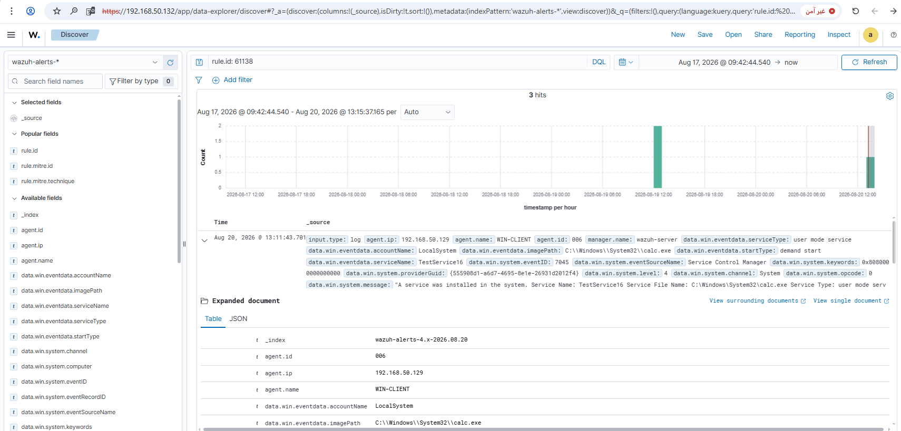
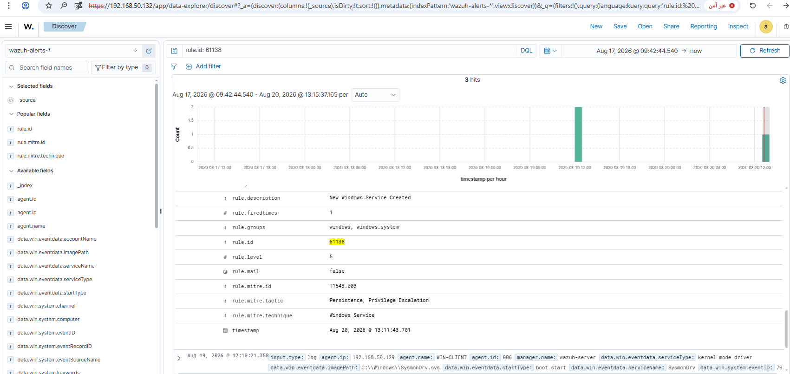

# Rule #16 - New Service Created on the System

**Windows Security Event ID:** 4697 (A service was installed in the system)
**Also fired by:** Event ID 7045 (System log - Service Control Manager)
**Rule ID:** 61138 (built-in Wazuh rule - no custom rule needed)
**Level:** 5
**MITRE ATT&CK:** T1543.003 - Windows Service

## Overview

Detects a new Windows service getting created - a third
way to gain persistence alongside Run/RunOnce keys (Rule #14) and
Scheduled Tasks (Rule #15). Services usually run as SYSTEM and start
automatically at boot, which makes them a favorite target for malware.

| Field | Value |
|---|---|
| Log Source | Windows Event Log - System (Service Control Manager, Event 7045); also Security (Event 4697) via GPO |
| Event ID | 7045 (the actual triggering source) / 4697 (auditing enabled, for actor info) |
| Wazuh Rule ID | 61138 (built-in) |
| Rule Description | New Windows Service Created |
| Rule Level | 5 |
| MITRE ATT&CK | T1543.003 - Windows Service (Persistence, Privilege Escalation) |
| ECC Control | 2-3-3-1 |

## Step 1 - Identify the correct audit subcategory (WIN-CLIENT)

Before configuring anything, the correct audit subcategory needs to be
confirmed rather than guessed.

```powershell
auditpol /list /subcategory:* | findstr /i "system"
```

This confirmed **"Security System Extension"** as the subcategory that
controls Event ID 4697.



## Step 2 - Navigate to the System audit category (GPO on DC01)

Reusing the existing `Audit-Scheduled-Tasks` GPO from Rule #15, edit it
and navigate to:

```
Computer Configuration → Policies → Windows Settings → Security Settings
  → Advanced Audit Policy Configuration → Audit Policies → System
```



## Step 3 - Configure "Audit Security System Extension"

Enable **Configure the following audit events** and check **Success**.



## Step 4 - Force policy update and verify on WIN-CLIENT

```powershell
gpupdate /force
auditpol /get /subcategory:"Security System Extension"
```



## Step 5 - Create a test service (WIN-CLIENT)

```powershell
sc.exe create TestService16 binPath= "C:\Windows\System32\calc.exe"
```



## Step 6 - Confirm the event locally (Event Viewer - Security log)

Event ID 4697, Task Category: Security System Extension.



## Step 7 - Confirm the event reached the manager

```bash
sudo grep "TestService16" /var/ossec/logs/archives/archives.json
```

Two built-in rules matched the same real-world action, from two
different Windows log sources:

- **Rule 92307** (level 3) - matched via Sysmon Event 13, triggered by
  `services.exe` writing the new service's registry keys.
- **Rule 61138** (level 5, "New Windows Service Created") - matched via
  **Event ID 7045** (System log, Service Control Manager), which Wazuh
  captured independently of the Event 4697 auditing configured above.



## Step 8 - Confirm the alert in the Wazuh dashboard (Discover)

Search: `rule.id: 61138`



## Step 9 - Expanded alert detail



Confirmed fields:
- `rule.id`: 61138
- `rule.level`: 5
- `rule.description`: New Windows Service Created
- `rule.mitre.id`: T1543.003
- `rule.mitre.tactic`: Persistence, Privilege Escalation
- `rule.mitre.technique`: Windows Service

## Notes

Setting up Event ID 4697 auditing through GPO was still worth doing - it captures who did it (`subjectUserName`, `logonId`), which the System-log-based rule 61138 doesn't. But the alert that actually fired came from Event ID 7045, which Windows logs by default with no extra config needed.

The same real-world event can show up through more than one log channel (Security vs. System), and the built-in Wazuh rule might be watching a different source than you'd assume. Checking `archives.json` directly instead of guessing saved me from drawing the wrong conclusion.
