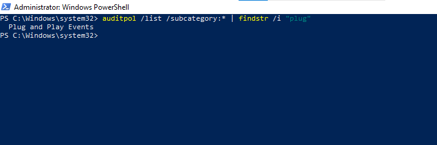
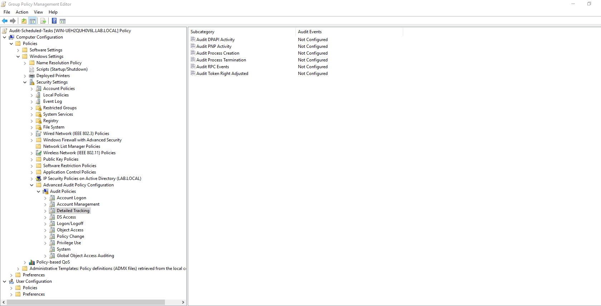
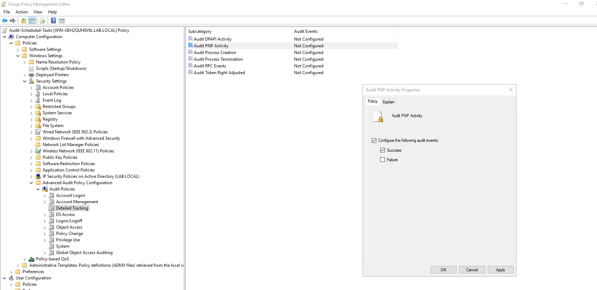
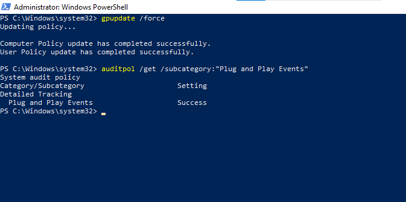
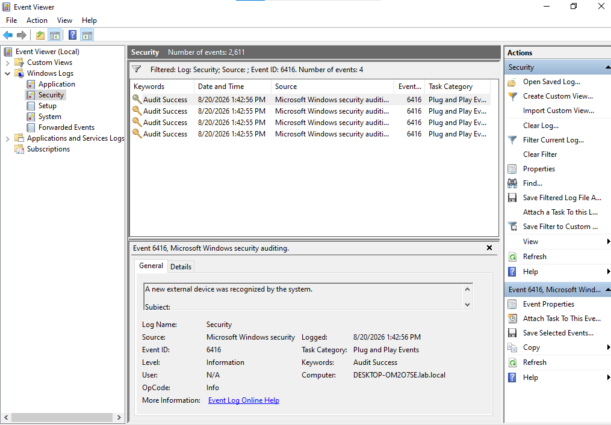
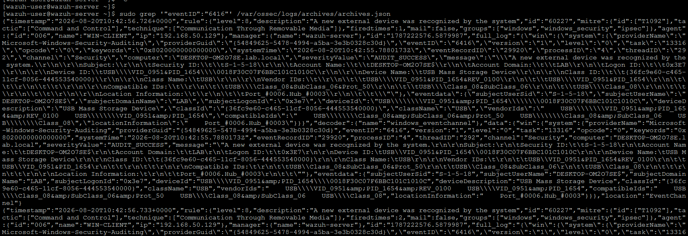
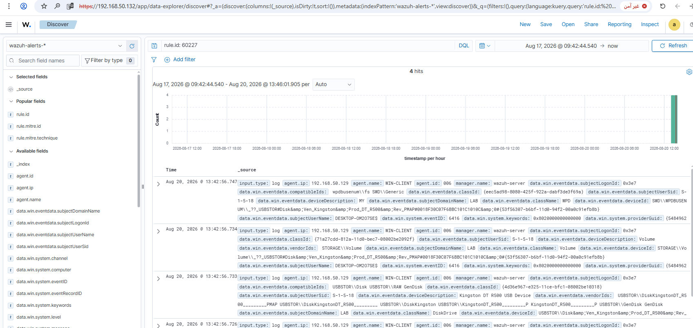
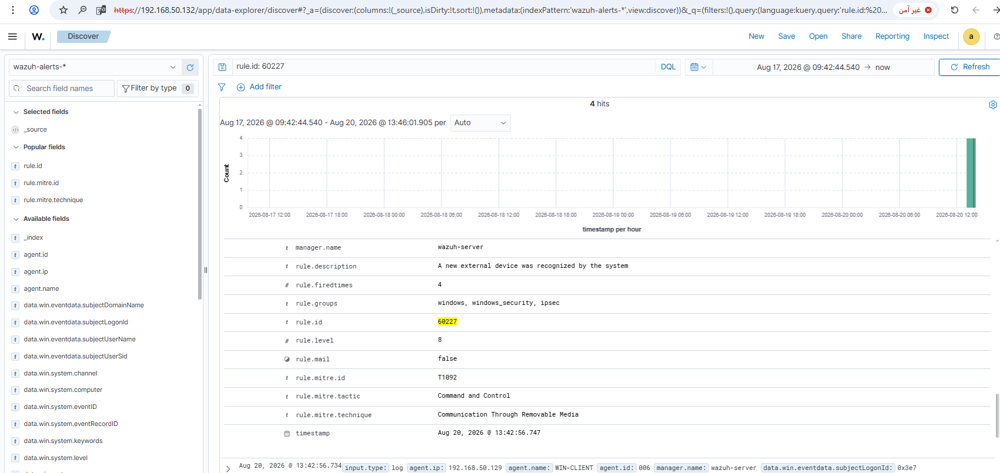

# Rule #17 - New USB Device Connected

**Windows Security Event ID:** 6416 (A new external device was recognized by the system)
**Rule ID:** 60227 (built-in Wazuh rule - no custom rule needed)
**Level:** 8
**MITRE ATT&CK:** T1092 - Communication Through Removable Media (future improvement: T1200 - Hardware Additions - fits better, since T1092 is about C2 relay between already-compromised hosts, not connecting a device)

## Overview

Detects a new USB device getting connected to WIN-CLIENT.
USB is a classic vector for pulling data out, dropping malware, or
BadUSB-style attacks (a device that pretends to be a keyboard and
types commands on its own).

| Field | Value |
|---|---|
| Log Source | Windows Security Event Log (WIN-CLIENT, via GPO) |
| Event ID | 6416 (A new external device was recognized by the system) |
| Wazuh Rule ID | 60227 (built-in) |
| Rule Description | A new external device was recognized by the system |
| Rule Level | 8 |
| MITRE ATT&CK | T1092 - Communication Through Removable Media (Command and Control) (future improvement: T1200 - Hardware Additions - fits better, since T1092 is about C2 relay between already-compromised hosts, not connecting a device) |
| ECC Control | 2-3-3-2 |

## Step 1 - Identify the correct audit subcategory (WIN-CLIENT)

```powershell
auditpol /list /subcategory:* | findstr /i "plug"
```

This confirmed **"Plug and Play Events"** as the subcategory that
controls Event ID 6416.



## Step 2 - Navigate to the Detailed Tracking audit category (GPO on DC01)

Reusing the existing `Audit-Scheduled-Tasks` GPO, edit it and navigate
to:

```
Computer Configuration → Policies → Windows Settings → Security Settings
  → Advanced Audit Policy Configuration → Audit Policies → Detailed Tracking
```



## Step 3 - Configure "Audit PNP Activity"

Enable **Configure the following audit events** and check **Success**.



## Step 4 - Force policy update and verify on WIN-CLIENT

```powershell
gpupdate /force
auditpol /get /subcategory:"Plug and Play Events"
```



## Step 5 - Connect a real USB device (VMware passthrough)

A real USB flash drive (Kingston DT R500) was connected to the host
machine, then passed through to WIN-CLIENT via:

```
VM → Removable Devices → [Kingston DT R500] → Connect (Disconnect from Host)
```

## Step 6 - Confirm the event locally (Event Viewer - Security log)

Event ID 6416, Task Category: Plug and Play Events. A single USB
insertion generated 4 separate 6416 events - one per Windows
plug-and-play layer (generic USB device, the actual disk device,
the volume, and the portable-device layer).



## Step 7 - Confirm the events reached the manager

```bash
sudo grep '"eventID":"6416"' /var/ossec/logs/archives/archives.json
```

All 4 events arrived and were each matched independently by the
built-in rule 60227.



## Step 8 - Confirm the alert in the Wazuh dashboard (Discover)

Search: `rule.id: 60227`



## Step 9 - Expanded alert detail



Confirmed fields:
- `rule.id`: 60227
- `rule.level`: 8
- `rule.description`: A new external device was recognized by the system
- `rule.mitre.id`: T1092
- `rule.mitre.tactic`: Command and Control
- `rule.mitre.technique`: Communication Through Removable Media

## Notes

Plugging in one USB stick produced 4 separate Event ID 6416 entries (`firedtimes: 1, 2, 3, 4`). Windows logs the same physical device across several plug-and-play layers (USB device, disk device, volume, portable device), so this isn't a bug or duplicate alert - the second event (`Kingston DT R500 USB Device`) has the most useful details for an investigation anyway.

Used a real USB stick passed through VMware (`VM → Removable Devices`) instead of faking the event, since real, verifiable evidence beats simulated data.
