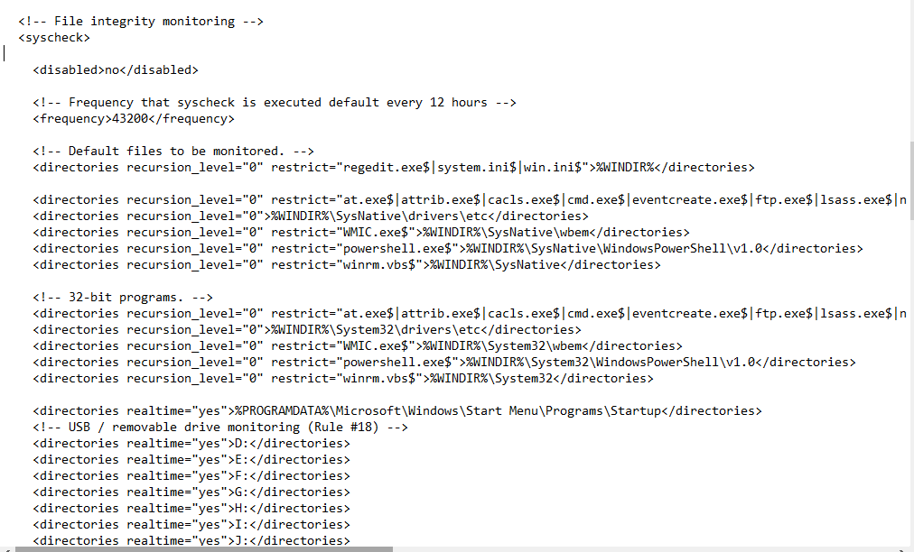
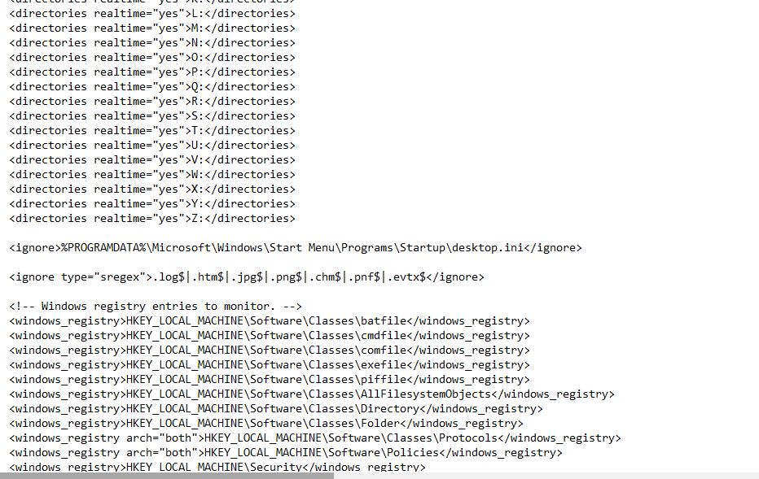
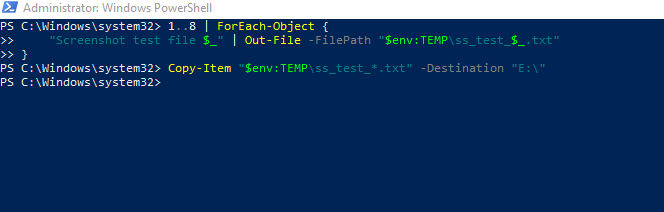
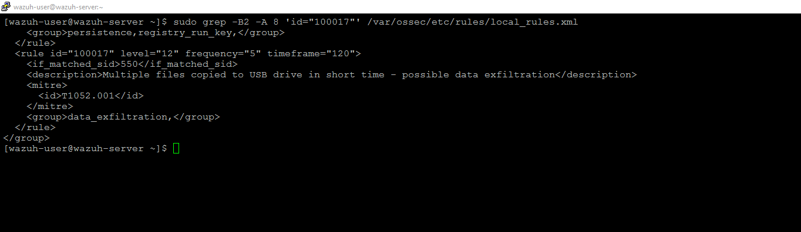
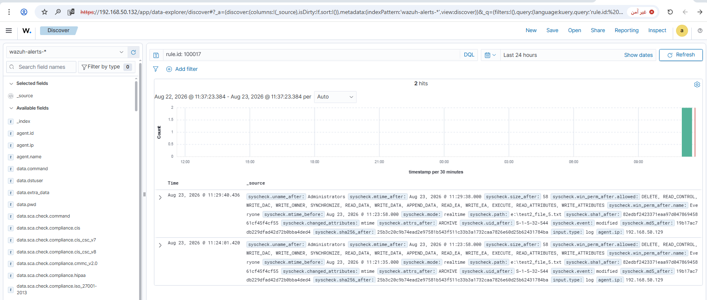
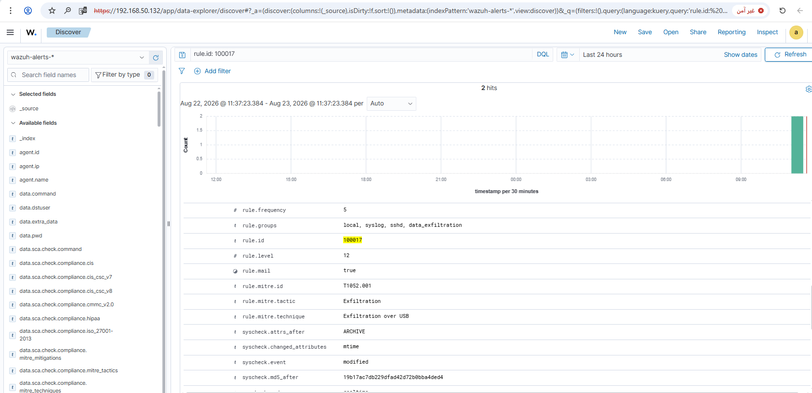

# Rule #18 - Multiple File Modifications on a Removable Drive in a Short Time

**Windows Event Source:** Wazuh File Integrity Monitoring (FIM / syscheck), realtime mode
**Rule ID:** 100017 (custom rule, built on top of default rule 550 - "Integrity checksum changed")
**Level:** 12
**MITRE ATT&CK:** T1052.001 - Exfiltration Over USB (behavioral indicator based on file-modification volume; not proof that data actually left the network)

## Overview

This rule looks for a burst of file-modification events on a removable
drive in a short window - a pattern worth flagging on its own, since a
normal user rarely touches five-plus files on a USB stick within two
minutes. It's built on Wazuh's default rule 550 ("Integrity checksum
changed"), which fires specifically on **modified** files - it does not
cover new files being added (rule 554) or deleted (rule 553), so as
written it won't catch someone who only *copies new* files onto the
drive without touching existing ones. That gap is called out below and
would be the first thing to extend in a non-lab version. Rule #17
only catches the USB device plugging in, not what happens on it after.

| Field | Value |
|---|---|
| Log Source | Wazuh FIM (syscheck), realtime - WIN-CLIENT |
| Event ID | N/A (FIM - no Windows/syslog Event ID; trigger: modified files on removable drives D-Z) |
| Wazuh Rule ID | 100017 (custom - built on `if_matched_sid: 550`, frequency=5, timeframe=120) |
| Rule Description | Multiple file modifications on a removable drive in a short time - possible data exfiltration |
| Rule Level | 12 |
| MITRE ATT&CK | T1052.001 - Exfiltration Over USB (behavioral indicator based on file-modification volume; not proof that data actually left the network) |
| ECC Control | 2-3-3-2 |

## Step 1 - Enable FIM realtime monitoring for USB drives (WIN-CLIENT)

Wazuh FIM on Windows does not support drive-letter wildcards (e.g. `*:\`),
so every possible USB drive letter must be listed explicitly in `ossec.conf`
under `<syscheck>`, right after the existing Startup folder monitoring
entry. Range covers D-Z (23 letters); A/B (historically floppy) and C (main
system disk) are intentionally excluded.

```xml
<directories realtime="yes">D:</directories>
<directories realtime="yes">E:</directories>
...
```



## Step 2 - Remaining drive letters and registry section (WIN-CLIENT)

Continuation of the same `<syscheck>` block, showing the rest of the D-Z
range through Z, followed by the existing registry monitoring entries
(unchanged) for context.



## Step 3 - Test: copy multiple files to the USB drive (WIN-CLIENT)

```powershell
1..8 | ForEach-Object {
    "Screenshot test file $_" | Out-File -FilePath "$env:TEMP\ss_test_$_.txt"
}
Copy-Item "$env:TEMP\ss_test_*.txt" -Destination "E:\"
```



## Step 4 - Build the aggregation rule (SIEM-SRV)

```bash
sudo grep -B2 -A 8 'id="100017"' /var/ossec/etc/rules/local_rules.xml
```

```xml
<rule id="100017" level="12" frequency="5" timeframe="120">
  <if_matched_sid>550</if_matched_sid>
  <description>Multiple files copied to USB drive in short time - possible data exfiltration</description>
  <mitre>
    <id>T1052.001</id>
  </mitre>
  <group>data_exfiltration,</group>
</rule>
```

To add this rule directly to `local_rules.xml`:

```bash
sudo sed -i '$i\
<rule id="100017" level="12" frequency="5" timeframe="120">\
  <if_matched_sid>550</if_matched_sid>\
  <description>Multiple files copied to USB drive in short time - possible data exfiltration</description>\
  <mitre>\
    <id>T1052.001</id>\
  </mitre>\
  <group>data_exfiltration,</group>\
</rule>' /var/ossec/etc/rules/local_rules.xml
sudo grep -A 8 'id="100017"' /var/ossec/etc/rules/local_rules.xml
```

No explicit path filter is applied. This is intentional: FIM realtime
monitoring on this agent is only enabled for D-Z (Step 1-2), so any
triggering of rule 550 already implies a removable-drive path.



## Step 5 - Verify the alert fired (Wazuh dashboard)

Discover view, filtered to `rule.id: 100017`, showing the matching events:



Alert detail view confirming rule ID, level, and MITRE mapping:



## Lessons Learned

- A trailing backslash before a closing XML tag breaks Wazuh's config parser - use `D:` not `D:\`.
- FIM/syscheck rules can't filter on `<field>` unless the base rule defines one; rule 550 doesn't, so the path filter was dropped.
- `wazuh-logtest` doesn't work for FIM/syscheck events.

## Status
✅ Complete and verified.
