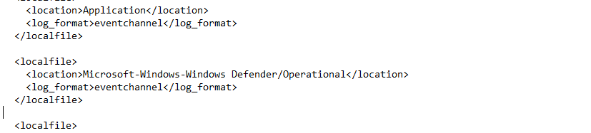
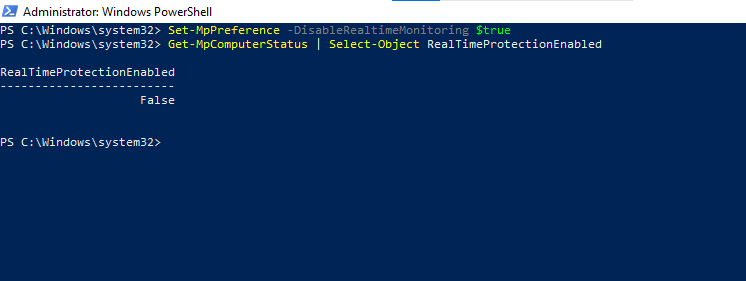
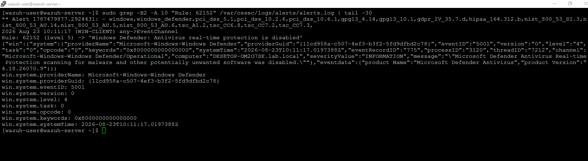
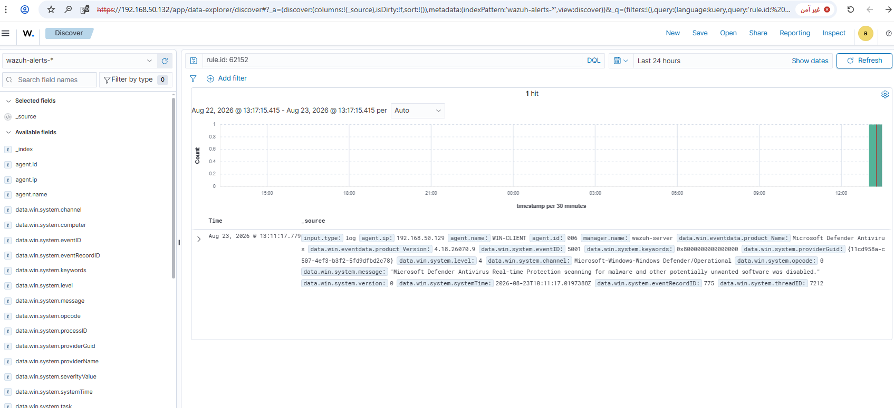
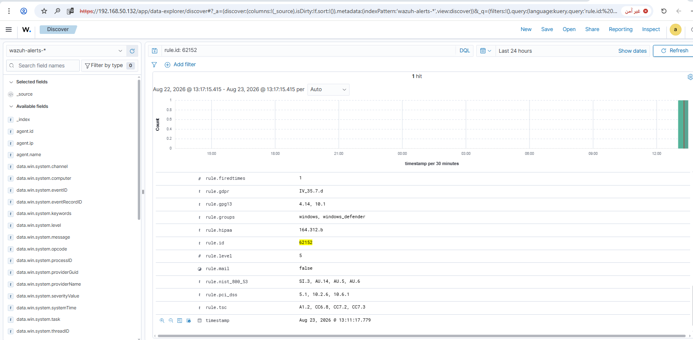

# Rule #19 - Windows Defender Disabled

**Windows Event Source:** Microsoft-Windows-Windows Defender/Operational, Event ID 5001
**Rule ID:** 62152 (built-in Wazuh rule - no custom rule needed)
**Level:** 5
**MITRE-adjacent behavior:** Defense Evasion - disabling endpoint protection

## Overview

Watches for Real-time Protection in Windows Defender getting
turned off on WIN-CLIENT. It's a common first move for an attacker or
a malicious script right after getting a foothold, so they can run
their tools without the antivirus flagging anything.

| Field | Value |
|---|---|
| Log Source | Windows Defender Operational Log (WIN-CLIENT, via direct `<localfile>`) |
| Event ID | 5001 (Windows Defender Antivirus Real-time Protection scanning disabled) |
| Wazuh Rule ID | 62152 (built-in) |
| Rule Description | Windows Defender: Antivirus real-time protection is disabled |
| Rule Level | 5 |
| MITRE ATT&CK | No MITRE mapping on this built-in rule (only GDPR/GPG13/NIST/PCI-DSS/TSC compliance tags) |
| ECC Control | 2-3-3-1 |

## Step 1 - Add Windows Defender log channel (WIN-CLIENT)

Unlike audit-policy-based rules (#15-#17), this event is logged natively by
Windows Defender itself in its own operational log - no GPO or audit
subcategory needs to be enabled. The Wazuh agent just needs to be told to
read that channel. Added a new `<localfile>` block in `ossec.conf`, right
after the existing `Application` entry:

```xml
<localfile>
  <location>Microsoft-Windows-Windows Defender/Operational</location>
  <log_format>eventchannel</log_format>
</localfile>
```



## Step 2 - Test: disable Real-time Protection (WIN-CLIENT)

```powershell
Set-MpPreference -DisableRealtimeMonitoring $true
Get-MpComputerStatus | Select-Object RealTimeProtectionEnabled
```



## Step 3 - Confirm the alert fired (SIEM-SRV)

```bash
sudo grep -B2 -A 10 "Rule: 62152" /var/ossec/logs/alerts/alerts.log | tail -30
```



## Step 4 - Verify in the Wazuh dashboard

Discover view, filtered to `rule.id: 62152`:



Alert detail view confirming rule ID, level, and groups:



## Step 5 - Re-enable Real-time Protection (WIN-CLIENT)

```powershell
Set-MpPreference -DisableRealtimeMonitoring $false
Get-MpComputerStatus | Select-Object RealTimeProtectionEnabled
```

## Lessons Learned

- Tamper Protection blocks the classic PowerShell Defender-disable trick; it has to be turned off via the Windows Security app.
- Once the log channel was wired up, built-in rule 62152 picked up the event with no custom rule needed.

## Status
✅ Complete and verified.
