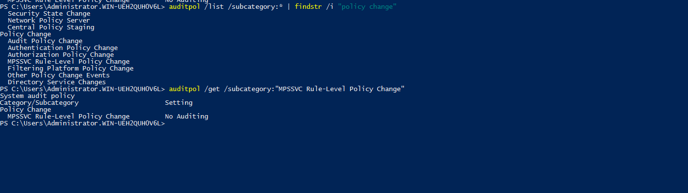
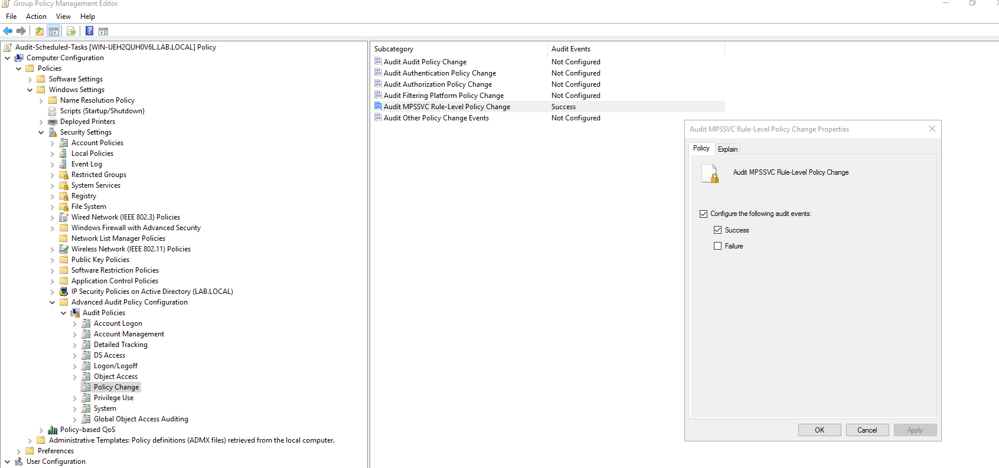
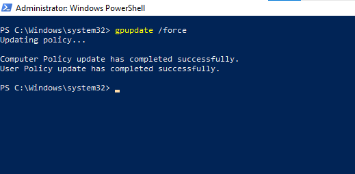
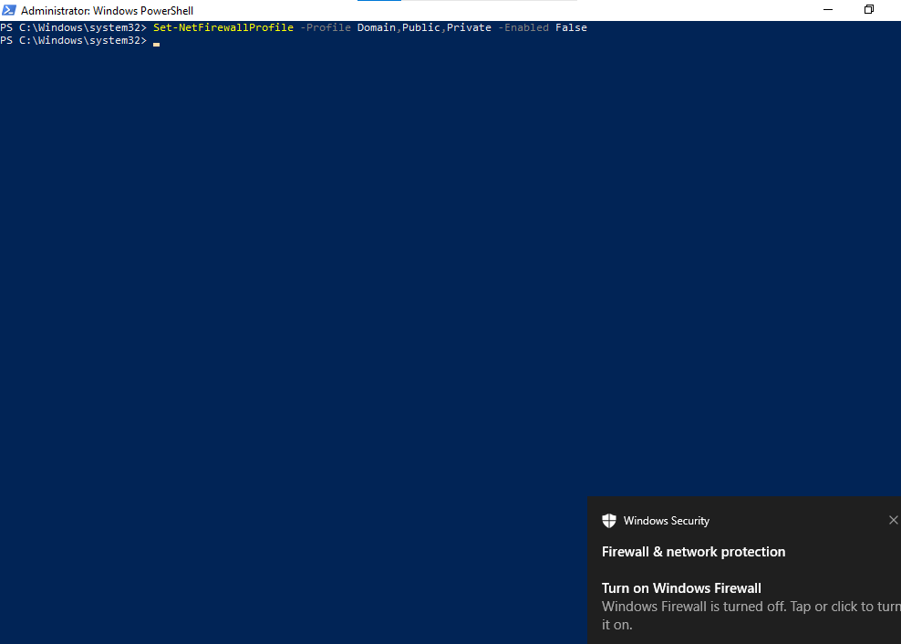
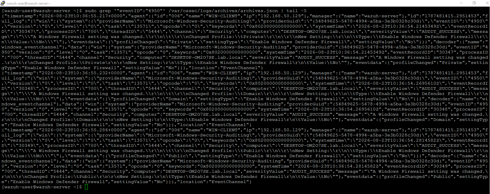
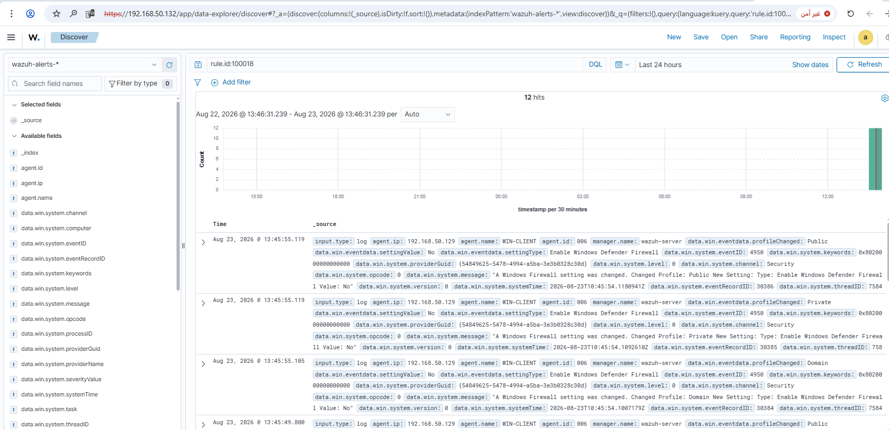
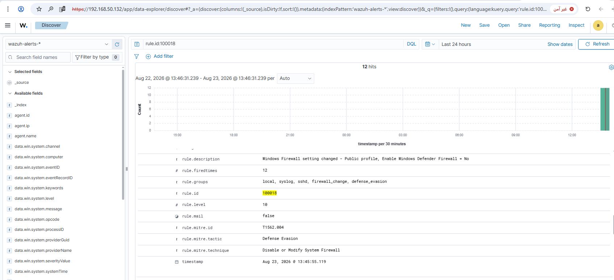

# Rule #20 - Windows Firewall Disabled

**Windows Event Source:** Windows Security Event Log, Event ID 4950 ("A Windows Firewall setting was changed")
**Rule ID:** 100018 (custom rule, `local_rules.xml`)
**Level:** 10
**MITRE ATT&CK:** T1562.004 - Disable or Modify System Firewall

## Overview

Flags changes to Windows Defender Firewall, especially
when a profile (Domain, Private, or Public) gets turned off. It's a
common defense evasion move - disable the local firewall to open up
connections that would otherwise be blocked.

| Field | Value |
|---|---|
| Log Source | Windows Security Event Log (WIN-CLIENT, via GPO) |
| Event ID | 4950 (A Windows Firewall setting was changed) |
| Wazuh Rule ID | 100018 (custom - `if_group: windows` + eventID=4950 filter) |
| Rule Description | Windows Firewall setting changed - $(profileChanged) profile, $(settingType) = $(settingValue) |
| Rule Level | 10 |
| MITRE ATT&CK | T1562.004 - Disable or Modify System Firewall (Defense Evasion) |
| ECC Control | 2-3-3-1 |

## Step 1 - Identify the correct audit subcategory (WIN-CLIENT)

```powershell
auditpol /list /subcategory:* | findstr /i "policy change"
```

This confirmed **"MPSSVC Rule-Level Policy Change"** (under the Policy
Change category) as the subcategory that controls Event 4950 - Windows
Firewall uses the MPSSVC service internally, hence the name.



## Step 2 - Enable the subcategory via GPO (DC01)

Reused the existing `Audit-Scheduled-Tasks` GPO (already linked to
`lab.local`) instead of creating a new one, since it already serves as the
central location for all custom audit-policy settings in this project:

```
Computer Configuration → Policies → Windows Settings → Security Settings
→ Advanced Audit Policy Configuration → Audit Policies → Policy Change
→ Audit MPSSVC Rule-Level Policy Change → Success
```



## Step 3 - Force GPO update (WIN-CLIENT)

```powershell
gpupdate /force
```



## Step 4 - Test: disable the firewall (WIN-CLIENT)

```powershell
Set-NetFirewallProfile -Profile Domain,Public,Private -Enabled False
```



## Step 5 - Build the custom rule (SIEM-SRV)

No default Wazuh rule matches Event 4950 directly, so a custom rule was
built:

```xml
<rule id="100018" level="10">
  <if_group>windows</if_group>
  <field name="win.system.eventID">^4950$</field>
  <description>Windows Firewall setting changed - $(win.eventdata.profileChanged) profile, $(win.eventdata.settingType) = $(win.eventdata.settingValue)</description>
  <mitre>
    <id>T1562.004</id>
  </mitre>
  <group>firewall_change,defense_evasion,</group>
</rule>
```

To add this rule directly to `local_rules.xml`:

```bash
sudo sed -i '$i\
<rule id="100018" level="10">\
  <if_group>windows</if_group>\
  <field name="win.system.eventID">^4950$</field>\
  <description>Windows Firewall setting changed - $(win.eventdata.profileChanged) profile, $(win.eventdata.settingType) = $(win.eventdata.settingValue)</description>\
  <mitre>\
    <id>T1562.004</id>\
  </mitre>\
  <group>firewall_change,defense_evasion,</group>\
</rule>' /var/ossec/etc/rules/local_rules.xml
sudo grep -A 8 'id="100018"' /var/ossec/etc/rules/local_rules.xml
```

`if_group="windows"` was used instead of a specific `if_sid`, the same
reliable approach used for similar rules earlier in the project (e.g. Rule
#10). The event fires once per firewall profile changed - disabling all
three profiles in one command produces three separate alerts.

## Step 6 - Confirm the event reached the manager (SIEM-SRV)

```bash
sudo grep '"eventID":"4950"' /var/ossec/logs/archives/archives.json | tail -5
```



## Step 7 - Verify in the Wazuh dashboard

Discover view, filtered to `rule.id: 100018`, showing 12 matching events
(4 test runs × 3 profiles each):



Alert detail view confirming rule ID, level, and MITRE mapping:



## Step 8 - Re-enable the firewall (WIN-CLIENT)

```powershell
Set-NetFirewallProfile -Profile Domain,Public,Private -Enabled True
Get-NetFirewallProfile | Select-Object Name, Enabled
```

## Lessons Learned

- `Set-NetFirewallProfile` only logs an event on an actual state change, not a repeated identical setting.
- No built-in rule covers Event 4950, so a custom rule was needed.

## Status
✅ Complete and verified.
