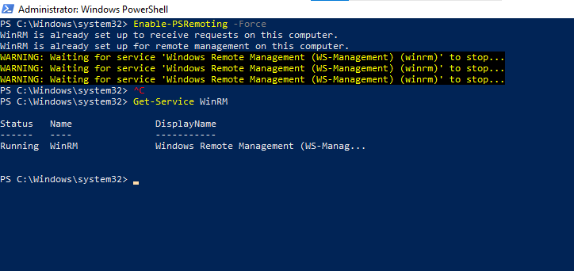
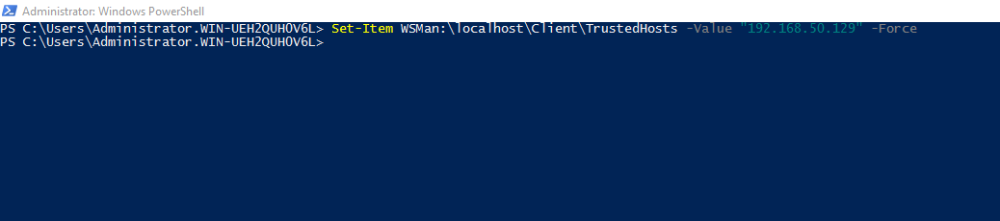
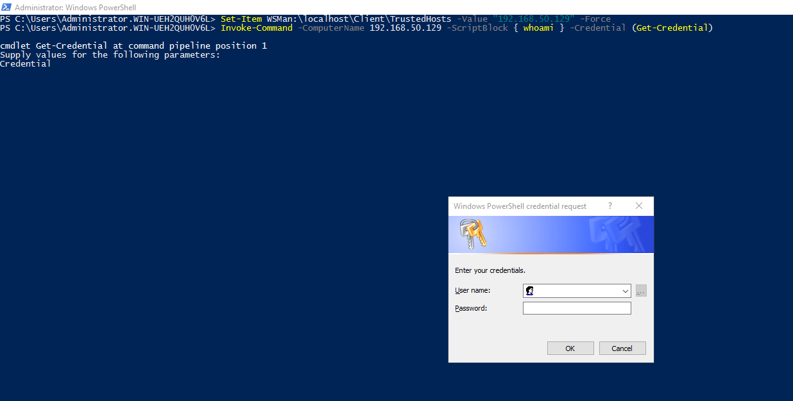
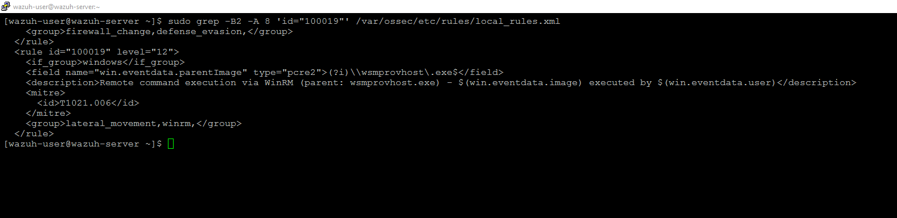
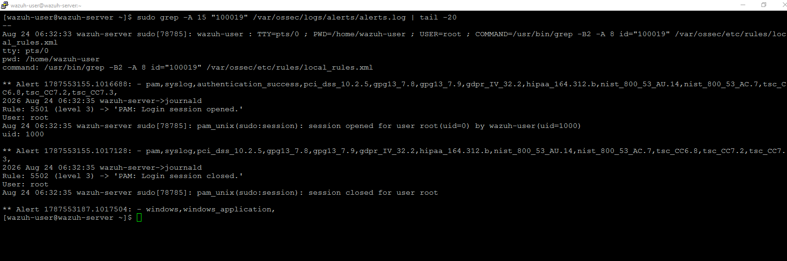
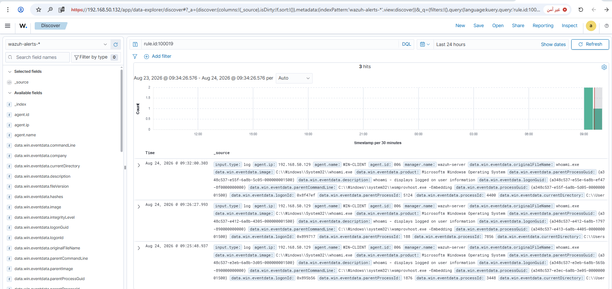
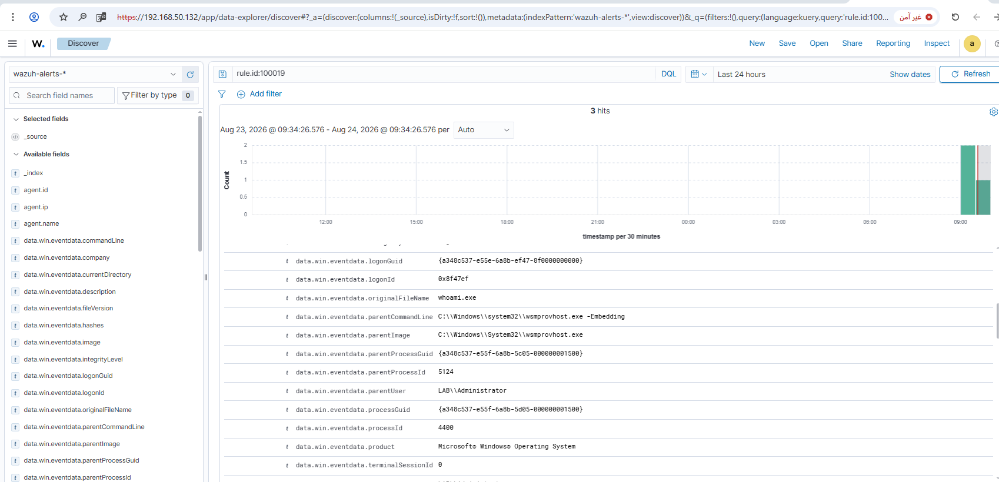

# Rule #21 - Lateral Movement via WinRM (PsExec Alternative)

**Windows Event Source:** Sysmon Event ID 1 (Process Creation)
**Rule ID:** 100019 (custom rule, `local_rules.xml`)
**Level:** 12
**MITRE ATT&CK:** T1021.006 - Remote Services: Windows Remote Management

## Overview

Started out scoped as "known lateral-movement tool used
(PsExec)." Since the lab is fully air-gapped, PsExec itself couldn't
be downloaded, and just renaming some unrelated exe to `PsExec.exe`
wouldn't really test anything real.

So instead this rule catches WinRM-based remote command execution -
`Invoke-Command` / PowerShell Remoting - a built-in Windows feature
that's become a common real-world stand-in for PsExec, partly because
a lot of EDR/AV tools specifically watch for PsExec by name. Any
process whose parent is `wsmprovhost.exe` (the WS-Management Provider
Host) was spawned by a remote WinRM command.

| Field | Value |
|---|---|
| Log Source | Sysmon (Event ID 1 - Process Creation) |
| Event ID | 1 |
| Wazuh Rule ID | 100019 (custom) |
| Rule Description | Remote command execution via WinRM (parent: wsmprovhost.exe) |
| Rule Level | 12 |
| MITRE ATT&CK | T1021.006 - Remote Services: Windows Remote Management |
| ECC Control | 2-2-3-2 |


## Step 1 - Enable WinRM for remote management (WIN-CLIENT)

```powershell
Enable-PSRemoting -Force
Get-Service WinRM
```



## Step 2 - Trust the target host (DC01)

WinRM does not allow connecting by IP address by default; the target must
be added to the TrustedHosts list first:

```powershell
Set-Item WSMan:\localhost\Client\TrustedHosts -Value "192.168.50.129" -Force
```



## Step 3 - Test: execute a command remotely (DC01)

```powershell
Invoke-Command -ComputerName 192.168.50.129 -ScriptBlock { whoami } -Credential (Get-Credential)
```



## Step 4 - Build the custom rule (SIEM-SRV)

```bash
sudo grep -B2 -A 8 'id="100019"' /var/ossec/etc/rules/local_rules.xml
```

```xml
<rule id="100019" level="12">
  <if_group>windows</if_group>
  <field name="win.eventdata.parentImage" type="pcre2">(?i)\\wsmprovhost\.exe$</field>
  <description>Remote command execution via WinRM (parent: wsmprovhost.exe) - $(win.eventdata.image) executed by $(win.eventdata.user)</description>
  <mitre>
    <id>T1021.006</id>
  </mitre>
  <group>lateral_movement,winrm,</group>
</rule>
```

To add this rule directly to `local_rules.xml`:

```bash
sudo sed -i '$i\
<rule id="100019" level="12">\
  <if_group>windows</if_group>\
  <field name="win.eventdata.parentImage" type="pcre2">(?i)\\\\wsmprovhost\\.exe$</field>\
  <description>Remote command execution via WinRM (parent: wsmprovhost.exe) - $(win.eventdata.image) executed by $(win.eventdata.user)</description>\
  <mitre>\
    <id>T1021.006</id>\
  </mitre>\
  <group>lateral_movement,winrm,</group>\
</rule>' /var/ossec/etc/rules/local_rules.xml
sudo grep -A 8 'id="100019"' /var/ossec/etc/rules/local_rules.xml
```

Same double-backslash-escaping note as Rules #12-#14 applies to the `pcre2` field here - double what's needed in the final XML, since `sed` collapses `\\` to `\`.

The rule matches on **parent process image** rather than the executed
command itself - this catches *any* command run through WinRM (not just
`whoami`), since every remotely-executed process shares the same parent:
`wsmprovhost.exe`.



## Step 5 - Confirm the alert fired (SIEM-SRV)

```bash
sudo grep -A 15 "100019" /var/ossec/logs/alerts/alerts.log | tail -20
```



## Step 6 - Verify in the Wazuh dashboard

Discover view, filtered to `rule.id: 100019`:



Alert detail view confirming rule ID, level, and MITRE mapping:



## Lessons Learned

- WinRM is a realistic PsExec substitute for air-gapped labs and a real-world technique on its own.
- WinRM refuses bare IPs by default - the target has to be added to TrustedHosts first.
- Filtering on `parentImage` catches any command run through WinRM, not just one specific command.

## Status
✅ Complete and verified.
