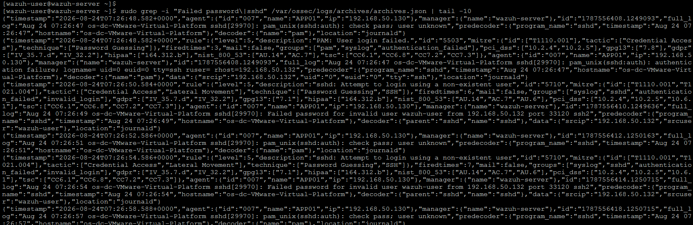
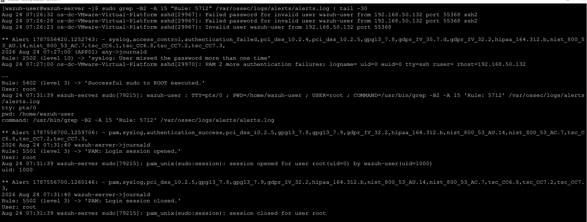
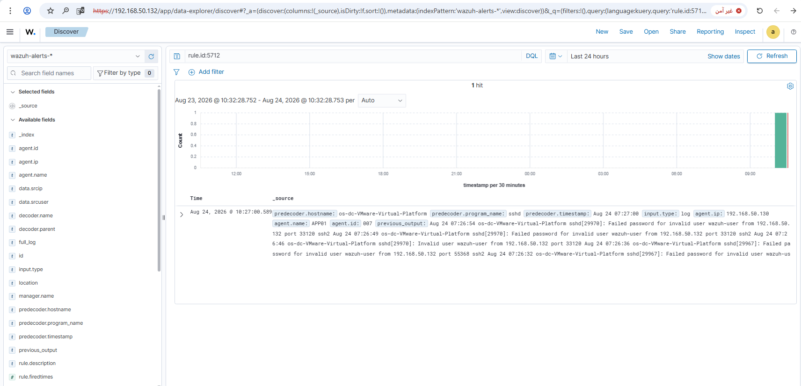
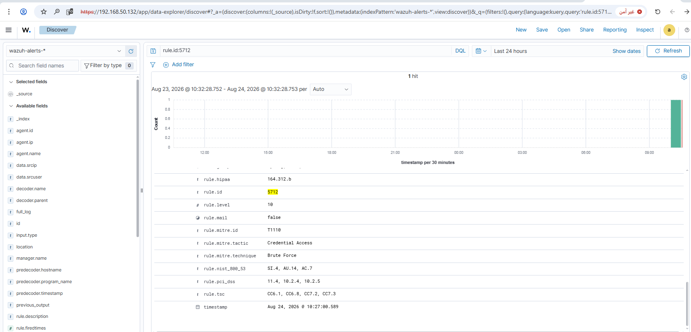

# Rule #22 - Repeated Failed SSH Attempts (Ubuntu App Server)

**Log Source:** `/var/log/auth.log` (via journald, on APP01)
**Rule ID:** 5712 (built-in Wazuh rule - no custom rule needed)
**Level:** 10
**MITRE ATT&CK:** T1110 - Brute Force

## Overview

This is a classic SSH brute-force detection against APP01: several
failed logins from the same source in a short window. First rule in
the project running on APP01 (Ubuntu) instead of Windows, using plain
syslog/journald data instead of Windows Event Log or Sysmon.

| Field | Value |
|---|---|
| Log Source | /var/log/auth.log (via journald, APP01) |
| Event ID | N/A (syslog - no Windows Event ID) |
| Wazuh Rule ID | 5712 (built-in) |
| Rule Description | sshd: multiple authentication failures |
| Rule Level | 10 |
| MITRE ATT&CK | T1110 - Brute Force |
| ECC Control | 2-2-3-2, 2-12-3-4 |

## Step 1 - Test: repeated failed SSH login attempts

From SIEM-SRV, connected to APP01 via SSH with a deliberately wrong
password, repeated 5-6 times in a row:

```bash
ssh wazuh-user@192.168.50.130
```

## Step 2 - Confirm events reached the manager (SIEM-SRV)

```bash
sudo grep -i "Failed password\|sshd" /var/ossec/logs/archives/archives.json | tail -10
```



## Step 3 - Confirm the aggregation rule fired (SIEM-SRV)

```bash
sudo grep -B2 -A 15 "Rule: 5712" /var/ossec/logs/alerts/alerts.log | tail -30
```



## Step 4 - Verify in the Wazuh dashboard

Discover view, filtered to `rule.id: 5712`:



Alert detail view confirming rule ID, level, and MITRE mapping:



## Lessons Learned

- Wazuh's default SSH ruleset (rule 5712, mapped to T1110) already covers brute force - nothing custom to build.
- OpenSSH had to be installed via `.deb` packages over USB (air-gapped); `dpkg` needs matching versions across dependent packages.

## Status
✅ Complete and verified.
