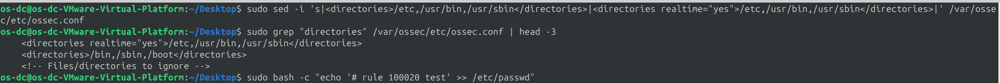
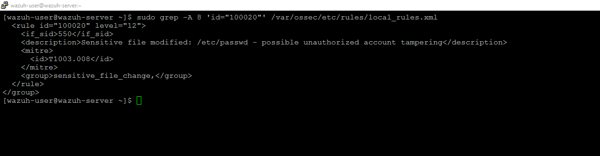
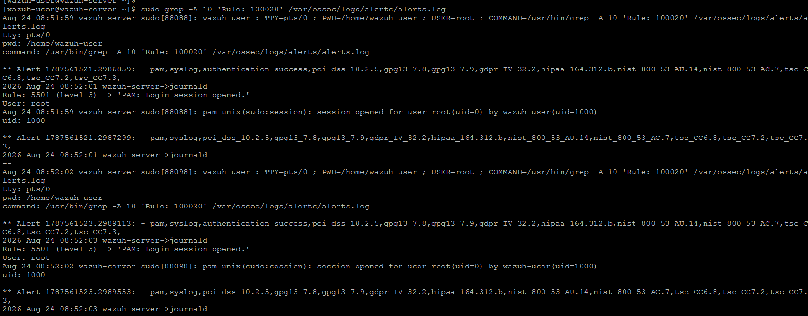
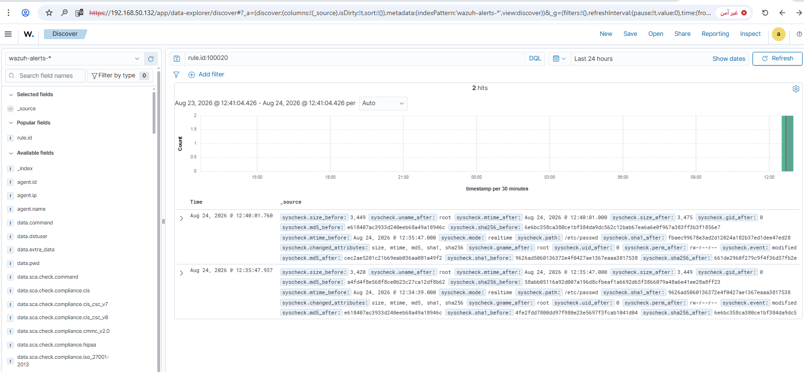
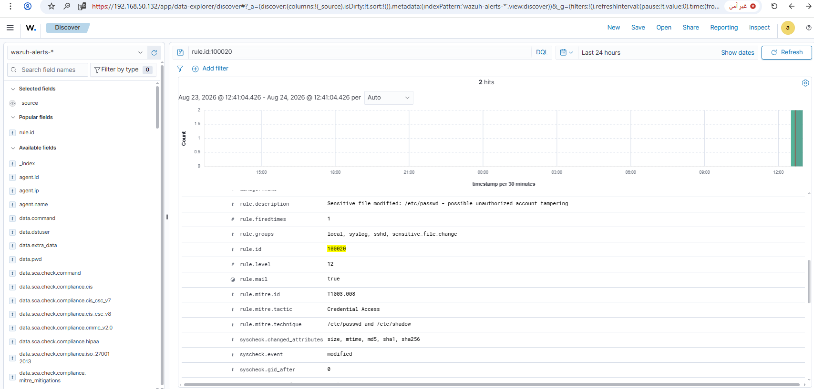
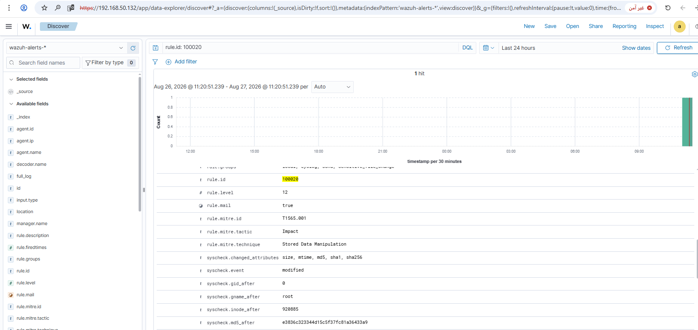

# Rule #23 - Sensitive File Modified (/etc/passwd) via Wazuh FIM

> ⚠️ The version below is the rule's **original** form and had a bug (no path filter - see Lessons Learned). The corrected, final version is in Rule #24's write-up. Don't copy this one as-is.

**Log Source:** Wazuh File Integrity Monitoring (FIM / syscheck), realtime mode, on APP01
**Rule ID:** 100020 (custom rule, `local_rules.xml`)
**Level:** 12
**MITRE ATT&CK:** T1565.001 - Stored Data Manipulation

## Overview

Catches any change to `/etc/passwd` on APP01 - probably the
most sensitive file on a Linux box, since it holds every local user
account. Even a one-line change (a hidden account added, a shell
swapped) deserves its own clear alert, not just a generic "integrity
checksum changed" notice.

| Field | Value |
|---|---|
| Log Source | Wazuh FIM (syscheck), realtime, APP01 |
| Event ID | N/A (FIM - no Windows/syslog Event ID) |
| Wazuh Rule ID | 100020 (custom) |
| Rule Description | Sensitive file modified: /etc/passwd - possible unauthorized account tampering |
| Rule Level | 12 |
| MITRE ATT&CK | T1565.001 - Stored Data Manipulation (originally T1003.008 - see Step 6 below for why it was corrected) |
| ECC Control | 2-7 |

## Step 1 - Enable realtime FIM monitoring for /etc (APP01)

```bash
sudo sed -i 's|<directories>/etc,/usr/bin,/usr/sbin</directories>|<directories realtime="yes">/etc,/usr/bin,/usr/sbin</directories>|' /var/ossec/etc/ossec.conf
sudo grep "directories" /var/ossec/etc/ossec.conf | head -3
```



## Step 2 - Test: append a comment line to /etc/passwd (APP01)

```bash
sudo bash -c "echo '# rule 100020 test' >> /etc/passwd"
```

## Step 3 - Build the custom rule (SIEM-SRV)

```xml
<rule id="100020" level="12">
  <if_sid>550</if_sid>
  <description>Sensitive file modified: /etc/passwd - possible unauthorized account tampering</description>
  <mitre>
    <id>T1003.008</id>
  </mitre>
  <group>sensitive_file_change,</group>
</rule>
```

To add this rule directly to `local_rules.xml`:

```bash
sudo sed -i '$i\
<rule id="100020" level="12">\
  <if_sid>550</if_sid>\
  <description>Sensitive file modified: /etc/passwd - possible unauthorized account tampering</description>\
  <mitre>\
    <id>T1003.008</id>\
  </mitre>\
  <group>sensitive_file_change,</group>\
</rule>' /var/ossec/etc/rules/local_rules.xml
sudo grep -A 8 'id="100020"' /var/ossec/etc/rules/local_rules.xml
```

Note: this is the rule's original form. It was later corrected in Rule #24 (a missing `<field name="file">` check caused it to mislabel unrelated file changes as `/etc/passwd` - see that file for the fix).



## Step 4 - Confirm the alert fired (SIEM-SRV)

```bash
sudo grep -A 10 "Rule: 100020" /var/ossec/logs/alerts/alerts.log
```



## Step 5 - Verify in the Wazuh dashboard

Discover view, filtered to `rule.id: 100020`:



Alert detail view confirming rule ID, level, and MITRE mapping:



## Step 6 - Correct the MITRE Mapping (Later Session)

T1003.008 covers reading/dumping `/etc/passwd` and `/etc/shadow` for offline
password cracking (Credential Access), not modifying the file - the wrong
tactic for what this rule actually detects. T1565.001 - Stored Data
Manipulation (Impact) is the accurate match. Since this is a custom rule,
no `overwrite` trick was needed - just updated the tag directly:

```bash
sudo sed -i '/id="100020"/,/<\/rule>/ s|<id>T1003.008</id>|<id>T1565.001</id>|' /var/ossec/etc/rules/local_rules.xml
sudo grep -A 8 'id="100020"' /var/ossec/etc/rules/local_rules.xml
sudo /var/ossec/bin/wazuh-analysisd -t; echo "Exit code: $?"
sudo systemctl restart wazuh-manager
```

Triggered a new test change on `/etc/passwd` and confirmed the alert now
shows `rule.mitre.id: T1565.001`, `rule.mitre.tactic: Impact`,
`rule.mitre.technique: Stored Data Manipulation`.



## Lessons Learned

- Scheduled FIM scans missed `/etc/passwd` changes; switching to `realtime="yes"` fixed it (root cause not fully confirmed).
- `if_matched_sid` didn't fire for single events - `if_sid` is the right choice unless pairing with frequency/timeframe.

## Status
✅ Complete and verified.
