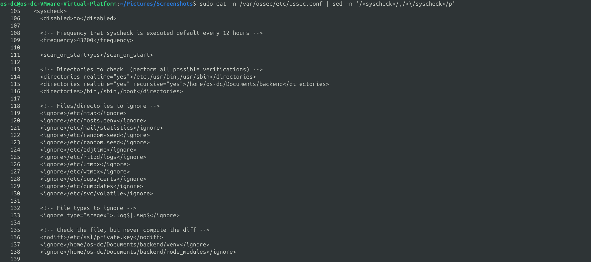
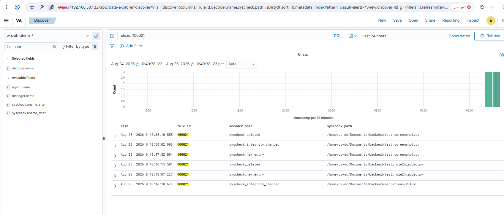
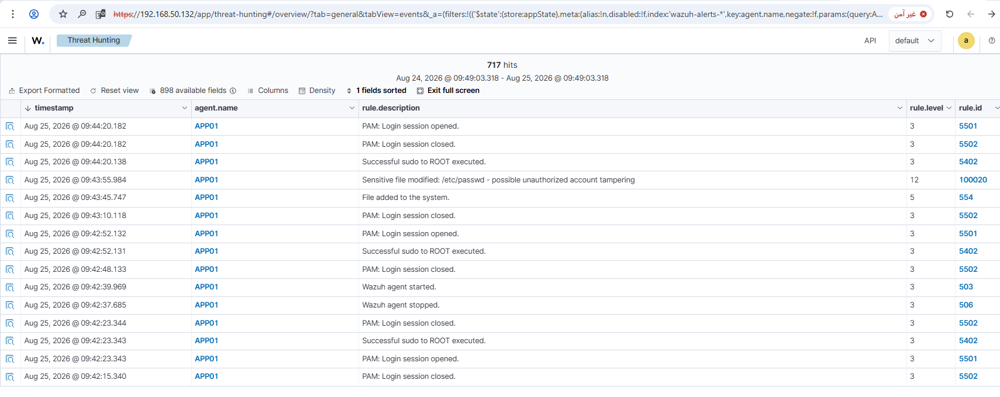
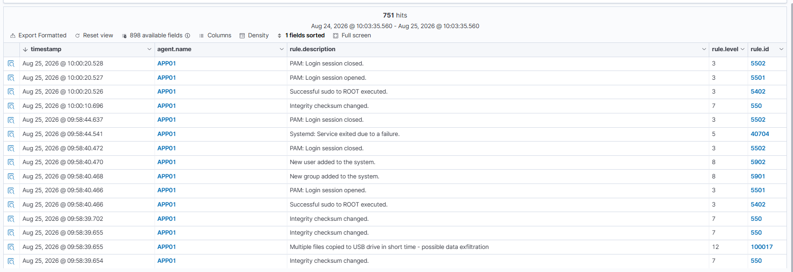
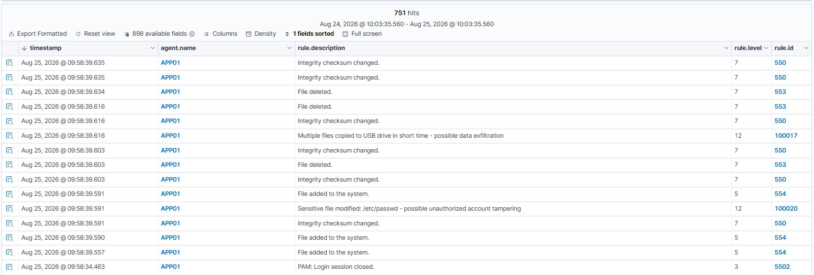
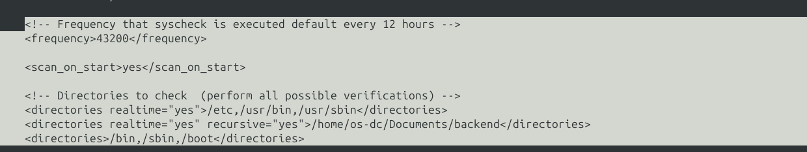
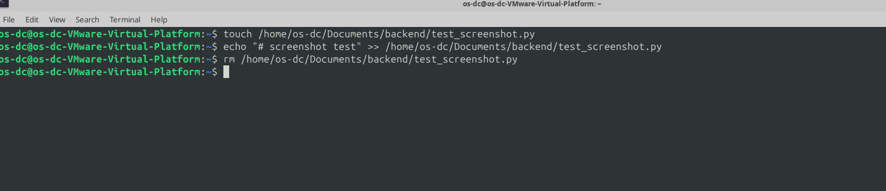
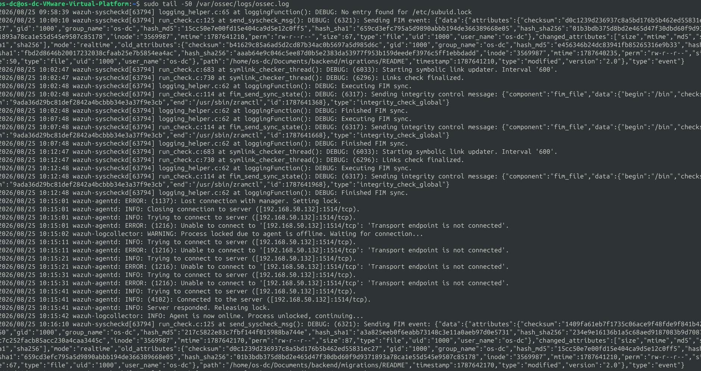

# Rule #24 - Backend Application File Change (Added / Modified / Deleted)

**Log Source:** Wazuh File Integrity Monitoring (FIM / syscheck), realtime mode, on APP01
**Rule ID:** 100021 (custom rule, `local_rules.xml`)
**Level:** 10
**MITRE ATT&CK:** T1565.001 - Stored Data Manipulation
**ECC-2:2024 Control:** 2-7 (Data & Information Protection)

## Overview

Catches any change (added, modified, deleted) to a file
inside the backend application's code folder on APP01
(`/home/os-dc/Documents/backend/`), to catch tampering with the app
itself - a planted backdoor, an edited config file with database
credentials or JWT secrets, that kind of thing.

While testing this, I found a pre-existing bug in Rule #23 (100020) -
it was matching on any file-modified event system-wide instead of
just `/etc/passwd`. Fixing that is part of this rule's write-up
(Steps 4-5) since I found and fixed it in the same session.

| Field | Value |
|---|---|
| Log Source | Wazuh FIM (syscheck), realtime + recursive, APP01 |
| Event ID | N/A (FIM - no Windows/syslog Event ID) |
| Wazuh Rule ID | 100021 (custom) |
| Rule Description | Backend application file changed: $(file) |
| Rule Level | 10 |
| MITRE ATT&CK | T1565.001 - Stored Data Manipulation |
| ECC Control | 2-7 |

## Step 1 - Enable realtime FIM monitoring for the backend directory (APP01)

```bash
sudo nano /var/ossec/etc/ossec.conf
```

Added inside the `<syscheck>` section:

```xml
<directories realtime="yes" recursive="yes">/home/os-dc/Documents/backend</directories>
```

## Step 2 - Exclude third-party library folders (APP01)

The initial baseline scan showed the backend directory contains `venv/`
(Python packages) and `node_modules/` (JavaScript packages) - thousands of
unrelated third-party files that would cause heavy noise on every
`pip`/`npm install`. Added explicit exclusions right after `<nodiff>`:

```xml
<ignore>/home/os-dc/Documents/backend/venv</ignore>
<ignore>/home/os-dc/Documents/backend/node_modules</ignore>
```

```bash
sudo cat -n /var/ossec/etc/ossec.conf | sed -n '/<syscheck>/,/<\/syscheck>/p'
```



## Step 3 - Restart agent and confirm baseline scan completes cleanly (APP01)

```bash
sudo systemctl restart wazuh-agent
sudo tail -50 /var/ossec/logs/ossec.log
```

Confirms the baseline scan finished with only real backend files (migrations,
package-lock.json, app/...) - no venv or node_modules entries.

> **Note:** A brief agent disconnect (`Lost connection with manager`, ~40s)
> was observed during testing. It reconnected automatically and did not
> affect realtime monitoring afterward.



## Step 4 - Bug discovered in Rule #23 (100020) while testing Rule #24

Testing an edit on a normal backend file (`migrations/README`) unexpectedly
triggered:

> "Sensitive file modified: /etc/passwd - possible unauthorized account tampering"

Root cause: rule 100020 was built on `<if_sid>550</if_sid>` with no check on
the actual file path - so it fired on *any* file-modified event system-wide
and always labeled it as `/etc/passwd`, regardless of the file that actually
changed.



## Step 5 - Fix Rule #23 (100020) and verify (SIEM-SRV)

Added a `<field name="file">` check so the rule only fires for the actual
target file:

```xml
<rule id="100020" level="12">
  <if_sid>550</if_sid>
  <field name="file">/etc/passwd</field>
  <description>Sensitive file modified: /etc/passwd - possible unauthorized account tampering</description>
  <mitre>
    <id>T1003.008</id>
  </mitre>
  <group>sensitive_file_change,</group>
</rule>
```

To apply just this fix to the existing rule (inserts the new `<field>` line right after `<if_sid>550</if_sid>` inside rule 100020):

```bash
sudo sed -i '/<if_sid>550<\/if_sid>/a\
  <field name="file">/etc/passwd</field>' /var/ossec/etc/rules/local_rules.xml
sudo grep -A 8 'id="100020"' /var/ossec/etc/rules/local_rules.xml
```

Test - modify `/etc/passwd` and a backend file, confirm they no longer collide:

```bash
sudo useradd -m testuser23
echo "# test rule24 v2" >> /home/os-dc/Documents/backend/migrations/README
```

Result: `/etc/passwd` fired rule 100020 correctly; `migrations/README` fired
the generic rule 550 only - no more cross-labeling.





## Step 6 - Build the custom rule for backend file changes (SIEM-SRV)

Added a rule that matches any FIM event (added/modified/deleted) under the
backend path in a single rule, using `<if_group>syscheck</if_group>`:

```xml
<rule id="100021" level="10">
  <if_group>syscheck</if_group>
  <field name="file" type="pcre2">(?i)/home/os-dc/Documents/backend/</field>
  <description>Backend application file changed: $(file)</description>
  <mitre>
    <id>T1565.001</id>
  </mitre>
  <group>backend_file_change,</group>
</rule>
```

To add this rule directly to `local_rules.xml`:

```bash
sudo sed -i '$i\
<rule id="100021" level="10">\
  <if_group>syscheck</if_group>\
  <field name="file" type="pcre2">(?i)/home/os-dc/Documents/backend/</field>\
  <description>Backend application file changed: $(file)</description>\
  <mitre>\
    <id>T1565.001</id>\
  </mitre>\
  <group>backend_file_change,</group>\
</rule>' /var/ossec/etc/rules/local_rules.xml
sudo grep -A 8 'id="100021"' /var/ossec/etc/rules/local_rules.xml
```

```bash
sudo /var/ossec/bin/wazuh-logtest
sudo systemctl restart wazuh-manager
```



## Step 7 - Test: Added / Modified / Deleted (APP01)

```bash
touch /home/os-dc/Documents/backend/test_screenshot.py
echo "# screenshot test" >> /home/os-dc/Documents/backend/test_screenshot.py
rm /home/os-dc/Documents/backend/test_screenshot.py
```



## Step 8 - Confirm all three events fired under rule 100021 (dashboard)

All three events fired under `rule.id: 100021`, each with a clear "Backend
application file changed: <path>" description (syscheck_new_entry /
syscheck_integrity_changed / syscheck_deleted).



## Lessons Learned

- Exclude third-party library folders (`venv`, `node_modules`) from FIM on app code directories.
- A rule built only on `if_sid` without a `<field name="file">` check fires on any file, not just the intended one - this is what was wrong with Rule #23.

## Status
✅ Complete and verified.
