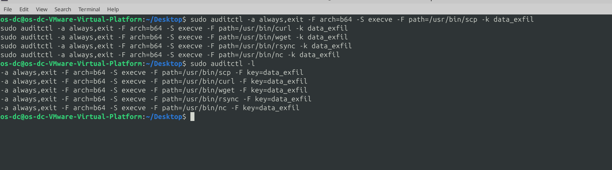
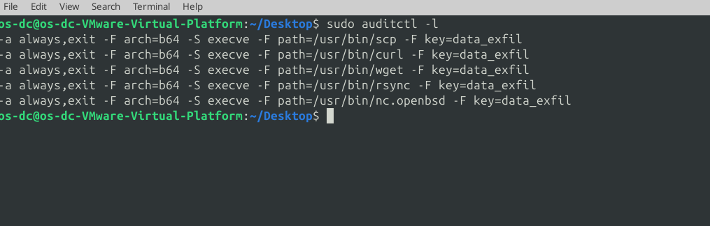
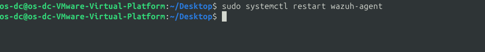
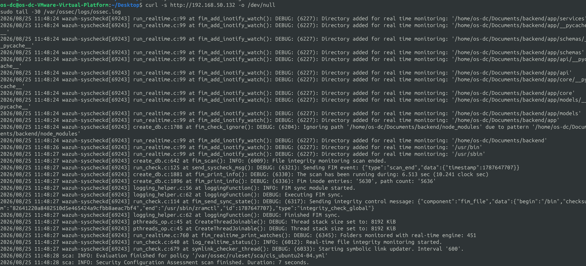
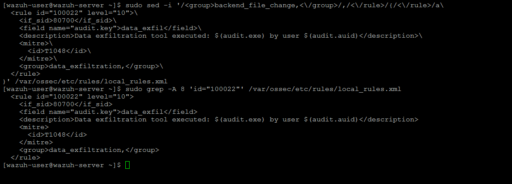
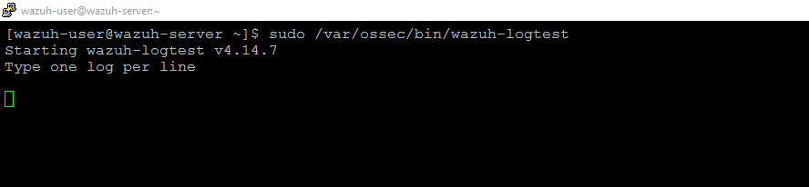
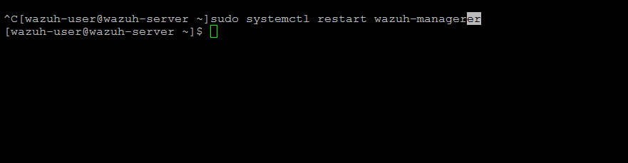
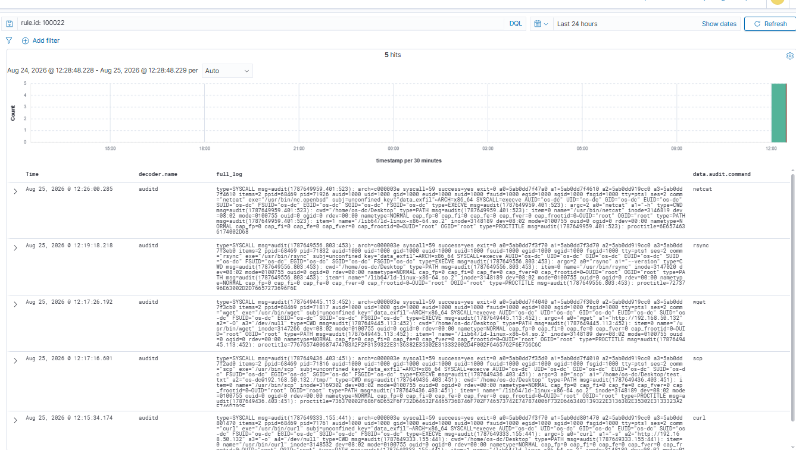

# Rule #25 - Suspicious File Transfer Tool Execution (auditd)

**Log Source:** Linux Audit Daemon (auditd), on APP01
**Rule ID:** 100022 (custom rule, `local_rules.xml`)
**Level:** 10
**MITRE ATT&CK:** T1048 - Exfiltration Over Alternative Protocol (contextual mapping - the rule detects tool execution, which does not by itself confirm exfiltration occurred)
**ECC-2:2024 Control:** 2-7, 2-5-3-5

## Overview

The lab is fully air-gapped, so a real Suricata-style traffic-volume rule
could never be tested against an actual external destination (same
limitation as Rule #13). Instead this one watches for common file-transfer
tools running at all - `scp`, `curl`, `wget`, `rsync`, `nc`/`netcat` - on
APP01. A behavior-based approach: any use of these tools is worth
flagging regardless of destination or size, since they're what an
attacker would actually reach for to move data out.

**Important scope note:** this rule detects *execution* of a
file-transfer tool, not a confirmed exfiltration. Running `curl` or
`scp` against another lab machine (as tested below) proves the tool ran
and reached its target - it doesn't by itself prove data actually left
the network or that the transfer was malicious. In a real deployment
this would be one signal among several (destination reputation, data
volume, user baseline), not a standalone verdict.

`auditd` wasn't installed on APP01, so it had to be brought in via
`.deb` packages (same USB transfer method as Rule #22), since it
watches process execution at the kernel level, something Wazuh FIM
can't do on its own.

| Field | Value |
|---|---|
| Log Source | Linux Audit Daemon (auditd), APP01 |
| Event ID | N/A (auditd - no Windows/syslog Event ID) |
| Wazuh Rule ID | 100022 (custom) |
| Rule Description | `Data exfiltration tool executed: $(audit.exe) by user $(audit.auid)` |
| Rule Level | 10 |
| MITRE ATT&CK | T1048 - Exfiltration Over Alternative Protocol (contextual mapping - the rule detects tool execution, which does not by itself confirm exfiltration occurred) |
| ECC Control | 2-7, 2-5-3-5 |

## Step 1 - Install auditd (APP01)

`auditd` was not present on APP01 (only its shared libraries were). Since the
network is air-gapped, the exact matching `.deb` packages were downloaded
from packages.ubuntu.com on an internet-connected machine and transferred via
USB:

```bash
sudo dpkg -i libauparse0t64_3.1.2-2.1build1.1_amd64.deb
sudo dpkg -i auditd_3.1.2-2.1build1.1_amd64.deb
sudo systemctl status auditd
```

## Step 2 - Add audit rules for file-transfer tools (APP01)

```bash
sudo auditctl -a always,exit -F arch=b64 -S execve -F path=/usr/bin/scp -k data_exfil
sudo auditctl -a always,exit -F arch=b64 -S execve -F path=/usr/bin/curl -k data_exfil
sudo auditctl -a always,exit -F arch=b64 -S execve -F path=/usr/bin/wget -k data_exfil
sudo auditctl -a always,exit -F arch=b64 -S execve -F path=/usr/bin/rsync -k data_exfil
sudo auditctl -a always,exit -F arch=b64 -S execve -F path=/usr/bin/nc -k data_exfil
sudo auditctl -l
```



## Step 3 - Fix the netcat path (APP01)

Testing `nc` produced no audit events at all. Ubuntu 24.04 ships `netcat` as
a symlink, and the rule needs the **resolved** binary path, not the command
name:

```bash
which netcat
readlink -f $(which netcat)
```

`readlink -f` resolved to `/usr/bin/nc.openbsd` - not `/usr/bin/nc`. The
rule was corrected and the persistent rules file rewritten with the fixed
path:

```bash
sudo auditctl -a always,exit -F arch=b64 -S execve -F path=/usr/bin/nc.openbsd -k data_exfil
sudo auditctl -l
```



## Step 4 - Make the audit rules persistent (APP01)

```bash
sudo tee /etc/audit/rules.d/audit.rules > /dev/null << 'EOF'
## First rule - delete all
-D
## Increase the buffers to survive stress events.
## Make this bigger for busy systems
-b 8192
## This determine how long to wait in burst of events
--backlog_wait_time 60000
## Set failure mode to syslog
-f 1
## Rule #25 - Data exfiltration detection (file transfer tools)
-a always,exit -F arch=b64 -S execve -F path=/usr/bin/scp -k data_exfil
-a always,exit -F arch=b64 -S execve -F path=/usr/bin/curl -k data_exfil
-a always,exit -F arch=b64 -S execve -F path=/usr/bin/wget -k data_exfil
-a always,exit -F arch=b64 -S execve -F path=/usr/bin/rsync -k data_exfil
-a always,exit -F arch=b64 -S execve -F path=/usr/bin/nc.openbsd -k data_exfil
EOF

sudo augenrules --load
```

## Step 5 - Point Wazuh at audit.log (APP01)

```bash
sudo sed -i '/<command>last -n 20<\/command>/,/<\/localfile>/{/<\/localfile>/a\
\
  <localfile>\
    <log_format>audit</log_format>\
    <location>/var/log/audit/audit.log</location>\
  </localfile>
}' /var/ossec/etc/ossec.conf

sudo systemctl restart wazuh-agent
```



## Step 6 - Confirm Wazuh is reading the audit log (APP01)

```bash
curl -s http://192.168.50.132 -o /dev/null
sudo tail -30 /var/ossec/logs/ossec.log
```

Confirmed `wazuh-logcollector: INFO: Analyzing file: '/var/log/audit/audit.log'`
in the log, meaning Wazuh was successfully reading the file.



## Step 7 - Bug: default rule 80700 doesn't alert (dashboard)

Even after confirming the events were being read, nothing appeared in the
dashboard. The root cause: Wazuh's built-in base rule that groups all
`auditd`-decoded messages (`id="80700"`) is `level="0"` - meaning it's
processed but never generates an actual alert, so it never reaches the
`wazuh-alerts-*` index the dashboard queries. A custom rule with a real
level was needed to surface these events.

## Step 8 - Build the custom rule (SIEM-SRV)

```bash
sudo sed -i '/<group>backend_file_change,<\/group>/,/<\/rule>/{/<\/rule>/a\
  <rule id="100022" level="10">\
    <if_sid>80700</if_sid>\
    <field name="audit.key">data_exfil</field>\
    <description>Data exfiltration tool executed: $(audit.exe) by user $(audit.auid)</description>\
    <mitre>\
      <id>T1048</id>\
    </mitre>\
    <group>data_exfiltration,</group>\
  </rule>
}' /var/ossec/etc/rules/local_rules.xml

sudo grep -A 8 'id="100022"' /var/ossec/etc/rules/local_rules.xml
```



```bash
sudo /var/ossec/bin/wazuh-logtest
```



```bash
sudo systemctl restart wazuh-manager
```



## Step 9 - Final test: all five tools (APP01 → dashboard)

```bash
curl -s http://192.168.50.132 -o /dev/null
scp /home/os-dc/Desktop/test.txt os-dc@192.168.50.132:/tmp/
wget http://192.168.50.132 -O /dev/null
rsync /home/os-dc/Desktop/test.txt os-dc@192.168.50.132:/tmp/
netcat -h
```

All five tools fired under `rule.id: 100022`, each captured with the full
command line, user, and resolved binary path via `data.audit.command`.



## Lessons Learned

- `auditd` covers what FIM can't - command execution, even without a file change.
- Symlinked binaries (like `netcat` → `nc.openbsd`) need the resolved path, not the friendly name.
- Wazuh's default audit rule (80700) is level 0 by design - a custom rule is needed to actually alert.

## Status
✅ Complete and verified.
