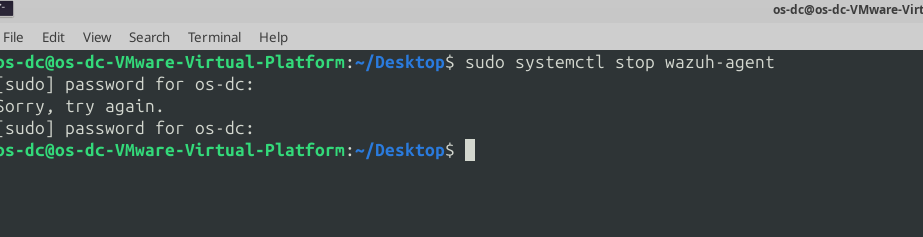
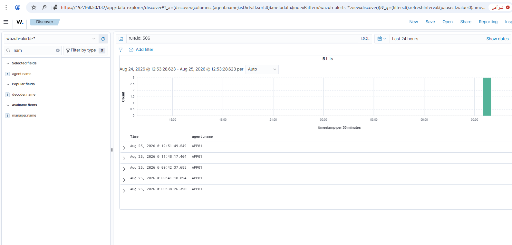
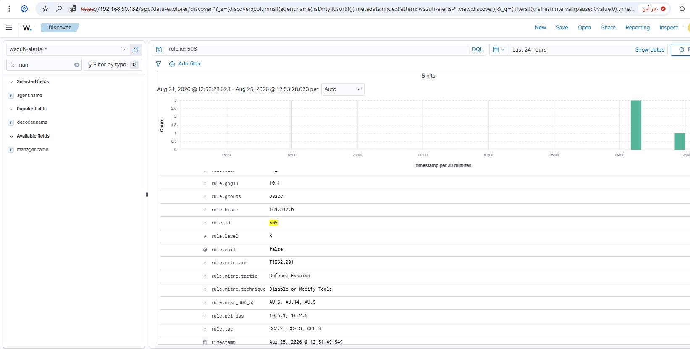

# Rule #26 - Wazuh Agent Stopped Sending Data

**Log Source:** Wazuh Manager (built-in agent connection status), on APP01
**Rule ID:** 506 (built-in Wazuh rule - no custom rule needed)
**Level:** 3
**MITRE ATT&CK:** T1562.001 - Disable or Modify Tools
**ECC-2:2024 Control:** 2-12-3-4

## Overview

Every rule up to this point (#1-#25) assumes one thing: the Wazuh agent
on the monitored host is actually running and sending data. If an
attacker (or someone covering their tracks) stops the agent service
itself, every other detection rule on that host goes blind, with no
alert to say so.

Wazuh already has a built-in rule (`id="506"`) that fires the moment an
agent's connection drops, already tagged with T1562.001. Unlike Rule
#23, where the default rule was too broad and needed fixing, 506
already matches exactly what's needed here, so no custom rule on top
of it.

| Field | Value |
|---|---|
| Log Source | Wazuh Manager (agent connection status), APP01 |
| Event ID | N/A (internal Wazuh agent-status event) |
| Wazuh Rule ID | 506 (built-in) |
| Rule Description | Wazuh agent stopped. |
| Rule Level | 3 |
| MITRE ATT&CK | T1562.001 - Disable or Modify Tools |
| ECC Control | 2-12-3-4 |

## Step 1 - Stop the Wazuh agent (APP01)

```bash
sudo systemctl stop wazuh-agent
```



## Step 2 - Confirm the alert fired (dashboard)

Discover view, filtered to `rule.id: 506`:



Alert detail view confirming description, level, and MITRE mapping:

```
rule.description: Wazuh agent stopped.
rule.id: 506
rule.level: 3
rule.mitre.id: T1562.001
rule.mitre.tactic: Defense Evasion
rule.mitre.technique: Disable or Modify Tools
```



## Step 3 - Restart the agent (APP01)

```bash
sudo systemctl start wazuh-agent
```

Restarted immediately after the test so APP01 resumes coverage under all
prior rules (#22-#25).

## Lessons Learned

Rule 506 covers this out of the box. This one's different from the rest, though - it watches the monitoring pipeline itself, so it indirectly protects every other rule in the project.

## Status
✅ Complete and verified.
