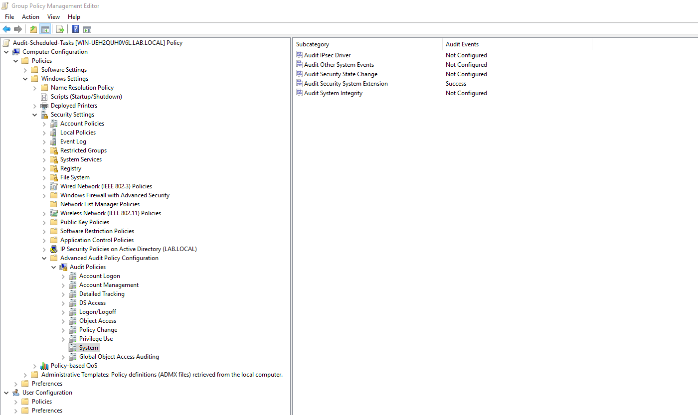
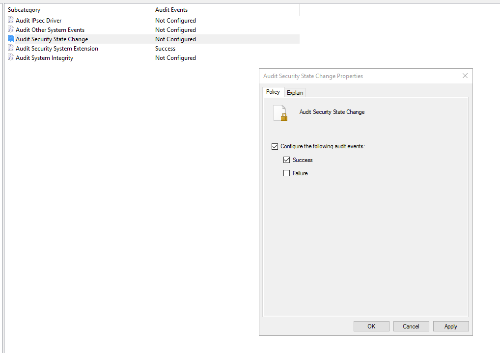
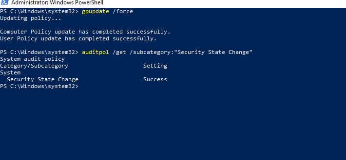
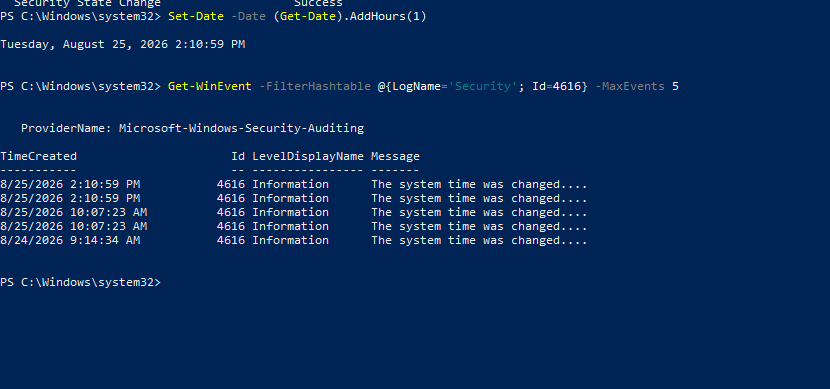
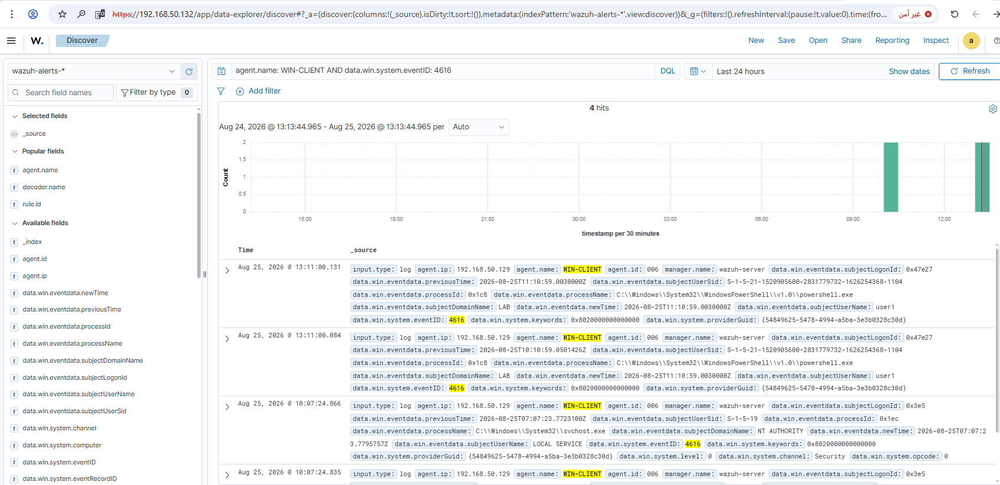

# Rule #27 - Manual System Clock Change

**Windows Event Source:** Event ID 4616 (Audit Security State Change)
**Rule ID:** 60132 (built-in Wazuh rule - no custom rule needed)
**Level:** 5
**MITRE ATT&CK:** T1562 - Impair Defenses (system clock change; not T1070.006 Timestomp, which specifically covers file timestamp manipulation, not the system clock itself)
**ECC-2:2024 Control:** 2-3-3-4 (Clock Synchronization)

## Overview

Changing the system clock is a known anti-forensics trick - it can
scramble the timeline an analyst would use to reconstruct an attack,
or briefly get around time-bound checks (expired certs, Kerberos's
~5-minute clock skew tolerance). Wazuh already has a built-in rule
(`id="60132"`) that fires on any Event 4616, tagged `time_changed`,
so no custom rule needed - same story as Rule #26.

One thing worth noting from testing: Event 4616 fires for any clock
change, including normal NTP resync, not just manual ones. The
built-in rule's low severity (level 5) already accounts for that
noise, so I left it as-is instead of trying to build an unreliable
filter to separate "manual" from "automatic" changes (the event
fields just don't support that distinction well).

| Field | Value |
|---|---|
| Log Source | Windows Security Event Log (WIN-CLIENT, via GPO) |
| Event ID | 4616 (Audit Security State Change) |
| Wazuh Rule ID | 60132 (built-in) |
| Rule Description | System time changed |
| Rule Level | 5 |
| MITRE ATT&CK | T1562 - Impair Defenses (system clock change; not T1070.006 Timestomp, which specifically covers file timestamp manipulation, not the system clock itself) |
| ECC Control | 2-3-3-4 |

## Step 1 - Enable auditing for Security State Change (DC01)

The event falls under **System → Audit Security State Change**, not
Account Logon or Policy Change (categories used in earlier rules). Reused
the existing `Audit-Scheduled-Tasks` GPO instead of creating a new one:

```
Computer Configuration
  → Windows Settings
    → Security Settings
      → Advanced Audit Policy Configuration
        → Audit Policies
          → System
            → Audit Security State Change → Success
```



Enabled the **Success** checkbox specifically:



## Step 2 - Apply the policy and verify (WIN-CLIENT)

```powershell
gpupdate /force
auditpol /get /subcategory:"Security State Change"
```



## Step 3 - Test: change the system clock (WIN-CLIENT)

```powershell
Set-Date -Date (Get-Date).AddHours(1)
Get-WinEvent -FilterHashtable @{LogName='Security'; Id=4616} -MaxEvents 5
```

Confirmed the event logged locally immediately. The older entries visible
in the same output (from earlier that day) turned out to be routine NTP
sync events, not manual changes - direct evidence of the noise mentioned
above.



## Step 4 - Restore the correct time (WIN-CLIENT)

```powershell
w32tm /resync /force
```

Run immediately after testing, since a skewed clock can break Kerberos
authentication with the domain.

## Step 5 - Confirm the alert fired (dashboard)

Discover view, filtered to `agent.name: WIN-CLIENT AND data.win.system.eventID: 4616`:



```
rule.description: System time changed
rule.groups: windows, windows_security, time_changed
rule.id: 60132
rule.level: 5
```

## Lessons Learned

Event 4616 falls under a different audit category (System → Security State Change) than most rules here. This rule backs up every time-based rule in the project (#07, #08).

## Status
✅ Complete and verified.

---

## Project Status

This completes all 27 planned detection rules across Active Directory,
Windows Client/Sysmon, Ubuntu, and Detection Pipeline Integrity.
